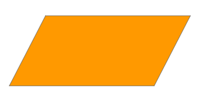
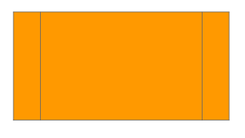
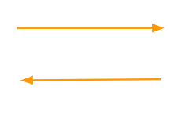
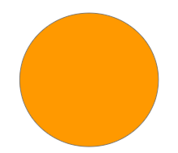

# Diagramas de flujo
- Tipo: `lectura`
- Formato: `self-learning`
- Duración: `30min`

## Objetivos de Aprendizaje

* Representar gráficamente las distintas etapas de un proceso y sus iteraciones, facilitando la comprensión de su funcionamiento.
* Conocer la utilidad  de los diagramas de flujo para analizar el proceso, proponer ideas, representar los controles, etc.

El texto a continuación se basa en la representación gráfica del algoritmo o proceso.
Es útil para la disciplina de programación, con la utilización de simbolos con significado definido que representan los pasos de algoritmo , representando el flujo de ejecución.
***

### ¿Qué es diagrama del flujo?
Un diagrama de flujo o diagrama de actividades es una **representación gráfica de un proceso**.  Cada paso del proceso es representado por un símbolo diferente que contiene una breve descripción de la etapa de un proceso.

**Los símbolos gráficos del flujo del proceso están unidos entre si** con flechas que indican la dirección de flujo del proceso.

### Caracterisiticas del Diagrama de Flujo

* Un diagrama de flujo siempre tiene un único punto de inicio y un único punto de termino.
* Realizaciones previas a la realización de un diagama de flujo:
 1. Definir lo que se espera obtener del diagrama de flujo.
 2. Identificar quién lo empleará y cómo.
 3. Establecer el nivel de detalle requerido.
 4. Determinar los límites del proceso a describir.

### Beneficios del Diagrama de Flujo

* Facilita la **obtención de una visión** transparente del proceso, mejorando su comprensión.
* Permiten **definir los límites de un proceso**. A veces estos límites no son tan evidentes, no estando definidos los distintos proveedores y clientes (internos y externos) involucrados.
* Facilita de identación de los clientes, es más sencillo determinar sus necesidades y ajustar el proceso hacia la satisfacción de sus necesidades y expectativas.
* Ayuda a **establecer el valor agregado** de cada una de las actividades que componen el proceso.

-----------

### Tipos de Diagramas de Flujo
 * **Formato vertical: ** En él el flujo o la secuencia de las opraciones, va de arriba hacia abajo. Es una lista ordenada de las operaciones de un proceso con toda la información que se considere necesaria, según su propósito.

 * **Formato horizontal:** En él, el flujo o la secuencia de las operaciones, va de izquierda a derecha.

 * **Formato panorámico:** El proceso entero está representado en una sola carta y puede apreciarse de una sola mirada mucho más rápido que leyendo el texto, lo que facilita su comprensión, aun para personas no familiarizadas. Registra no solo en línea vertical, sino también en horizontal, distintas acciones simultáneas y la participación de más de un puesto o departamento que el formato vertical no registra.

 * **Formato arquitectónico:** Describe el itinerario de ruta de una forma o persona sobre el plano arquitectónico del área de trabjo. El primero de los flujogramas es eminentemente descriptivo, mientras que los utilizados son fundamentalmente representativos.

-----------

### Símbolos utilizados en diagramas de flujo
* #### Inicio / Fin

 | Marca el inicio o el fin del Diagrama de Flujo
-- | --

* #### Decisión

  | Expresa una condición
-- | --

* #### Entrada

  | Expresa lectura cuando el ususario introduce datos.
-- | --

* #### Proceso

 | Representa una actividad llevada a cabo en el proceso
-- | --

* #### Salida

  | Expresa salida de datos, resultado de datos, expresa escritura.
-- | --

* #### Subrutina

  | Llama a un procedimiento
-- | --

* #### Líneas de flujo

  | Indican la secuencia de flujo de las operaciones del diagrama
-- | --

* #### Conector

  | Conecta las partes de un diagrama de flujo dentro de una misma página
-- | --

### Ejemplo

[Continuar](02-input-output.md)
