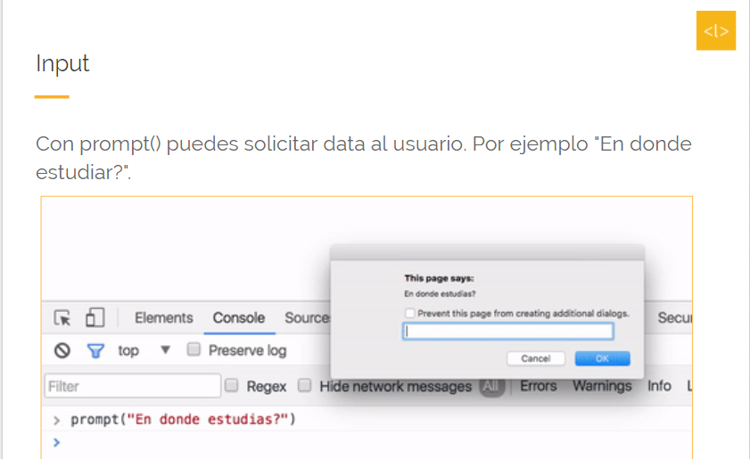
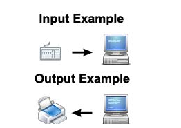
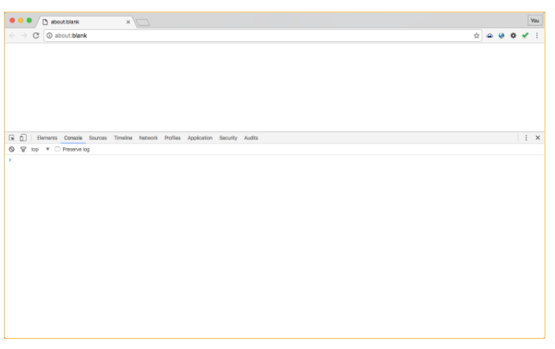
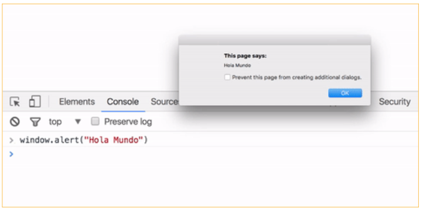
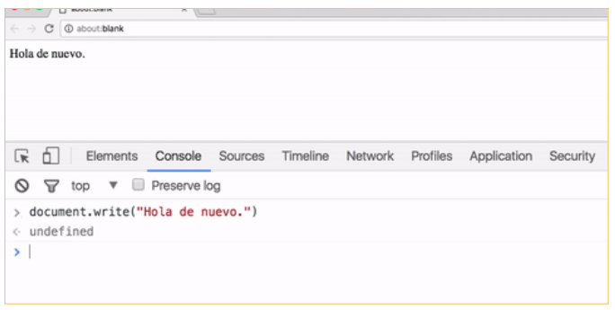
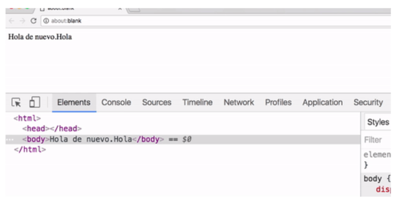

# Input - Output
- Tipo: `lectura`
- Formato: `self-learning`
- Duración: `30min`

## Objetivos de Aprendizaje

* Introducir datos y obtener resultados en la computadora para su procesamiento.
* Crear controles interactivos para formularios basados en la web para aceptar datos del ususario y obtener la salida de los conocimientos adquiridos.

##  Input

* La etiqueta < input > especifica un campo de entrada donde el usuario puede introducir datos.

* Los elementos < input > se utilizan dentro de un elemento < form > pra declarar controles de entrada que permiten a los usuarios introducir datos.

* El campo de entrada puede variar de muchas maneras, dependiendo del atributo de tipo.

* Un método para poder ingresar data, texto, o números a Javascript de manera que puedan ser usados más adelante es **prompt().**

* Puedes usarlo de tres formas:

 1. `prompt()`. Muestra el cuadro de diálogo, con el **input** para poder poner los datos.
 2. `prompt("texto")`. Muestra el cuadro de diálogo con el texto indicado para darle contexto al usuario.
 3. `prompt("texto","default")`. Muestra el cuadro de diálogo con el texto indicado para darle contexto al usuario. Además ingresara en el input la respuesta por defecto.

 Con `prompt()` puedes solicitar data al usuario. Por ejemplo "¿En donde estudiar?"

 

 ## Output

* La etiqueta < output > es nueva en HTML5.
* Cualquier informción que hay sido procesada y enviada desde un ordenador o dispositivo similar se considera **salida**. Un simple ejemplo de salida es todo lo que ve en el monitor de su computadora. La mitad inferior de la imagen muestra los datos que se envían desde un ordenador a una impresora, que se considera salida. Esos datos se imprimen en un pedazo de papael, también se considera una forma de salida.
* Cuando se hace referencia HTML, la etiqueta < output > se utiliza para representar el resultado de la acción de un usuario o de un cálculo.

***
Los output son forma de exponer datos. Javascript no tiene método imprimir, ni display por defecto. Pero tiene otras formas de mostrar la data.

1. Escribir la data en una alerta **window.alert()**
2. Escribirlo directamente en el documento html con **document.write().**
3. Escribirlo directamente en el documento html usando **innerHTML()**
4. Escribir en la consola de browser con **console.log()**

***

### Window.alert()

El método `alert()` muestra un cuadro de alerta con un mensaje especificado y un botón **OK.**

Un cuadro de alerta se utiliza a menudo si desea asegurarse de que la información llega a través del usuario. Este cuadro de alerta aleja el foco de la ventana actual y obliga al navegador a leer el mensaje.

Escribir en la consola o en **repl.it**:

                               window.alert("Hola Mundo");

Al dar enter, en la consola, inidcamos que se ejecute lo escrito, el equivalente com un run de repl.it. Ambos están ejecutando la línea o líneas que ingresaste.
Este comando mostrará una alerta con tu texto "Hola Mundo".

Como observaremos en la imagen, al escribir **window.alert("Hola Mundo")** y dar enter, se ejecutara la línea de código y nos mostrará la alerta.

### Document.write()
El método write() escribe expresiones HTML o código Javascript en un documento.

El método write() se utiliza principalmente paralas pruebas: Si se utiliza después de que un documento HTML está completamente cargado, se eliminará todo el HTML existente.

Cuando este método no se utiliza para realizar pruebas, suele utilizarse para escribir un texto en un flujo de salida abierto por el método **document.open()**

Podemos escribir en la consola o en el repl.it:

                                 document.write("Hola de nuevo");

Al digitar esto ya sea en la consola o en repl.it, en el HTML existente se agregará el contenido que se escribio, teniendo resultado como se mostrará en la imagen siguiente.

Y al inspeccionarlo podremos obserbar contenido HTML.

### InnerHTML
La propiedad innerHTML establece o devuelve el contenido HTML (html interno) de un elemento que se haya indicado.
Mostraremos en el ejemplo el elemento **span** con **id "curso"**

### Console.log
Permite escribir contenido en la consola y ejecutar funciones aritméticas. Se usa debug, depurar el cógido. Muestra mensajes que el desarrollador puede ver.
Por ejemplo, en nuestro caso vamos a indicar un "Hola mundo" y una pequeña operación aritmética.

***
[Continuar](03-conditionals-and-loops.md)
