# HTML
- Formato: `self-learning`
- Tipo: `lectura`
- Duración: `30min`

## Objetivos de Aprendizaje

- Profundizar el entendimiento de Qué es HTML. 
- Entender y usar etiquetas de Estructura de manera adecuada. 
- Entender y usar adecuadamente etiquetas HTML para el contenido de su página web. 
- Crear un formulario sólo con HTML. 

***

link a slides de lab: https://docs.google.com/presentation/d/1xA1tofzNZKya0IOBpFRjrfeMKBsy0cjgdHNcztSwKgQ/edit#slide=id.g1cea969e01_0_65

materaial previo:
https://github.com/Laboratoria/curricula-js/blob/master/01-intro/01-introduction/03-your-first-website.md

referencia:
https://developer.mozilla.org/en-US/docs/Learn/HTML/Introduction_to_HTML/Getting_started


## ¿Qué es HTML?

En la unidad de Introducción vimos como hacer tu primera web. Recapitulemos un poco en lo que vimos. 

Recordemos que _Hipertext Markup Language_ o _HTML_ es un lenguaje de marcado.  __No es un lenguaje de programación__. Digamos que es un lenguaje donde indicas qué es cada cosa a través de etiquetas. A través de este lenguaje le decimos al navegador cómo estructurar el contenido de la página web en pequeños bloques de elementos html. Dependiendo de la _etiqueta_ que usemos, el elemento html se verá un poco diferente.

## Anatomía de un elemento HTML


Como vimos anteriormente, una etiqueta esta formada principalmente por: 
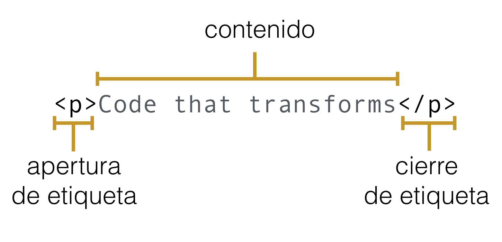

En este ejemplo estamos definiendo un elemento __párrafo__ con la etiqueta ___p___. Este pequeño párrafo tiene un contenido de texto que es ___Code that transforms___.


### Atributos

Un elemento HTML además puede tener varios atributos que lo modifican, especializan, identifican o demás. 

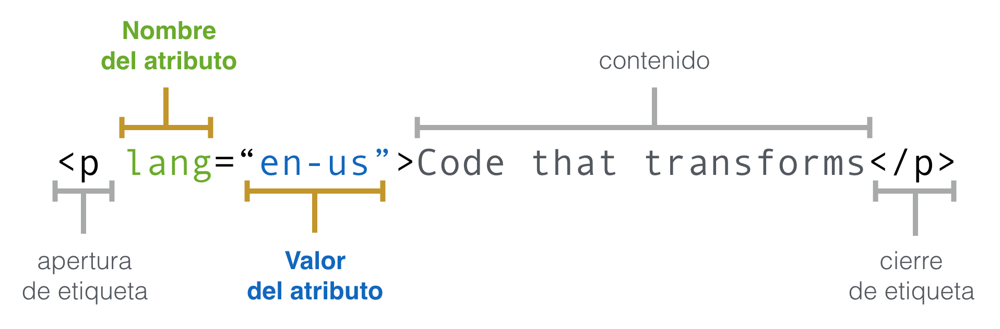

Los atributos nos dan información adicional sobre el contenido de una elemento. En algunos casos agregan características y/o comportamiento a tu elemento HTML. Los atributos aparencen en la apertura de una etiqueta de un elemento de html y consiste de dos partes, un nombre y un valor separados por un signo de `=`. 


### Etiquetas vacías

Algunas etiquetas no tienen directamente contenido, sino que, en algunos casos reciben un fuente de la que obtendrán contenido. Por ejemplo el elemento __imagen__ que creamos con la etiqueta __img__.

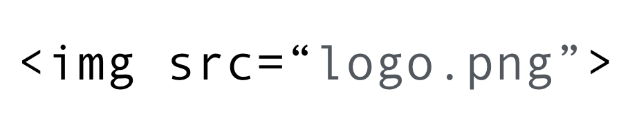

Ese es el caso de la etiqueta __br__

En otros casos crean un comportamiento en si mismas. Es el caso de la etiqueta __br__ que define un salto de línea en el contenido:

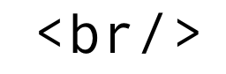

Más adelante vamos a aprender más sobre las versiones de HTML, pero te voy adelantando que en HTML5 ya no es necesario que pongas el __/__ de cierre, por ejemplo el __br__ quedaría como: 

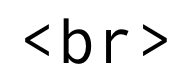


### Anidado de etiquetas

Como recordarás, una etiqueta puede contener en su _contenido_ otras etiquetas o elementos HTML 

Por ejemplo, cuando vimos nuestra primera página web: 

```html
<body>
    <h1>Hola Mundo</h1>
</body>
```

Aquí el elemento __body__ que tiene como objetivo contener el cóntenido de la página web, tiene un elemento anidado o hijo que es el título __h1__. 

Por ejemplo, si definimos una lista no ordenada de frutas: 
```html
<ul>
    <li>fresa</li>
    <li>melón</li>
    <li>naranja</li>
    <li>kiwi</li>
<ul>
```

El __ul__ o _lista no ordenada_ (unordered list) tendrá internamente varios elementos __li__ de la lista. Cada uno de ellos con su propio contenido.  


## Comentarios en HTML


Para definir un comentario recordemos que usamos las etiquetas `<!--` para arbri el comentario y `-->` para cerrar el comentario. 

```html
<ul>
    <li>fresa</li>
    <li>melón</li>
    <li>naranja</li>
    <!-- Este es un comentario y no se verá en mi página web, pero si en mi código. -->
    <li>kiwi</li>
<ul>
```


## Estructura HTML 


Las etiquetas actuan como contenedores de la información que esté entre sus etiquetas de apertura y cierre. 

Si definimos como contenedores, tendremos que :

```html
<!DOCTYPE html>
<html lang="es">
  <head>
    <title>Mi primera página</title>
  </head>
  <body>
    <h1>Hola Mundo!</h1>
    <p>Bienvenidos a mi primera página web</p>
  </body>
</html>
```
Si recordamos, cuando guardes este código en un archivo `index.html` y luego decidas abrirlo con un navegador, ser verá más o menos así: 

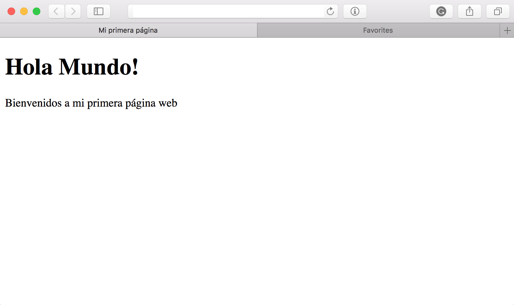

He agregado un poco de CSS para que puedas tener una idea de los contenedores que mencionaba: 

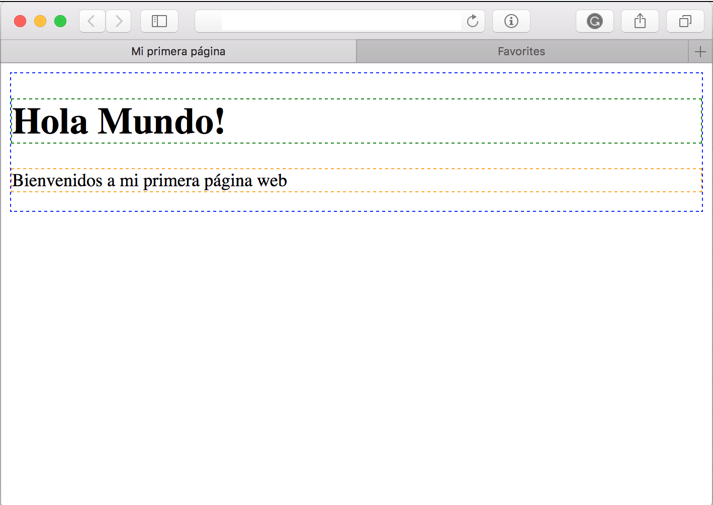


A parte del `<!DOCTYPE html>` que nos dice que el siguiente documento es un documento HTML, las demás etiquetan generan contenedores. Más allá de esos contenedores, es importante recordar que cada una de las etiquetas que vemos arriba tiene un propósito.

El elemento <body> ya lo conoces. Todo lo que este dentro de este elemento se muestra en la vetana del navegador.

Antes del elemento `<body>`, por lo general verás un elemento `<head>`. `<head>` contiene información sobre la página, esta información no se muestra directamente, como el elemento `body`, pero le dice al navegador datos sobre la información que se contendrá, cómo mostrar la página y detalles que la ventana del navegador puede usar. Es el caso del `<title>`, que se mostrará en la barra de título del navegador.  

Veremos un poco más de `head` y otras etiquetas HTML que es importante que conozcas para poder estructurar tu página web.


### Un poco de historia
***

En un momento de la historia de la web, muchas de las estructuras en la web se hacían con tablas, usando la etiqueta `<table>`.

Incluso puedes ver algunos rezagos de estas antigüedades de la web circulando en internet. Por ejemplo este site de [Three Rivers Stadium](http://www.3riversstadium.com/index2.html), si vemos estructura HTML en su contenido notarás que la navegación y todo esta escrito con tablas: 

```html
<!DOCTYPE HTML PUBLIC "-//IETF//DTD HTML 3.0//EN">
<html>

<head>

  <title>Three Rivers Stadium</title>

  <meta NAME="Keywords" CONTENT="Three Rivers Stadium, Pittsburgh, Pennsylvania, stadium, Steelers, Pirates, three rivers">
  <meta NAME="Description" CONTENT="Welcome to the Three Rivers Stadium website.">
  <!--Aquí había varios scripts, que retiré ya que por el momento no vienen al caso-->
</head>
<body BGCOLOR="#000000" TOPMARGIN="15" LEFTMARGIN="11" LINK="#993399" VLINK="#006600" ALINK="#FFCC00">


  <!--*********************************** TOP NAVIGATION *******************************************-->
  <table WIDTH="599" BORDER="0" CELLSPACING="0" CELLPADDING="0">
    <tr ALIGN="LEFT" VALIGN="TOP">
      <td WIDTH="32" BGCOLOR="#000000">
        <br>
      </td>
      <td COLSPAN="3" BGCOLOR="#FFFFFF">
        <br>
        <br>
        <a HREF="index2.html" onMouseOver="return bar('Three Rivers Stadium Home')"
          onMouseOut="return bar('')" TARGET="_top"></a>
        <a HREF="contact/index.html" onMouseOver="img_act('t4'); 
		return bar('Contact Three Rivers Stadium')" onMouseOut="img_inact('t4'); return bar('')" TARGET="_top"></a><a HREF="directions/index.html" onMouseOver="img_act('t5'); return bar('Directions to Three Rivers Stadium')"
          onMouseOut="img_inact('t5'); return bar('')" TARGET="_top"></a>
        <a HREF="search/index.html" onMouseOver="img_act('t6'); return bar('Site Search')" onMouseOut="img_inact('t6'); return bar('')"
          TARGET="_top"></a><br>
        <br>
      </td>
      <td WIDTH="32" BGCOLOR="#000000">
        <br>
      </td>
    </tr>
  </table>
  <!--*********************************** END TOP NAVIGATION ***************************************-->

  <!--*********************************** MIDDLE NAVIGATION ****************************************-->
  <table WIDTH="599" BORDER="0" CELLSPACING="0" CELLPADDING="0">
    <tr ALIGN="LEFT" VALIGN="TOP">
      <td WIDTH="32" BGCOLOR="#000000">
        <br>
      </td>
      <td WIDTH="286" BGCOLOR="#FFFFFF">
        <a HREF="music/index.html"></a><br>
        <a HREF="events/index.html"></a><br>
        <a HREF="sports/index.html"></a><br>
      </td>
      <td BGCOLOR="#FFFFFF">
        
        <a HREF="about/index.html" onMouseOver="img_act('a2'); 
		return bar('About Three Rivers Stadium')" onMouseOut="img_inact('a2'); return bar('')" TARGET="_top"></a><br>
        <br>
      </td>
      <td WIDTH="32" BGCOLOR="#000000">
        <br>
      </td>
    </tr>
    <tr ALIGN="LEFT" VALIGN="TOP">
      <td WIDTH="32" BGCOLOR="#000000">
        <br>
      </td>
      <td COLSPAN="2" BGCOLOR="#000000">
        <br>
      </td>
      <td WIDTH="32" BGCOLOR="#000000">
        <br>
      </td>
    </tr>
  </table>
  <!--********************************** END MIDDLE NAVIGATION *************************************-->

  <!--*********************************** EVENTS/ADVERTISING ***************************************-->
  <table WIDTH="599" BORDER="0" CELLSPACING="0" CELLPADDING="0">
    <tr ALIGN="LEFT" VALIGN="TOP">
      <td WIDTH="32" BGCOLOR="#000000">
        <br>
      </td>
      <td WIDTH="20" BGCOLOR="#FFFFFF">
        <br>
      </td>

      <td WIDTH="495" BGCOLOR="#FFFFFF"><br>
        <br>
        <br>
        <br>
        <hr NOSHADE SIZE="1"> This site has been optimized for <a HREF="http://home.netscape.com/comprod/mirror/client_download.html" TARGET="_top">Netscape 
      3.0 or above</a> and <a HREF="http://www.microsoft.com/ie/download/" TARGET="_top">Internet 
      Explorer 4.0 and above</a>.
        <p> <a HREF="http://home.netscape.com/comprod/mirror/client_download.html" TARGET="_top"></a>
          <a HREF="http://www.microsoft.com/ie/download/" TARGET="_top"></a>
          <br>
          <font SIZE="1">copyright  1998 Three Rivers Stadium.</font> <br>
          <br>
          <font SIZE="1">Site development and management by <a HREF="http://www.h2.com/" TARGET="_top">H2</a></font>
          <br>
          <br>
          <br>
      </td>
      <td WIDTH="20" BGCOLOR="#FFFFFF">
        <br>
      </td>
      <td WIDTH="32" BGCOLOR="#000000">
        <br>
      </td>
    </tr>
  </table>
  <!--********************************* END EVENTS/ADVERTISING *************************************-->
  <br>
  <br>
  <br>
  <!-- * Author-Corporate: H2* Publisher: 		H2 (www.h2.com)* Publisher-Email: 	info@h2.com -->
</body>
```

El resultado en un navegador moderno se ve: 


Este sitio web se creo en 1998. Cerca de 2 décadas después, muchas cosas han cambiado. 

Por ejemplo notarás varias cosas: 
- `DOCTYPE` es de otra versión.
- El uso de atributos para dar estilo y color. 
- Usar los atributos todo en mayúsculas. 
- Y sobre todo, el uso de tabla para definir todas las estructuras. 

Todos estos detalles, hoy en día ya se consideran malas prácticas de desarrollo. 

Cuando el mundo del desarrollo reaccionó y recordó que las tablas están hechas para tabular datos y no para hacer estructuras en la web, surgió toda una "moda" de crear todo con etiquetas `div`. 
También hubo un momento en la vida en que todo se quería hacer con `frameset`, un caso es este [site de Jurassic Park](http://www.lost-world.com/ingen/index.html). 
Tiempos oscuros ahora, pero en su momento podían ser la mejor práctica. 

Regresemos a los `div`, se expandieron y tuvieron varias años para ser la mejor práctica. 
Todo eran `div`s. 
Para darle más sentido y significado a qué hacía dicho `div` los desarrolladores aprovecharon los atributos `class` y `id`.

Surge HTML5 como la nueva versión del estándar de desarrollo y con ello trae nuevas buenas prácticas. Una de las principales características de HTML5 fue reclamar la semántica de los elementos HTML. 

En otros tiempos una estructura HTML y `DIV` podría ser:

```html
<body>
    <div class="header">
    <!-- Aquí iban la navegacion y demás cosas de la cabecera -->
    </div>
    <div class="main">
    <!-- Aquí iba el contenido principal -->
        <div clas="gallery">
        <!-- Aquí imaginemos que va una sección con la galería de imágenes -->
        </div>
        <div class="comments">
         <!-- Aquí imaginemos que va una sección de comentarios -->
        </div>
    </div>
    <div class="side-menu">
    <!-- Aquí iban la navegacion interna del contenido principal. -->
    </div>
    <div class="footer">
    <!-- Aquí nuevamente la navegacion como lista, copyright entre otros en el pie de la página. -->
    </div>
</body>
```

Con algo de CSS, la estructura a la que llegaríamos es:


Con HTML5 tenemos etiquetas que por si mismas indican la función que cumplirá el elemento, por lo que se considera que es más semántico, es decir asociado a significado. Ahora tenemos etiquetas como `<header></header>` para la cabecera, `<section></section>` para indicar que estamos creando una sección en la página. 

Si bien la estructura es parecida a la anterior: 


Las etiquetas ya tienen un significado en si mismas, y como desarrolladores nos da mejor idea de que es lo que esta sucediendo con ese código, que sería: 

```html
<body>
    <header>
    <!-- Aquí iban la navegacion y demás cosas de la cabecera -->
    </header>
    <section class="main">
    <!-- Aquí iba el contenido principal -->
        <section clas="gallery">
        <!-- Aquí imaginemos que va una sección con la galería de imágenes -->
        </section>
        <section class="comments">
         <!-- Aquí imaginemos que va una sección de comentarios -->
        </section>
    </section>
    <aside>
    <!-- Aquí iban la navegacion interna del contenido principal. -->
    </aside>
    <footer>
    <!-- Aquí nuevamente la navegacion como lista, copyright entre otros en el pie de la página. -->
    </footer>
</body>
```

### ¿Por qué necesitamos semántica?

La semántica nos rodean, confiamos en experiencias previas para decirnos cúal es la función de los objetos de cada día; cuando vemos algo, sabemos cuál será su función. Así que, por ejemplo, esperamos la luz roja del semáforo que significa "Pare", y la luz verde del semáforo que significa "avanzar". Algunas se pueden poner confusas rápidamente si se aplican las semánticas incorrectas. 

Conocemos de la luz roja, y la luz verde en el semáforo y entendemos que hacer cuando aparece cada una, porque hemos construído socialmente un ___entendimiento compartido___ de lo que __significa__ para nosotros. 


## Meta data: Head
***

https://developer.mozilla.org/en-US/docs/Learn/HTML/Introduction_to_HTML/The_head_metadata_in_HTML

Como mencionamos, `head` contiene información de la página para el navegador. Esta etiqueta y su contenido no se ven por defecto en el contenido principal del navegador.  Esta información incluye:

### `<title></title>` 
Esta etiqueta despliega el título que verás en la barra de título del navegador.
Solo para aclarar. Puedes ver dónde aparece el contenido de la etiqueta `title` en el navegador.

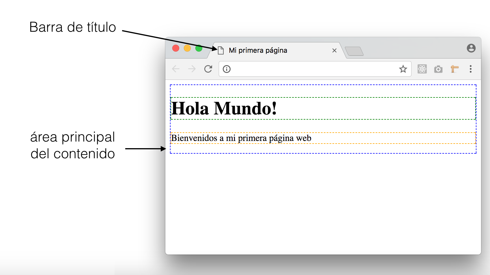

### `<link href="[direccion url de tu hoja de estilos]" rel="stylesheet">`
También encontraras, por lo general, la etiqueta `link` que genera un vínculo entre la página y otros recursos. Puedes revisar la [documentacion de link que tiene disponible MDN](https://developer.mozilla.org/es/docs/Web/HTML/Elemento/link). Por lo general lo usamos para _stylesheets_ (hojas de estilos). Hay algunos atributos que sería importante que conozcas:
    
#### `href`
Indica la dirección url donde se encuentra el recurso que vamos vincular.

#### `rel`
Este atributo indica que tipo de relación tiene el recurso que estamos vinculando respecto a nuestra página. Para hojas de estilos usamos el valor _`stylesheet`_, pero existen otros valores como _copyright_, _lincense_, _help_, _author_, entre otros. 

#### `type`
Nos ayuda a especificar el tipo de archivo que que vincularemos. Para el caso de hojas de estilos este valor muchas veces se omite, pero el oficial es usar: _`text/css`_. Para otro tipo de recursos, [necesitarás otros types](http://www.iana.org/assignments/media-types/media-types.xhtml).

#### `media` 
Este atributo nos permite decirle al navegador para que tipos de medios físicos estará disponible el recurso. Tú, yo, viendo esto en una computadora desktop en un navegador, o en un celular, estaríamos usando un media conocido como _`screen`_, pero hay otros media, como _`print`_ que usamos para indicar que este será usado para impresiones (pdf o impresoras). También otro bastante usado es el _`speech`_ para lectores para personas con discapacidad visual. También [puedes unir este atributo a otros con los que especificar más el medio](https://www.w3schools.com/tags/att_link_media.asp) al que dirijes el recurso. 

### `<meta>` 
Es una etiqueta vacía. En sus atributos recibe información sobre la información de la página web. Hay variada información que puedes incluir con esta etiqueta y no es raro que la encuentres varias veces en el `head` con diferentes datos. Algunos de los datos esenciales-más importantes que indicar son: 
#### `charset__: 
Indica el sistema de caracteres que usaremos en la web. Por lo general usamos en esta atributo el valor `utf-8` que es el estándar de caracteres más usado ya que incluye letras, número, tildes, letras del alfabeto frances, español, ruso entre otros. En tu HTML tendras este meta: `<meta charset="utf-8">`
#### `name` y  `content`: 
Usamos estos dos atributos juntos especificar diferentas datos que son útiles para guardar, búsquedas desde buscadores como Google o Bing, además de apoyo para vistas en redes sociales.
        
_`name`_ nos ayuda a identificar la información que vamos a poner, por ejemplo si vamos a poner el autor de la página tendremos `name="author"` y con _`content`_ indicaremos la información que corresponde al autor, por ejemplo: `content="Laboratoria"`. El meta sería: `<meta name="author" content="Laboratoria">`. 

Otros valores que puedes usar en  que puedes usar en `name` incluyen _description_ (descripción de la páginas para los buscadores), _generator_ (indicar con que producto, tecnologias se generó esta página), _keyworkds_ (palabras clave que responden al contenido de la página). 

Existen otros valores de `name` que si bien no son oficiales, son bastante usados: _viewport_ (puede modificar cómo se verá la web, usualmente usado para dispositivos móviles), _creator_ (similar a autor, pero asociado al creador de la página), _robots_, _googlebot_ , _slurp_. Estos tres últimos están relacionados a información que queremos darle a los robots que actualizan los índices de los buscadores. 

#### `property` y `content`: 
Similar al dúo `name` y `content`, por lo general usamos este dúo dinámico para dar información, por lo general, asociada a diferentes redes sociales. Un ejemplo es el caso de qué información queremos que se muestre en __Facebook__ si usaremos:

```html
<!-- 
    <meta property="og:image" content="http://[URL DE LA IMAGEN QUE QUEREMOS MOSTRAR]">
    
    <meta property="og:description" content="[Descripción que aparecerá en la pubicación]">
    
    <meta property="og:title" content="[Título que tomaría la publicación]">

-->
    <meta property="og:url" content="http://laboratoria.la">
    <meta property="og:title" content="Laboratoria">
    <meta property="og:description" content="Laboratoria is a tech social enterprise that empowers young women from low-income backgrounds by giving them access to education and work in the digital sector. ">
``` 

Cuando compartamos la página que tiene este código, en Facebook, obtendremos algo como lo que sigue:


Twitter tiene también su propio estándar para propiedades que usará en caso de publicación. 

Como ves, la etiqueta meta especificará bastante información sobre tu página web. Puedes ver más en la [documentación de la etiqueta `meta`](https://developer.mozilla.org/en-US/docs/Web/HTML/Element/meta).

### `script` 
Es otra etiqueta que verás y por lo regular la usamos para vincular archivos de JavaScript. Pero eso lo veremos más adelante. 

Tal y cómo vimos, `head` entonces sera en contenedor de variada información sobre nuestra página. Puede ver más en este [artículo de MDN](https://developer.mozilla.org/en-US/docs/Learn/HTML/Introduction_to_HTML/The_head_metadata_in_HTML) al respecto.  


## Principales etiquetas

De hecho existen montones de etiquetas que puedes usar, y podemos dividirlas entre etiquetas que definen estructura y etiquetas que definen contenido.  

### Etiquetas de estructuras

Las etiquetas de estructura nos ayudan a definir los grandes contenedores en donde organizaremos el contenido de nuestra página web. 

Aparte de las ya conocidas `head`y `body`, veamos otras etiquetas que nos apoyarán en generar estructura en el contenido dentro de `body`. 

#### `div`: 
Define una división de la página web. Es uno de los  más usados para definir contenedores para estructura. 

Si bien las siguientes etiquetas funcionan como un `div`, la semántica juega un papel importante y deberías usarlas cuando creas que es necesario. 

#### `header`: 
Significado de que lo que va dentro de este contenedor es parte de la _cabecera_ de nuestra página web. 

#### `section`: 
Nos ayuda a definir secciones de nuestra página web para las que luegos especificar a que se van a especializar. 

#### `aside`: 
Define una sección lateral en la que por lo general va navegación o datos extra sobre el propio contenido.

#### `main`: 
Este contenedor tendra el contenido principal de la página web.

#### `article`: 
Esta sección define contenido que será actualizado regularmente. La característica principal de `article` es que el contenido que irá aquí debe hacer sentido por si mismo, sin necesidad de las otras secciones. Puede haber uno o varios `article` dentro de algún `section`, pero también puede ser a la inversa.

#### `footer`: 
Footer se refiere al pie de la página web, por lo general en esta sección irán algunos links importantes, el copyright, y/o incluso datos de contacto. 

#### `nav`: 
Por lo general esta etiqueta esta anidada en algunas de las estructuras de `header`, `aside` o `footer`. Nos indica que el contenido que tiene ayuda a la navegación de la página, conteniendo vínculos por ejemplo.

#### `address`
Que por lo general se usa para poner información de contacto. Funcina como un bloque y puedes poner variada información dentro de él. 

  

### Etiquetas de contenido

Podríamos usar todas las etiquetas de estructura, pero lo que da forma y esencia a una página web es el contenido que tiene. 

#### Textos
    
Para el caso de textos tenemos varias etiquetas.
    
##### Headlings o Cabeceras

Estas etiquetas dan un sentido jerárquito a los títulos y subtítulos. Las etiquetas son:

```html
    <h1>H1</h1>
    <h2>H2</h2>
    <h3>H3</h3>
    <h4>H4</h4>
    <h5>H5</h5>
    <h6>H6</h6>
```
Estós títulos se van a renderizar como: 

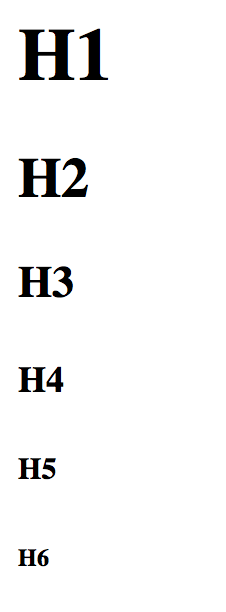

Donde H1 es el título de mayor jerarquía, y H6 el de menor jerarquía.

##### Párrafos
      
Los párrafos los definimos con la etiqueta `<p></p>`. Como tal, define un bloque te texto.

Por ejemplo, este párrafo:

```html
<p>Space, the final frontier. These are the voyages of the starship Enterprise. Its continuing mission: to explore strange new worlds, to seek out new life and new civilizations, to boldly go where no one has gone before!<p>
```

Se verá como: 
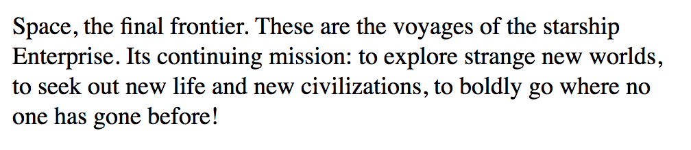

###### `pre`:
A veces el formato del párrafo, en el que texto sigue su flujo, no es conveniente para lo que necesitamos. En ese caso podemos usar `pre` que estila tal y como lo dejaste en el código. 

```html
    <strong>Invictus</strong>
    <pre>
    Fuera de la noche que me cubre,
    Negra como el abismo de polo a polo,
    Agradezco a cualquier dios que pudiera existir
    Por mi alma inconquistable.
    En las feroces garras de las circunstancias
    Ni me he lamentado ni he dado gritos.
    Bajo los golpes del azar
    Mi cabeza sangra, pero no se inclina.
    Más allá de este lugar de ira y lágrimas
    Es inminente el Horror de la sombra,
    Y sin embargo la amenaza de los años
    Me encuentra y me encontrará sin miedo.
    No importa cuán estrecha sea la puerta,
    Cuán cargada de castigos la sentencia.
    <em>Soy el amo de mi destino:
    Soy el capitán de mi alma.<em>
    </pre>
    <em>William Ernest Henley</em>
```

Cuando lo veamos en nuestra página web, se verá así:

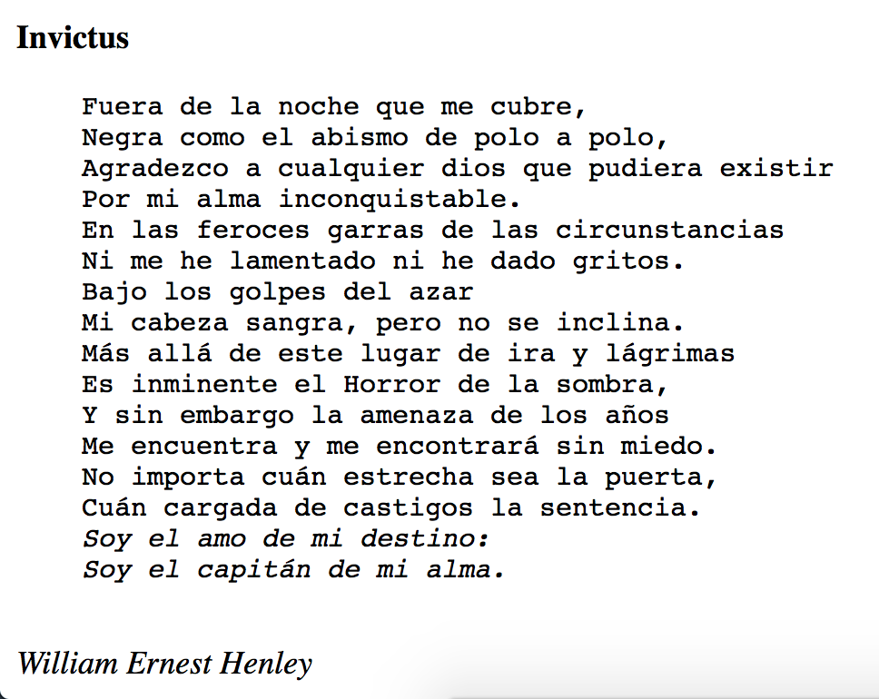

###### `strong` 
        
Usamos `strong` para dar importancia a tun texto. Puedes usarlo dentro de un párrafo. 

###### `em`
Al igual que `strong` ayuda a dar importancia a un texto, aunque su estilo es diferente y más suave. Vienen de _"emphasis"_, o énfasis en español. 

###### `span`

Aloja un pedazo de texto al que luego puedes estilar como prefieres específicamente. 
`<span>Palabra</span>`

###### `mark`

Funciona como un resaltador en la web. Dando un color restaltante a lo que indicamos entre sus etiquetas. 

```html
    <p>Space, the final frontier. These are the voyages of the starship Enterprise. Its continuing mission: <mark>to explore strange new worlds, to seek out new life and new civilizations, to boldly go where no one has gone before!</mark><p>
```
Se verá como: 

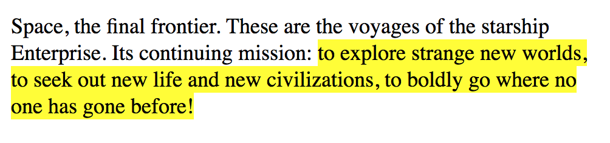

###### `abbr`
       
Define abreviaciones o acrónimos. La ventaja de usar `abbr` es que al dejar el cursor, se mostrará el título adecuado de dicha abreviatura. 

```html
    <p>En esta lectura veremos todo sobre <abbr title="HiperText Markup Language">HTML</abbr>para construir tu página web</p>
```
Notarás en la imagen cómo es que se ve, con un pequeño tooltip, el texto sin abreviar. 

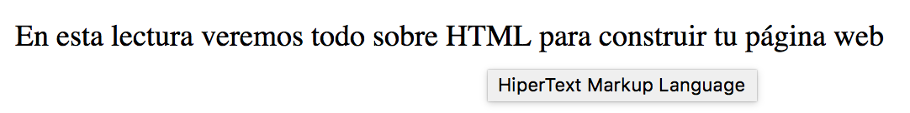 

Hay algunas otras que puedes revisar en la documentación de MDN.    

##### Citas

Para citas, podemos usar dos etiquetas, la primera es `q` que nos dará la posibilidad de introducir citas en el mismo párrafo. Para citas más complejas que merecen su propio párrafo y descripción de la fuente, tenemos `blockquote`. Hay momentos en que sólo queremos nobrar el título del trabajo que inspira esas líneas, en ese caso usamos `cite`. 

Veamoslo con un pequeño ejemplo:

```html
<blockquote>
    <p>(...)Se necesita mucha confianza para admitir que necesitas ayuda. Como Q le había dicho Picard después de que Picard pidiera ayuda, <q>fue una admisión difícil, otro hombre habría sido humillado al decir esas palabras, otro hombre habría muerto antes que pedir ayuda</q>. ¿Cuántos de nosotros hemos estado en proyectos condenados porque el líder del proyecto era demasiado orgulloso o demasiado ciego para pedir ayuda?(...)</p>       
    <footer>Es parte del artículo <cite>Five Leadership Lessons From Jean-Luc Picard</cite> por <em>Alex Knapp</em> de <strong>Forbes<strong></footer>    
</blockquote>
```

En este ejemplo estamos citando una parte de un artículo, como es una parte completa del artículo, estamos incluyendolo en `blockquote`. Notarás que dentro del artículo se hace referencia a la una frase de Picard. Para citar dicha frase estamos usando `q` que nos permite seguir con el párrafo sin interrumpir el flujo del contenido. 
Hay algo extra. El uso de `footer` nos permite separar semánticamente la referencia del contenido de la cita. Podríamos usar otra etiqueta, pero `footer` es la que hace más sentido semántico. Por último, indicamos el trabajo, en este caso, artículo de donde obtuvimos esta cita, y enfatizamos el autor y la fuente. 

El resultado, será parecido al que sigue: 

 
    


##### Listas

Tenemos dos tipos de listas, las listas ordenadas y las no ordendas. 
Las listas se componen del un elemento `<ul></ul>` para listas no ordenadas u `<ol></ol>` para listas ordendas. Este elemento anidará a los elementos de la lista que se limitan con la etiqueta `<li><li>`.

```html
    <!-- listas ordenadas -->
    <ul>
        <li>Lima</li>
        <li>Arequipa</li>
        <li>Santiago de Chile</li>
        <li>Ciudad de Mexico</li>
        <li>Guadalajara</li>
    </ul>
    <!-- listas ordenadas -->
    <ol>
        <li>Lima</li>
        <li>Arequipa</li>
        <li>Santiago de Chile</li>
        <li>Ciudad de Mexico</li>
        <li>Guadalajara</li>
    </ol>
```

Que se verán así: 

 

###### `ol`
    
En el caso de la _lista ordenada_ `ol`, puedes especificar el tipo de numeración escogiendo entre los diferentes valores del atributo `type`. Dependiendo de cada valor la numeración varía. Por defecto el valor es `type="1"`, por eso ves los números por defecto.

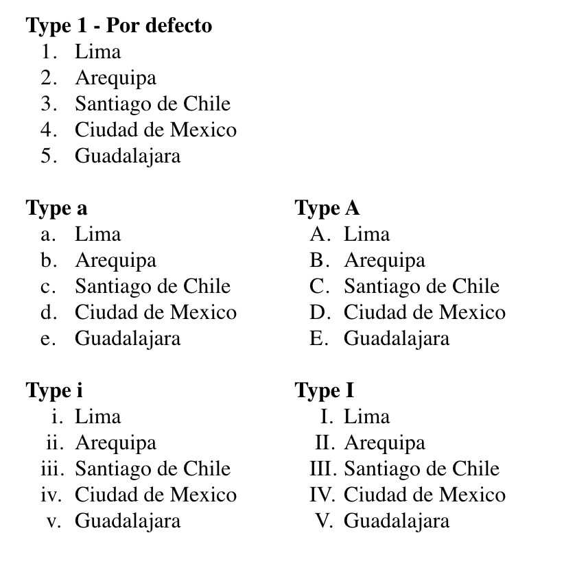 


###### `ul`

En el caso de las listas _no ordenadas_ `ul`, podemos cambiar el símbolo a través de una propiedad que veremos en CSS llamada `list-style-type`. 

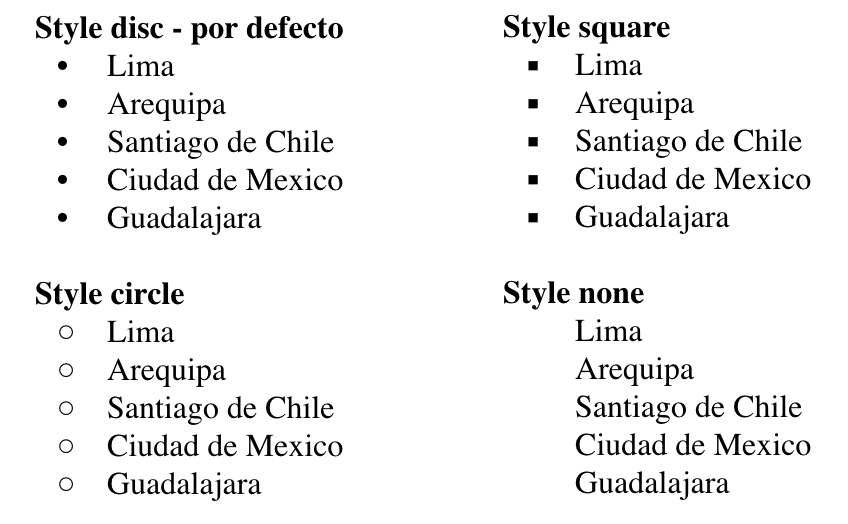 


###### Listas de definiciones

Estas listas son especificas para usar en terminos y sus definiciones

```html
<dl>
    <dt>Rock</dt>
    <dd>[...]</dd>
    <dt>Pop</dt>
    <dd>[...]</dd>
    <dt>Musica electrónica</dt>
    <dd>[...]</dd>
    <dt>Rap</dt>
    <dd>[...]</dd>
    <dt>Reggae</dt>
    <dd>[...]</dd>
</dl>
``` 

Por ejemplo se verá: 

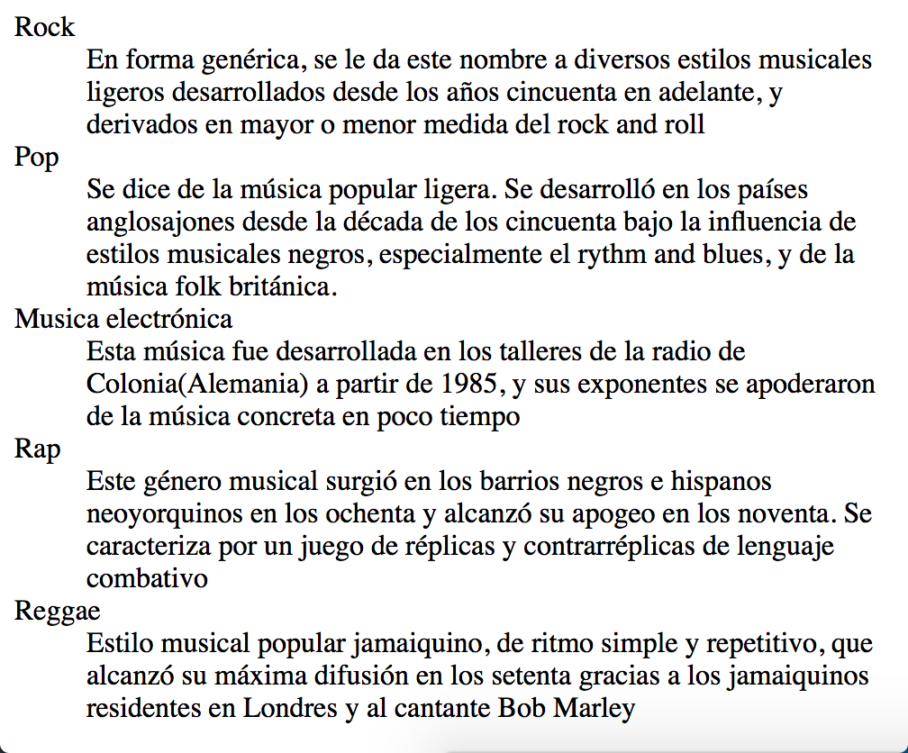 

#### Links

Para crear un hipervínculos usamos la etiqueta `<a></a>`. 

Un link típico se ve como:

```html
    <a href="http://laboratoria.la" target="_blank">Laboratoria</a>
```

Notarás 2 atributes. 

###### `href` 
Nos dice que recurso, página, vinculará ese link. Aquí puedes poner links externos, como el del ejemplo, o puedes poner links a otras páginas de tu sitio, por ejemplo si quieres ir al admin de tu propio sitio web `href="/admin"` creará un link que te lleve a esa dirección. 

###### `target` 
Nos permite decirle al navegador, cómo o donde abrirá el link que hemos creado. Tiene varios valores determinados: 

###### `_blank`:
Abre el documento en una nueva ventana o tab. 
###### `_self`:
este es el valor por defecto y abre el documento en el tab o ventana actual.
###### `_parent`:
Abre el link en un fragmento padre (Probablemente no tengas que usarlo).
###### `_top`:
Abre el link en todo el cuerpo de la ventana(Probablemente no tengas que usarlo). 
###### `framename`:
Abre el link en el frame con el nombre indicado, ya no se usa. Se usaba en el tiempo en que usabamos `frameset` para hacer estructuras en la página web. 

Los vínculos tienen estados, hablamos de un link:

###### _no visitado_:
En este caso el link se verá en fuente azul y con subrayado. 
###### _visitado_:
Cuando la página que vincula al link ya ha sido visitada antes. 
###### _activo_:
Un link esta activo desde el momento que empezamos el tap o click hasta que soltamos la pantalla o el mouse. Por lo general esta representado con letras y subrayado rojo. 

 

#### Imágenes

Para incluir imágenes como contenido usamos la etiqueta ``. Esta es una etiqueta vacía. Tiene varios atributos con los que puedes manipular cómo llamar a la imagen, dimensiones entre otros. 

Los principales atributes de `img` son: 

###### `src`: 
Este atributo nos permite especificar la fuente o la dirección en donde se encuentra la imagen que vamos a mostrar. Soporta varias extensiones. 

###### `alt`_: 
Aquí especificamos el texto alternativo que se mostrará en caso el navegador no pueda cargar la imagen desde la fuente que indcamos. 

Por ejemplo si quiero incluir una imagen: 

```html
    
```

En caso la imagen no existiera,en el navegador Chrome, solo mostrará el texto alternativo:

 

Pero si la imagen existe, si se mostrará: 

     

Puedes poner imágenes como contenido de etiquetas `a`, `p`, o dentro de otras etiquetas. 

Otro atributo de `img` que cada vez se usa más es `srcset`. A través de este atributo, indicamos una serie de imagenes para aplicarse a diferentes resoluciones de pantalla, pero verás más de esto cuando veamos web responsive. Puedes ver otros atributos en la [documentación de MDN de img](https://developer.mozilla.org/en-US/docs/Web/HTML/Element/img).


#### Tablas

Lo ideal es usarlas para lo que fueron creadas, tabular información. Las tablas son estructuras en sí mismas. 

Iniciamos una etiqueta principal: `<table></table>`. Dentro de esta etiqueta enc

Hay varias etiquetas que anidar: 

###### `<tr>` 
Nos permite definir las files que tendra nuestra tabla.

###### `<th>` 
Definiremos una celda de cabecera. 

###### `<td>` 
Crea una celda. 

Con estas etiquetas ya podemos crear varias formas de tablas. Por ejemplo esta tabla:

```html
    <table>
        <tr><th>Programa</th><th>Fecha de Inicio</th><th>Fecha de Fin</th><th>No. de Misiones tripuladas</th><th>Notas</th></tr>
        <tr><td>Mercury program</td><td>1959</td><td>1963</td><td>6</td><td>Primera misión estadounidense tripulada</tr>
        <tr><td>Gemini program</td><td>1963</td><td>1966</td><td>10</td><td>Program used to practice space rendezvous and EVAs</tr>
        <tr><td>Apollo program</td><td>1961</td><td>1972</td><td>11[a]</td><td>Llevar el primer hombre a la luna</tr>
        <tr><td>Skylab</td><td>1973</td><td>1974</td><td>3</td><td>Las misiones tripuladas solo se dieron en 1973 y 1974; primera estación espacial americana</tr>
        <tr><td>Apollo-Soyuz</td><td>1975</td><td>1975</td><td>1</td><td>Junto a la unión soviética</tr>
        <tr><td>Shuttle-Mir Program</td><td>1995</td><td>1998</td><td>9[b]</td><td>Partnership con Rusia</tr>
        <tr><td>Project Constellation</td><td>2003</td><td>2010[4]</td><td>0</td><td>Programa cancelado. Buscaba llevar humanos a la Luna de nuevo, a Marte y más allá</tr>
        <tr><td>Space Shuttle</td><td>1981</td><td>2011</td><td>135</td><td>Primera misión donde se reusó cohetes</tr>
        <tr><td>International Space Station</td><td>1998</td><td>Ongoing</td><td>44</td><td>Junto a Rusia, Canada, Estación Espacial Europea, y JAXA(Agencia espacial Japonesa). Cooperan la agencia espacial italiana ASI y brasileña AEB.</td></tr>
    </table>
```
Si intentas el código anterior, puede que no veas ningún borde, porque esto requiere que uses el atributo `border="1"` para que se vea. De igual manera no es recomendable ya que puedes manejar los borders y colores de mejor manera usando CSS. 
En mi caso se ve como sigue: 

    


Cuando tenemos tablas más complejas, podemos usar `thead` (zona de cabecera), `tbody`(zona de contenido), `tfoot`(zona de pie), para agrupar celdas y filas en la tabla. Además los atributos `colspan` y   `rowspan` para indicar cuandas columnas o filas, respectivamente va a ocupar una celda, úsalo si van a usar más de 1. 

Por ejemplo, si hacemos un poco más compleja la tabla anterior.

```html
    <table>
        <caption>Programas espaciales de NASA</caption>
        <thead>
            <tr><th rowspan="2">Programa</th><th colspan="2">Fechas</th><th rowspan="2">No. de Misiones tripuladas</th><th rowspan="2">Notas</th></tr>
            <tr><th>Inicio</th><th>Fin</th></tr>    
        </thead>
        <tbody> 
            <tr><td>Mercury program</td><td>1959</td><td>1963</td><td>6</td><td>Primera misión estadounidense tripulada</tr>
            <tr><td>Gemini program</td><td>1963</td><td>1966</td><td>10</td><td>Program used to practice space rendezvous and EVAs</tr>
            <tr><td>Apollo program</td><td>1961</td><td>1972</td><td>11[a]</td><td>Llevar el primer hombre a la luna</tr>
            <tr><td>Skylab</td><td>1973</td><td>1974</td><td>3</td><td>Las misiones tripuladas solo se dieron en 1973 y 1974; primera estación espacial americana</tr>
            <tr><td>Apollo-Soyuz</td><td>1975</td><td>1975</td><td>1</td><td>Junto a la unión soviética</tr>
            <tr><td>Shuttle-Mir Program</td><td>1995</td><td>1998</td><td>9[b]</td><td>Partnership con Rusia</tr>
            <tr><td>Project Constellation</td><td>2003</td><td>2010[4]</td><td>0</td><td>Programa cancelado. Buscaba llevar humanos a la Luna de nuevo, a Marte y más allá</tr>
            <tr><td>Space Shuttle</td><td>1981</td><td>2011</td><td>135</td><td>Primera misión donde se reusó cohetes</tr>
            <tr><td>International Space Station</td><td>1998</td><td>Ongoing</td><td>44</td><td>Junto a Rusia, Canada, Estación Espacial Europea, y JAXA(Agencia espacial Japonesa). Cooperan la agencia espacial italiana ASI y brasileña AEB.</td><tr>
        </tbody>
        <tfoot>
            <tr><td colspan="5">Continuará</td></tr>
        </tfoot>
    </table>
```

Notarás que en `thead` hemos anidado las filas `tr` que contienen cabeceras. Hemos agregado un `tbody` para agrupar la información. Además un `tfoot` con un pequeño mensaje. También tendré un `caption` que nos permite decir en algunas palabras qué información se mostrará en la tabla.

Si intentas el código anterior, puede que no veas ningún borde, porque esto requiere que uses el atributo `border="1"` para que se vea. De igual manera no es recomendable ya que puedes manejar los borders y colores de mejor manera usando CSS.

Por último, se verá como sigue: 

  

#### Formularios


Los formularios nos ayudan a interactuar y obtener información de los usuarios. De hecho haz llenado algún formulario antes, desde el formulario de admisión, pasando por tu regisro y login de redes sociales, y hasta el registro y login de tu correo electrónico. 

Los formualarios tienen un marqueje especial con sus propias etiquetas. La principal es `<form></form>` que nos ayuda a definir el formulario.

La principal etiqueta para obtener información del usario es la etiquta `<input>`. Esta es una etiqueta vacía que indica que se mostrará un campo donde el usuario podrá ingresar información. Como se usa para introducir diferentes tipos de información, un atributo que no podemos evitar poenr es el tipo de input que será nuestro elemento: 

Todos navegadores soportan `type` con valores `text` para texto, `password` para texto encubierto, `submit` para el botón de enviar, `reset` para tener un botón que limpie los datos del formulario, 

Un formulario básico tendrá:
```html
<form action="login">
    <label for="field1" >Nombre</label><input name="field1"type="text"><br>
    <label for="field2" >Contraseña</label><input name="field2"type="password"><br>
    <label for="field7" ></label><input name="field7"type="submit"><br>
    <label for="field8" ></label><input name="field8"type="reset"><br>
</form>
```
En este caso he puesto unos `br` solo para darle salto de línea a los elementos. 

Que se verá un poco como sigue: 

 

Si ejecutas ese formulario, verás que al dar click en `submit` el formulario intentará enviar la información. El botón `reset` limpiará los campos. Cuando llenes algunos datos en el formulario, verás como en el caso de `type="password` los caracteres se ocultan. 

 

Hay otra cosa que notarás, la etiqueta `<label>`. Esta etiqueta nos ayudará  a darle más información al usuario al indicarle que datos se esperan. Con el atributo `for` podemos asociar un `label` al campo al que se refiere, en este caso un `input`. 

##### `input`
Hay más tipos de inputs. Algunos requieren un tratamiento extra a través de otras etiquetas o asociando a través de atributos.

###### `input type="radio"`
 El input tipo radio, se refiere a Radio Button. Están diseñados para que el usuario elija 1 opción entre varias.

```html
<form action="update">
        <p>Elija su nivel de instrucción</p>
        <input type="radio" id="instruction-level-1" name="instruction-level" value="undegraduate">
        <label for="instruction-level-1">Undegraduate</label>
        <input type="radio" id="instruction-level-2" name="instruction-level" value="graduate">
        <label for="instruction-level-2">Graduate</label>            
        <input type="radio" id="instruction-level-3" name="instruction-level" value="master">
        <label for="instruction-level-3">Master</label>
        <input type="radio" id="instruction-level-4" name="instruction-level" value="doctor">
        <label for="instruction-level-4">Doctor</label>
        <br>
        <button type="submit">Enviar</button>
    </form>
```

 

Si pruebas el código anterior, notarás que sólo puedo seleccionar una de las opciones a la vez. La forma en que se asocian todos los radio button para indicar que corresponden a seleccionar un sólo valor es gracias al atributo `name`. 

###### `input type="checkbox"`
El input tipo checkbox esta diseñado para darte varias opciones y que puedas seleccionar más de una. 

```html
    <form action="update">
        <p>Elige tus géneros de películas favoritos</p>
        <input type="checkbox" id="favorite-genre-1" name="favorite-genre" value="romance">
        <label for="favorite-genre-1">Romance</label>
        <input type="checkbox" id="favorite-genre-2" name="favorite-genre" value="comedy">
        <label for="favorite-genre-2">Comedy</label>
        <input type="checkbox" id="favorite-genre-3" name="favorite-genre" value="horror">
        <label for="favorite-genre-3">Horror</label>
        <input type="checkbox" id="favorite-genre-4" name="favorite-genre" value="thriller">
        <label for="favorite-genre-4">Thriller</label>
        <input type="checkbox" id="favorite-genre-5" name="favorite-genre" value="sciencefi">
        <label for="favorite-genre-4">Science Fiction</label>
        <input type="checkbox" id="favorite-genre-6" name="favorite-genre" value="action">
        <label for="favorite-genre-4">Action</label>
        <br>
        <button type="submit">Enviar</button>
    </form>
```

 

Otros tipos de input son: 

###### `input type="file"`
Que nos sirve para que el usuario seleccione archivos en su computador. Por ejemplo, su código se verá cómo: 

```html
    <form action="update">
        <input type="file" name="archivo" id="file-field">
        <button type="submit">Enviar</button>
    </form>
```

Y en funcionalidad lo veremos comportarse cómo:

 


Puedes restringir que tipos de archivos puede subir el archivo usando el atributo `accept` y en el mismo indicar que extensiones de archivos acepta. Puedes ver más en la [documentación de MDN sobre el input file](https://developer.mozilla.org/en-US/docs/Web/HTML/Element/input/file).
            

###### `input type="hidden"`
En el caso de hidden, este campo no lo podrá ver usuario, pero el valor que pongas aquí igualmente viajará con los demás datos que ponga el usuario. 

###### `input type="image"`
En realidad sirve para crear un botón funciona igual que el `submit`. El detalle es que este botón nos permite costumizarlo usando una imagen que le indicamos en el atributo `src`. Además debes ponerle dimensiones, ya sea con HTML con los atributos `height` y `width`, o con CSS.

Existen otros input types que se establecieron gracias a HTML5.

###### `input type="color"`
Despliega un elemento de seleccion, de manera que puedas elegir un color. Recibe un texto que represente un colo. 

###### `input type="date"`
Este control es para ingresar la fecha, Año, mes y día, sin hora. 

###### `input type="datetime-local"`
Para ingresar la fecha y hora, sin indicar la zona horaria. 

###### `input type="email"`
Para ingresar y validar correos electrónicos.

###### `input type="month"`
Un control para ingresar un mes y año, sin zona horaria.

###### `input type="month"`
Un control paa  ingresar números.

###### `input type="tel"`
Para ingresar y validar números de teléfono. 

###### `input type="range"`
Te ayuda a ingresar números de teléfono en el caso en que el número exacto no es tan importante. 

###### `input type="week"`
Sólo esta soportado por Chrome por el memento, pero te permite elegir una seman, sin zona horaria. 

###### `input type="month"`
Al igual que `week` sólo esta soportado con Chrome y tiene como característica que te permite elegir un mes en algún año. 

###### `input type="search"`
Usualmente se comporta sólo como `text` y se le pone a formularios de búsqueda.

###### `input type="number"`
Permite seleccionar o ingresar un número. 

Puedes revisar la documentación sobre [input en MDN](https://developer.mozilla.org/en-US/docs/Web/HTML/Element/input)

##### `select`

Los `select` son otros elementos que nos ayudan a ofrecerle oopciones a los usuarios. En este caso le presentas una lista de opciones de las que puede elegir. 

```html
    <form action="">
        <p>Selectiona tu Persona de Macbeth</p>
        <select name="" id="">
            <option value="macbeth-1">Duncan – King of Scotland</option>
            <option value="macbeth-2">Malcolm – Duncan's elder son</option>
            <option value="macbeth-3">Donalbain – Duncan's younger son</option>
            <option value="macbeth-4">Macbeth – a general in the army of King Duncan; originally Thane of Glamis, then Thane of Cawdor, and later King of Scotland</option>
            <option value="macbeth-5">Lady Macbeth – Macbeth's wife, and later Queen of Scotland</option>
            <!-- ... más opciones -->
        </select>
    </form>
```

Se verá cómo: 

 

También puedes agregar un elemento `option` sin valor `value` al inicio para que sea el primero el verse antes de seleccionar nada. 

 


También anidar varios `option` en un `optgroup` que te permite agruparlos de alguna manera que haga sentido con la información. 

 

El detalle especial con respecto a `select` es que sólo puedes escoger los valores que te ofrece, ninguno más o menos. Puedes decirle que se puede elegir más de una opción de la lista, pero nada más. 

##### `datalist`
Incluído en HTML5. Este campo se compone de dos partes. Un `input`, y la lista de opciones. Si bien el usuario puede elegir alguna de las opciones, la que hace diferente `datalist` de `select` es que en caso se requiera, el usuario puede ingresar otro valor, diferente a los disponibles. 

Por ejemplo para código: 

```html
    <input list="personajes" name="personaje">
    <datalist id="personajes">
        <option value="Duncan – King of Scotland">
        <option value="Malcolm – Duncan's elder son">
        <option value="Donalbain – Duncan's younger son">        
        <option value="Third Apparition – crowned child">
        <option value="Attendants, Messengers, Servants, Soldiers">
        <!-- Aquí hay muchas más opciones -->
    </datalist>
```

Que funcionando se verá como: 

 

Puedes ver más de [Datalist en MDN](https://developer.mozilla.org/en-US/docs/Web/HTML/Element/datalist)

##### `textarea`
Es un input en que puedes ingresar gran cantidad de caracteres. Por lo general se recomienda si el texto que va a ingresar el usuario podría tener varías líneas. En código:

```html
    <label for="texto">Tell me about Spacce</label><br>
    <textarea rows="6" cols="80" name="texto"></textarea>
``` 

 

Puedes ver más de [Textarea en MDN](https://developer.mozilla.org/en-US/docs/Web/HTML/Element/textarea), incluyendo las propiedades de `rows` y `cols`, que indican al navegador el tamaño con el que deberá aparecer como mínimo. 

    
##### `fieldset`: 
Si bien no es una forma de agregar información, nos ayuda a indicarle a un usuario que algunos campos están relacionados. 

```html
    <form action="">
        <fieldset>
            <legend>Datos Personales</legend>
            <label for="name">Nombres:</label><input type="text" name="name" id="name" placeholder="ej. John">
            <br>
            <label for="lastname">Apellidos:</label><input type="text" name="lastname" id="lastname" placeholder="ej. Doe">
            <br>
            <label for="phone">Teléfono:</label><input type="tel" name="phone" id="phone" placeholder="ej. +5190000000">
        </fieldset>
    </form>
```

Que se mostrará  como: 

 

Recuerda usar la etiqueta `legend` junto a `fieldset`. `legend` te permite darle un título que describa al grupo de campos que tienes agrupados por el `fieldset`. 

### HTML5

## Block vs in-line

Notarás que en varios de los ejemplos tuve que agregar un elemento `br` para indicar una nueva línea, esto debido a que algunos elementos suelen usar sólo el espacio que requieren para su contenido y no necesitan más epacio, por lo que otro elemento de similares características puede seguir al costado del primero, si el espacio le alcanzara. A estos elementos se les denomina __`inline`__.

Por ejemplo, si en los elementos de `fieldset` retiramos todos los `br`, tendríamos las siguientes características. 

```html
        <form action="#">
            <fieldset>
                <legend>Datos Personales</legend>
                <label for="name">Nombres:</label><input type="text" name="name" id="name" placeholder="ej. John">
                <label for="lastname">Apellidos:</label><input type="text" name="lastname" id="lastname" placeholder="ej. Doe">
                <label for="phone">Teléfono:</label><input type="tel" name="phone" id="phone" placeholder="ej. +5190000000">
            </fieldset>
        </form>
```

Por lo que al mostrarse se verá como: 

 

Notarás, como mencionaba, que los elementos tratan de acomodarse uno al costadao del otro tan pronto tengan espacio.

Los elementos inline son:
- `<a>`
- `<b>`
- `<big>`
- `<i>`
- `<small>`
- `<tt>`
- `<abbr>`
- `<acronym>`
- `<cite>`
- `<code>`
- `<dfn>`
- `<em>`
- `<kbd>`
- `<strong>`
- `<samp>`
- `<time>`
- `<var>`
- `<bdo>`
- `<br>`
- ``
- `<map>`
- `<object>`
- `<q>`
- `<script>`
- `<span>`
- `<sub>`
- `<sup>`
- `<button>`
- `<input>`
- `<label>`
- `<select>`
- `<textarea>`

Los elementos inline, pueden contener otros inline sin generar un salto de línea. 

Pero, hay otros elementos que son solo ser declarador generan una nueva línea, y si visualizamos el html como una caja que puede contener otras cajas, los visualizaremos como cajas que tiene todo el ancho y largo de la caja, no dejando que otros elementos intenten ocupar las líneas que él ya ocupa. Hablamos de los elementos tipo `block`. 

Entre las etiquetas que tienen comportamiento de bloque, tenemos :


- `<address>`
    Información de contacto.

- `<article>` 
    Propio de HTML5. Contenido del artículo.

- `<aside>` HTML5
   Propio de HTML5. Contenido de costado, o al lado.

- `<blockquote>`
    Cita larga ("bloque").

- `<canvas>` 
    Propio de HTML5. Sirve para dibujar.

- `<dd>`
    Describe un termino en una lista de descripciones.

- `<div>`
    División del documento

- `<dl>`
    Lista de descripciones.

- `<dt>`
    Lista de términos.

- `<fieldset>`
    Agrupa elementos. 

- `<figcaption>` 
    Propio de HTML5. Le da una descripción al elemento `figure`.

- `<figure>` 
    Propio de HTML5. Agrupa contenido de medio como imágenes, con su respectivo `figcaption`.

- `<footer>` 
    Propio de HTML5. Pie de sección o página.

- `<form>`
    Formulario

- `<h1>`, `<h2>`, `<h3>`,`<h4>`, `<h5>`,`<h6>`
    Cabeceras de nivel 1-6.

- `<header>` 
    Propio de HTML5. Cabecera de sección o página.

- `<hgroup>` HTML5
    Propio de HTML5. Agrupa información de cabecera.

- `<hr>`
    Línea horizontal

- `<li>`
    Item de una lista.

- `<main>`
    Contiene el contenido centras y único para este documento.
- `<nav>`
    Contienen línks de navegación.

- `<noscript>`
    Contenido a usar si script como JavaScript están deshabilitados

- `<ol>`
    Lista ordenada.

- `<output>` HTML5
    Propio de HTML5. Para output.

- `<p>`
    Párrafo.

- `<pre>`
    Texto Preformateado.

- `<section>` HTML5
    Propio de HTML5. Sección de una página web.

- `<table>`
    Tabla.

- `<tfoot>`
    Pie de Table.

- `<ul>`
    Lista no ordenada.

- `<video>`
    Propio de HTML5. Cargar y mostrar video.

Los elementos de bloque o `block` por lo general pueden contener otros bloques y elementos inline. 


## Enlazando HTML con JavaScript

Para enlazar nuestro HTML con JavaScript, usamos la etiqueta `<script><script>`. Tenemos dos forms de usarla. 

1. Incluir el JavaScript directamente dentro del script.

    ```html
        <!DOCTYPE html>
        <html lang="es">
        <head>
            <title>Mi primera página</title>
        </head>
        <body>
            <script type="text/javascript">
            alert("Hola");
            </script>
            <h1>Hola Mundo!</h1>
            <p>Bienvenidos a mi primera página web</p>
            <p>Esta página tiene varios elementos</p>
            <ul>
            <li>body</li>
            <li>head</li>
            <li>h1</li>
            <li>p</li>
            </ul>
        </body>
        </html>
    ```

    Al ejecutar este código obtendremos: 

     


    Sin embargo esta no es la mejor manera, ya que vamos a mantener demasiadas cosas, aparte del HTML, tendremos que preocuparnos de lo que pase en `script` y esto puede extenderse mucho, haciendo molesta y complicada la lectura dl código.

2. La segunda forma es trayendo el código, a través de un __source__ o fuente indicada en el atributo `src` de nuestro script.

    En nuestro archivo HTML tendremos

    ```html
        <!DOCTYPE html>
        <html lang="es">
        <head>
            <title>Mi primera página</title>
            <meta charset="utf-8">
        </head>
        <body>
            <h1>Hola Mundo!</h1>
            <p>Bienvenidos a mi primera página web</p>
            <p>Esta página tiene varios elementos</p>
            <ul>
            <li>body</li>
            <li>head</li>
            <li>h1</li>
            <li>p</li>
            </ul>
            <script type="text/javascript" src="js/app.js"></script>
        </body>
        </html>
    ```

    y en nuestro nuevo archivo __app.js__ al que referenciamos con la etiqueta script antes de finalizar el documento, tendremos:

    ```js
        alert("Hola");
    ```

    Al ejecutar. Se verá más o menos: 

     

    Se ve casi igual, porque nuestro ejemplo es bastante pequeño, pero verás como hace gran diferencia en el momento de escribir código

    Esta forma nos ayuda a tener mayor independencia de código. Notarás que pse el `script` justo antes de terminar el `body`. Esto de manera que al momento de cargar y ejecutar el archivo app.js, todos los elementos HTML, y hayan sido cargados y existan en nuestra aplicación web.

## Guía de estilos

Los archivos html inicialmente tenían varias restricciones. Conforme los navegadores se hicieron más robustos, ahora soportan más variaciones en el uso de etiquetas y atributos. 

Para mantener el orden, y un estilo adecuado en el código, usamos una __guía de estilos__ que mantiene varios estándares de la industría de desarrollo de software. 

 ### Tipo de documento
 Definiremos el DOCTYPE en la primera línea de nuestro archivo HTML. 

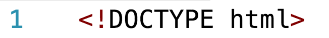

El doctype que ves arriba es el que usamos para HTML5 y es soportado por todos los navegadores. 

Versiones más antiguas tendrán una definición un poco diferente, como en HTML 4.01 con algunas variaciones:

```html
<!DOCTYPE HTML PUBLIC "-//W3C//DTD HTML 4.01//EN" "http://www.w3.org/TR/html4/strict.dtd">
```

o el de HTML 1.0 que se ve un poco así con algunas variaciones: 

```html
<!DOCTYPE html PUBLIC "-//W3C//DTD XHTML 1.0 Strict//EN" "http://www.w3.org/TR/xhtml1/DTD/xhtml1-strict.dtd">
```


### Idioma
Recuerda definir el idioma que usarás en tu web. Esto ayuda a la __accesibilidad__ y a la optimización para resultados de búsqueda (__seo__).


 ### Nombre de los elementos en minúscula
HTML __no__ es __case sensitive__ con el nombre de sus elementos. ___Case Sensitive___ significa que no va a diferenciar entre mayúsculas y minúsculas. 

---
#### Case sensitive:

Sensible a si las letras son mayúsculas o minúsculas. Si un elemento es case sensitive tendremos por ejemplo que: 

``` casa != Casa // casa es diferente de Casa```

``` Casa != cAsa // Casa es diferente de cAsa```

Cuando decimos que algo NO es Case sensitive, mas bien se da el caso contrario: 
``` casa == Casa // casa se refiere a lo mismo que Casa```

``` Casa == cAsa // Casa se refiere a lo mismo que cAsa```

---

Como decía, HTML __N0__ es _case sensitive_ para el nombre de las etiquetas por lo que puedes tener elementos como: 
```html
 
 ... 
 
```
Ambos casos mostrará una imagen. Para mantener un estándar adecuado, escribe los nombres de las etiquetas con _minúsculas_. 
```html
  <<--- así NO
 ... 
  <<--- así SI
```
 
 ### Nombre de atributos en minúscula

Del mismo modo que con el nombre de las etiquetas, HTML tampoco es case sensitive con el nombre de los atributos de HTML. Pero de igual manera, para mantener un estándar adecuado, escribe los atributos en _minúsculas_.

```html
  <<--- así NO
  <<--- así NO
 ... 
  <<--- así SI
```

### Comillas simples vs Comillas dobles

En HTML podemos usar comillas dobles (double quotes) `" "` o comillas simples (single quotes) `' '` para definir atributos de los elementos. Por estándar, para HTML usaremos las comillas dobles. 
```html
  <<--- así NO
 ...
  <<--- así SI
```

### Espacios en blanco

No dejes espacios en blanco entre atributo y su valor.

```html
  <<--- así NO
 ...
  <<--- así SI
```
### Caracteres especiales

Incluye caracteres especiales como el de Copyright, Marca Registrada entre otros usando el markup de HTML para los mismos en vez de escribirlos directamente o pergarlos de algún lado. 
Esto debido a que no interrumpen el Markup Language y lo hacen un HTML válido si otros programas lo quieren interpretar. 

Por ejemplo usa en tu HTML: 
- `&copy;` para ©
- `&reg;` para ®
- `&#8482;` para ™

Existen otros que puedes encontrar en la [web de ASCII](http://www.ascii.cl/htmlcodes.htm).

## Debugging HTML

Nos referimos a _debugging_ a la forma de encontrar, identificar y reparar errores. En HTML, estos errores tienden a ser: 

### Errores de Syntaxis. 
Son errores que se refieren al mal uso del lenguaje. De repente escribir mal alguna etiqueta, o no cerrarla adecuadamente. 

### Errores de Lógica
Si bien las etiquetas pueden estar bien escritas, y cerradas, la estructura que tienen no es la adecuada o no apoyan a cumplir la función para la que fueron creadas. 

Para validar, y conocer nuestros errores en HTML de syntaxis, no basta con abrir el documento en un navegador, puesto que los navegador corren el HTML de manera _permisiva_, es decir, si se encuentran errores, el navegador, de acuerdo al contexto, cerrará en donde pueda las etiquetas, e interpretará las etiquetas que no conoce como `div` o algún bloque similar. 

Pero entonces, para conocer si nuestro HTML esta bien, y poder escribir código de calidad, es importante aplicar las buenas prácticas y validar el documento a través de otras herramientas. Podemos usar el [__HTML Validator de _W3C___](https://validator.w3.org/#validate_by_input). Si ingresas al link, notarás que está en el tab _validate input_. Esto es para que ingresemos un código que quizá este mal escrito. 


Supongamos que ingreso el siguiente código: 

```html
<!DOCTYPE html>
<html lang="es">
  <head>
    <title>Mi primera página</title>
  </head>
  <body>
    <h1>Hola Mundo!</h1>
    <p>Bienvenidos a mi primera página web
    <p>Esta página tiene varios elementos
    <ul>
     <li>body
     <li>head
     <li>h1
     <li>p
    <ul>
  </body>
  <br>
</html>
```
Este código ya contiene un error, que es que _no se ha cerrado la etiqueta `p`, ni el `ul`, ni sus `li`_, además hay un <br> después del `body`. 

Si pegamos este código en el validator y seleccionamos _Check_ tendremos un resultado como: 


1. [Error] End tag for `body` seen, but there were unclosed elements.
    Este se refiere a que si bien se cierra la etiqueta body, hay varias etiquetas que no han cerrado como deberían. 

2. y 3. [Error]  Unclosed element `ul`.
    Este error se refiere a que no se cerró la etiqueta `ul`. Y esto es porque en la línea 15, en lugar de escribir `</ul>` escribimos sólo `<ul>`

4. [Error] Stray start tag `br`. 
    Se refiere al hecho de poner un `br` fuera del contexto de `body`.

Supongamos que corregimos primero estos 4 errores y probamos nuestro código. 

```html
<!DOCTYPE html>
<html lang="es">
  <head>
    <title>Mi primera página</title>
  </head>
  <body>
    <h1>Hola Mundo!</h1>
    <p>Bienvenidos a mi primera página web
    <p>Esta página tiene varios elementos
    <ul>
     <li>body
     <li>head
     <li>h1
     <li>p
    </ul>
  </body>
</html>
```

Notarás que el validador ya no nos da más errores, aunque sabes que los tags no están cerrados adecuadamente. Esto es porque el anidado esta relativamente claro y el navegador podría interpretar donde cerrar las etiquetas. Aún así, recuerda cerrarlas adecuadamente. El código final quedaría como: 

```html
<!DOCTYPE html>
<html lang="es">
  <head>
    <title>Mi primera página</title>
  </head>
  <body>
    <h1>Hola Mundo!</h1>
    <p>Bienvenidos a mi primera página web</p>
    <p>Esta página tiene varios elementos</p>
    <ul>
     <li>body</li>
     <li>head</li>
     <li>h1</li>
     <li>p</li>
    </ul>
  </body>
</html>
```
***


Sources: 
https://html.spec.whatwg.org
https://developer.mozilla.org/en-US/docs/Learn/HTML/Introduction_to_HTML/HTML_text_fundamentals
https://www.w3schools.com/html/html_forms.asp
https://developer.mozilla.org/en-US/docs/Learn/HTML/Forms/How_to_structure_an_HTML_form
https://developer.mozilla.org/en-US/docs/Learn/HTML/Introduction_to_HTML/HTML_text_fundamentals
https://developer.mozilla.org/en-US/docs/Web/HTML/Inline_elements#Inline_vs._block-level_elements_a_demonstration
https://developer.mozilla.org/en-US/docs/Learn/HTML/Introduction_to_HTML/Debugging_HTML
