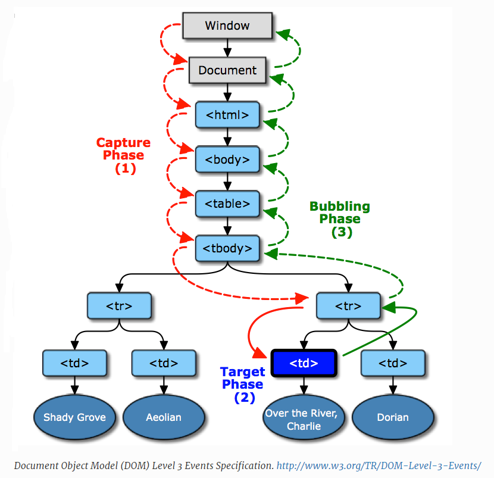

# Eventos
- Tipo: `lectura`
- Formato: `self-learning`
- Duración: `30min`

## Objetivos de Aprendizaje

En esta unidad aprenderemos:
* ¿Qué es un evento y para qué nos sirve?
* ¿Cómo usarlos?
⋅⋅* Manejo y flujo de eventos (propagación).
* Tipos

***

Referencia:
https://developer.mozilla.org/en-US/docs/Learn/JavaScript/Building_blocks/Events

http://eloquentjavascript.net/14_event.html

## ¿Qué es un evento?
 ⋅⋅⋅Es cuando el usuario realiza una acción permitiéndole interactuar con el programa. A cada evento se le asocia un manejador (conocido como eventHandlers o eventListener) el cual, se ejecutará cuando ocurra el evento.

###### Referencia: https://www.youtube.com/watch?v=gyICdb1iwII


## ¿Cómo usar los eventos?

⋅⋅⋅Para poder hacer uso de la magia de los eventos es necesario saber primero como escucharlos, esto se puede lograr mediante el método __addEventListener__.

La sintaxis es muy sencilla:
```javascript
  elemento_que_escucha.addEventListener('evento', funcion_a_ejecutar);
```
###### Referencia: http://www.codexexempla.org/curso/curso_4_3_e.php

⋅⋅⋅Existen diferentes formas de asociar un evento a elementos del DOM, para saber más sobre ello revisa el siguiente link (apartir del punto 6.2) http://librosweb.es/libro/javascript/capitulo_6/modelo_basico_de_eventos_2.html


### Manejo de eventos

⋅⋅⋅Además de agregar el *listener* al evento también se puede eliminar usando el método __removeEventListener__, el cual funciona casi de la misma manera. La sintaxis es d ela siguiente manera:

```javascript
  elemento_que_escucha.removeEventListener('evento', funcion_a_eliminar);
```
Para que el método funcione correctamente es obligatorio mandar como parámetro el callback (función) utilizado con addEventListener.

### Flujo de eventos (Propagation)
⋅⋅⋅Cuando un evento se ejecuta pasa por diferentes fases: *Capture phase*, *Target phase* y *Bubbling phase*, como se muestra en la siguiente imagen.



Revisa este video(https://youtu.be/lgkqf6hldEk?t=15m5s) para que veas en práctica este flujo.

## Tipo de eventos
⋅⋅⋅Cuando el usuario interactua con el navegador se pueden desencadenar múltiples tipos de eventos, algunos de los más comunes son:

* Eventos del ratón(mouseEvent)
* Eventos del teclado(keyboardEvent)
* Eventos del formularios
* Eventos de la ventana

###### Referencia: https://es.khanacademy.org/computing/computer-programming/html-css-js/html-js-dom-events/a/dom-event-types

Para mayor información sobre todos los eventos visita este link(https://sites.google.com/site/dwebtodojs/referencia/modelo-de-eventos-del-dom).

### Key Events
⋅⋅⋅Estos son algunos de los eventos más utilizados:

- keyup/keydown
- mouse click
- mouse motion
- scroll
- focus
- load
- script execution timeline
- setting timers
- debouncing


[Aquí](https://codepen.io/Inti_Developer/pen/EvGMKG) podrás encontrar un ejemplo sobre la interacción con los eventos.

> Guía de uso:
> 1. Nota como el fondo es de color blanco
> 2. Ahora haz click en el botón *Hacer magia :)*
> 3. Revisa el código y analiza la lógica de programación
> 4. Ahora intenta modificar el código para que reaccione con otros eventos, diviertete ;)

***

[Continuar]( )
