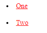
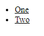
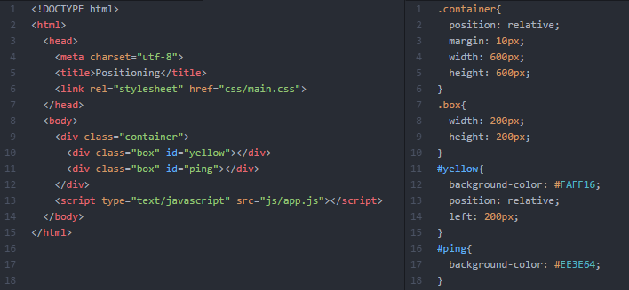
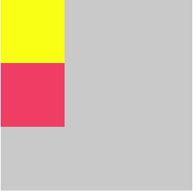
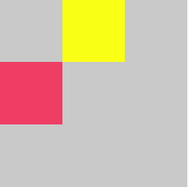
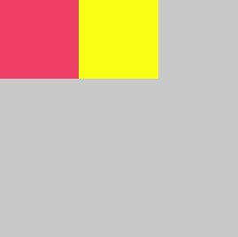

# Quiz #1

- Tipo: `quiz`
- Formato: `self-paced`
- Duración: `30min`

***

## Objetivos

- En esta sección tendrás la oportunidad de evaluarte para que pongas tus
  conocimientos a prueba. Es una oportunidad para que te calibres y valides que
  realmente estás aprendiendo. ¡Mucho éxito!

***

## Preguntas

### 1) ¿Qué es HTML?

#### Opciones
1. Lenguaje de programación
2. Lenguaje de marcado
3. Hoja de estilo
4. Herramienta de código abierto

<solution style="display:none;">2</solution>

### 2) ¿Qué hace `doctype`?

#### Opciones

1. Inicia el documento HTML
2. Indica al navegador que el documento es HTML5
3. Agrega una línea para que el `html` aparezca en la segunda línea

<solution style="display:none;">2</solution>

### 3) ¿Cuáles son las etiquetas que no necesitan cierre?

#### Opciones
1. em
2. div
3. img
4. p

<solution style="display:none;">1,3</solution>

### 4) Ejemplo correcto de anidación:

#### Opciones
1. `<p>Soy una <strong>excelente</p> <em>coder</em></strong>`
2. `</p>Soy una </strong>excelente<strong> </em>coder<em><p>`
3. `<p>Soy una <strong>excelente</strong> <em>coder</em></p>`

<solution style="display:none;">3</solution>

### 5) Son características de un elemento en bloque

#### Opciones
1. No comienzan con la nueva línea.
2. No debería estar anidado dentro de un elemento en línea
3. Comienzan en una nueva línea
4. Pueden comenzar en cualquier parte de una línea
5. Pueden contener elementos en línea y otros elementos en bloque

<solution style="display:none;">2,3,5</solution>

### 6) Las propiedades CSS son `case-sensitive` (toma en cuenta las minúsculas y mayúsculas)

```css
ul {
  MaRgiN: 10px;
}
```

#### Opciones

1. Verdadero
2. Falso

<solution style="display:none;">2</solution>

### 7) ¿Cuál es la diferencia entre `display: inline-block` y `display: inline`?

#### Opciones
1. A un elemento inline no se le puede determinar dimensiones, mientras que a
   uno inline-block sí
2. A un elemento inline-block no se le puede determinar dimensiones, mientras
   que a uno inline sí
3. No hay diferencias entre ambos
4. Un elemento inline no aparece en pantalla, mientras que un inline-block si

<solution style="display:none;">1</solution>

### 8) ¿Cuál es la sintaxis correcta para la etiqueta `img`?

#### Opciones
1. `<image src="foto.jpg" alt="Foto"></image>`
2. `<image href="foto.jpg" alt="Foto">`
3. ``
4. ``
5. `</img>`

<solution style="display:none;">4</solution>

### 9) ¿Las propiedades `margin-top` y `margin-bottom` tienen efecto sobre elementos inline?

#### Opciones

1. Si
2. No

<solution style="display:none;">2</solution>

### 10) ¿Las propiedades `padding-top` y `padding-bottom` incrementan el tamaño de un elemento inline?

#### Opciones

1. Si
2. No

<solution style="display:none;">2</solution>

### 11) Dado el siguiente estilo CSS, ¿qué color tendrán los `<h3>`?

```css
h3 {
  color: red;
}

h3 {
  color: blue;
}

h2 {
  color: yellow;
}
```

#### Opciones
1. red
2. blue
3. yellow

<solution style="display:none;">2</solution>

### 12) ¿Qué orden prevalece para asignar un estilo?

#### Opciones
1. Especificidad, orden del código e importancia
2. Importancia, especificidad y orden del código
3. Orden del codigo, importancia y especificidad

<solution style="display:none">2</solution>

### 13) Según el siguiente código, ¿cuál seria el resultado en el navegador?


#### Opciones
1. 
2. 
3. 
4. 

<solution style="display:none">1</solution>

### 14) Tomando en cuenta el siguiente código, ¿cuál es el color del texto **JavaScript**?

**HTML:**

```html
<ul class="programming-languages" id="awesome">
  <li><span>Python</span></li>
  <li class="favorite" id="must-use"><span class="highlight">JavaScript</span></li>
</ul>
```

**CSS:**

```css
ul li {
  color: red;
}

#must-use {
  color: blue;
}
```

#### Opciones

1. Negro
2. Azul
3. Rojo

<solution style="display:none;">2</solution>

### 15) Según el siguiente código, ¿cuál seria el resultado en el navegador?


#### Opciones
1. 
2. 
3. 
4. 

<solution style="display:none">3</solution>

### 16) ¿Qué sucede con los elementos en línea cuando se vuelve flotante?

#### Opciones
1. Se mantiene como elemento en línea
2. Se vuelve un elemento en bloque

<solution style="display:none">2</solution>

### 17) Selecciona las propiedades que corresponde a las tipografías

#### Opciones
1. font-size
2. font-color
3. font-family
4. font-weight
5. float

<solution style="display:none">1,3,4</solution>
