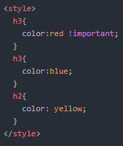
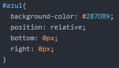
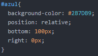

# Quiz #2: requizzing

- Tipo: `quiz`
- Formato: `guiado`
- Duración: `30min`

## Objetivos

- Tomar un segundo quiz para asegurarnos que terminamos la unidad con un
entendimiento pleno de los conceptos.

***

## Preguntas

### 1) Las siglas HTML significan...

#### Opciones
1. Herramienta de Texto markdown Language.
2. Hypervinculo type markup Language
3. HyperText Markup Language

<solution style="display:none;">3</solution>

### 2) Anatomia de un elemento HTML

#### Opciones
1. Loops
2. Etiqueta de inicio
3. Doctype
4. Contenido u otras etiquetas
5. Etiqueta de cierre
6. Condicionales

<solution style="display:none;">1,4,5</solution>

### 3) ¿Cuáles son las etiquetas que necesitan cierre?

#### Opciones
1. table
2. ol
3. hr
4. br
5. a

<solution style="display:none;">1,2,5</solution>

### 4) Ejemplo correcto de anidación

#### Opciones
1. `<body><h3>hola!!</h3>Soy una<strong>excelente</strong><em>coder</em>
</body>`
2. `
Soy una</strong>excelente<strong></em>coder<em>
`
3. `
Soy una<strong>excelente</strong><em>coder</em>
`

<solution style="display:none;">3</solution>

### 5) Son caracteristicas de un elemento en linea

#### Opciones
1. No comienzan con la nueva línea.
2. No estaría anidado dentro de un elemento en línea
3. Comienzan en una nueva línea
4. Pueden comenzar en cualquier parte de una línea
5. Pueden contener elementos en línea y otros elementos en bloque
6. Pueden contener únicamente los datos y otros elementos en línea.

<solution style="display:none;">1,4,6</solution>

### 6) ¿Cuál es la diferencia entre display:inline-block y display:inline?

#### Opciones
1. A un elemento inline no se le puede determinar dimensiones, mientras que a uno inline-block sí
2. A un elemento inline-block no se le puede determinar dimensiones, mientras que a uno inline sí
3. No hay diferencias entre ambos
4. Un elemento inline no aparece en pantalla, mientras que un inline-block si

<solution style="display:none;">1</solution>

### 7) ¿Cuál es la sintaxis correcta para la etiqueta `<a>`?

#### Opciones
1. `<a href="http://laboratoria.la/">Ir a Laboratoria</a>`
2. `<a src="http://laboratoria.la/">Ir a Laboratoria</a>`
3. `<a href="http://laboratoria.la/">`

<solution style="display:none;">1</solution>

### 8) Dado este CSS ¿qué color tendrán los `<h3>`?

#### Opciones
1. red
2. blue
3. yellow

<solution style="display:none;">1</solution>

### 9) ¿Para qué sirve line-height?

#### Opciones
1. Establece la altura de cada línea de texto
2. Establece el color de texto
3. Establece el groson del texto

<solution style="display:none">1</solution>

### 10) ¿Cuál es la sintaxis de css?

#### Opciones
1. `{p = color: red; font-size: 15px; }`
2. `p { color: red, font-size: 15px, }`
3. `p { color: red; font-size: 15px; }`

<solution style="display:none">3</solution>

### 11) Según el siguiente código, ¿Cuál seria el resultado en el navegador?

#### Opciones
1. 
2. 
3. 
4. 

<solution style="display:none">3</solution>

### 12) Son propiedades que corresponde a la tipografia

#### Opciones
1. font
2. font-color
3. font-family
4. font-weight
5. float

<solution style="display:none">3,4</solution>
