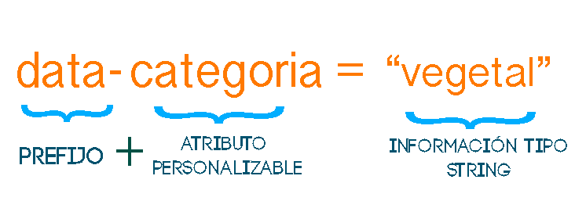

# Data Attributes
   
* Tipo: lectura
* Formato: self-paced
* Duración: 4h

## Objetivos de Aprendizaje

* ¿Qué son los Data Attributes?
* Sintaxis de los Data Attributes
* Saber como se utilizan los Data Attributes

## ¿Qué son los Data Attributes?

Son una de las nuevas características de HTML5, los Data Attributes nos permiten integrar a un o unos elementos en particular fragmentos de información sobre la semántica de html.

## Sintaxis de los Data Attributes

Una nueva ventaja de los data attributes es que son personalizables. Tal vez ahorita no entiendas mucho pero primero entendamos la sintaxis para después poder ver un ejemplo y que nos quede más claro

Se usa un prefijo data- más el nombre del atributo que nosotros queramos.

A parte del prefijo data- la sintaxis válida debería contener sólo letras, guiones(-), puntos(.), dos puntos (:), o guión bajo (_) y **NO** debería tener mayúsculas.

Luego de tener nuestro prefijo y atributo definido es igual que como hemos visto se ponen atributos a un elemento: 

Hay dos cosas que se debe mantener en cuenta:
 * La información guardada en estos data attribute deberá ser de tipo string.
 * Solo se debe usar cuando no haya otros elementos apropiados. Un elemento no apropiado sería data-class, puedes usar números  pero estos aparecerán en string y después los convertirías en js.

----
## Saber como se utilizan los Data Attributes

Ahora que sabemos su significado y como es su sintaxis, entendamos bien que es un Data Attribute y como nos sirve

Alguna vez has usado clases para guardar información con el propósito de que tu JavaScript sea más simple? Si es así te tengo una noticia justo para eso HTML5 agrego los data attributes, pero a lo mejor esto no te dice mucho ¿Qué te parece si lo vemos con un ejemplo de que podamos aplicar en la vida real?

Supongamos que queremos una lista de semillas vegetales para plantar, si queríamos hacer nuestro js más sencillo poníamos una clase para saber cuanto debíamos dejar de espacio para plantar, o lo insertábamos en js pero teníamos que asignarlo de alguna forma a nuestro elemento lo cual nos haría hacer más procesos.

    <ul id="semillas-vegetales">
      <li class="espacio10">Zahanorias</li>
      <li class="espacio30">Apio</li>
      <li class="espacio3">Rabano</li>
    </ul>
    
Pero esto no tiene mucho sentido ya que las clases se usan para poder modificar los estilos y me llenaría de clases si por ejemplo a esto quisiera yo agregarle el tiempo de cosecha. Pero como ya sabemos ahora existen los Data Attributes podemos hacer esto

    <ul id="semillas-vegetales">
        <li data-espacio-plantar="10cm" data-tiempo-cosecha="Marzo a Junio">Zahanorias</li>
        <li data-espacio-plantar="30cm" data-tiempo-cosecha="Febrero a Marzo">Apio</li>
        <li data-espacio-plantar="3cm" data-tiempo-cosecha="Marzo a Septiembre">Rabano</li>
    </ul>
    
¿No es mucho más sencillo ahora poder poner información a nuestros elementos para poder usar después en nuestro JS?

