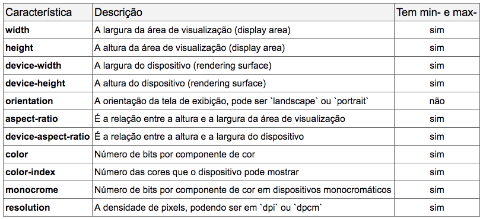

# Media Queries

- Tipo: `lectura`
- Formato: `self-paced`
- Duración: `10min`

***

## Objetivos de Aprendizaje

- Conocer y entender el uso de media queries dentro del Responsive Web Design

## ¿Qué son los Media Queries?

Es una técnica introducida en CSS3, que usa la regla **@media** para incluir un bloque de propiedades CSS que se ejecutarán en nuestro sitio **solo si las condiciones dadas al @media son verdaderas**.

Los Media Queries están conformadas por 
**Media Types**, **Media Features** y el bloque de código a ejecutar si las condiciones entregadas en el media type y el media feature son verdaderas. Todo esto se conecta gracias a los **operadores lógicos** correspondientes.

Los **media types** corresponden a los distintos dispositivos donde se puede visualizar nuestro sitio web. En la siguiente imagen, se pueden ver los distintos media types que pueden ocuparse.

Los **media feature** corresponden a la condición que debe cumplir el dispositivo y la cual debe ser verdadera para que se aplique el código contenido en nuestra media query.

Los media features más comunes son los referidos a las dimensiones de pantalla del dispositivo, pudiendo establecer el alto y ancho en el que se aplicarán (con height y width), o lo que es más interesante, a partir de que ancho o alto se aplicarán (con min/max-width y min/max-height). 

Los **operadores lógicos** son *and*, *not*, 
*only* y *lista separada por comas*(que funciona como el operador lógico or de Javascript) y se encargan de unir nuestros media types a los media feature.

El operador *and* es usado para combinar múltiples media en un solo Media Query, requiriendo que cada función devuelve true para que el media query también lo sea. El operador *not* se utiliza para negar un media query completo y el operador *only* se usa para aplicar un estilo sólo si el query completo es correcto.

## ¿Cómo utilizo los Media Queries?

Una vez que ya comprendemos como funcionan los media queries, debemos usarlos

See the Pen <a href="https://codepen.io/bosqueinvierno/pen/wevWQV/">Uso de Media Queries</a> by Ally G (<a href="https://codepen.io/bosqueinvierno">@bosqueinvierno</a>) on <a href="https://codepen.io">CodePen</a>.

