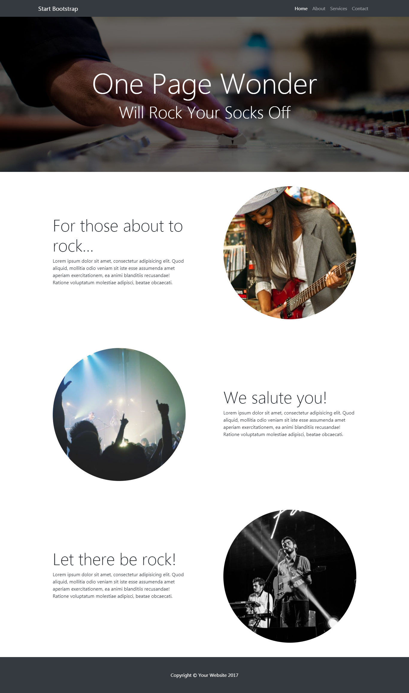
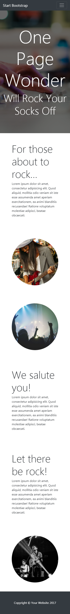

# Clase Práctica

- Tipo: `taller`
- Formato: `guiado`
- Duración: `2h`

***

## Objetivos

- Practicar codeando junto a tu equipo de profes, resolviendo ejercicios de
  `html` y `css`
- Practicar, practicar y practicar

## Enunciados

A continuación tienes algunos ejercicios de práctica que serán resueltos, paso a
paso, por tu equipo de profes en una sesión presencial (`taller`). Te sugerimos
que intentes resolver los ejercicios por tu cuenta (o en equipo) **antes** de la
sesión presencial. Así, ya vienes con dudas específicas y estarás familiarizada
con los retos. Quizás, puedas tú presentar tu solución ante la clase y así
ayudar al resto de tus compañeras :)

Debes subir todos tus ejercicios a `GitHub` y publicarlos en `gh-pages`.

### 1. Love Love Panda Desu
Crea una página web para amantes de los pandas. Puedes obtener las imágenes en
el siguiente enlace: [Archivos](https://drive.google.com/drive/folders/1H0v3wCL7I3cJWvJDs9anlCrJpg8FZv1p?usp=sharing "Archivos")

Versión 1: Crea tu página utilizando un grid system de tu elección (que no
pertenezca a un framework como Bootstrap o Materialize).
Versión 2: Crea tu propia versión móvil de la página

### 2. Rock Site

Replica las siguientes vistas poniendo en práctica tus conocimientos de `grid
system`.
Puedes obtener las fotografías en el siguiente enlace: [Archivos](https://drive.google.com/drive/folders/1i9wBosEqkP3LEwBsB-T8089-NY5rhZuN?usp=sharing "Archivos") 

***

Puedes ver el siguiente video para saber como crear y utilizar un grid system:

[Video](https://youtu.be/uUGHF0dM6GA "Video") 