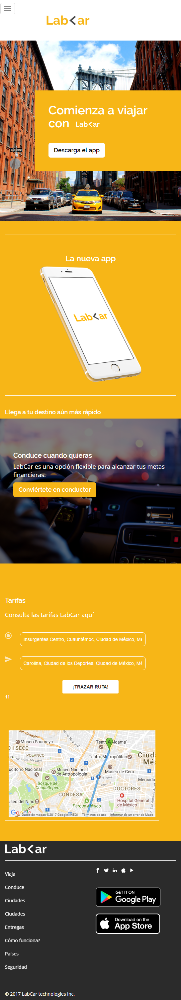
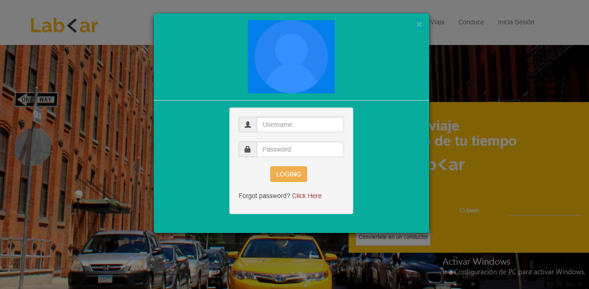
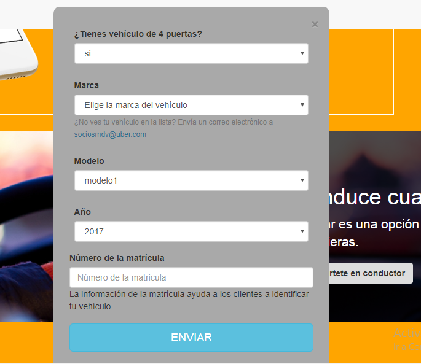

# Retos

- Tipo: `práctica`
- Formato: self-paced`
- Duración: `20h`

## Objetivos

- A continuación te presentamos los retos que debes completar para poner tus
  conocimientos a prueba.

***

## Lab-<ar

Recrea la siguiente página web. Las imágenes y todo lo que necesitas lo
encuentras [aquí](https://github.com/Laboratoria-learning/lab-car-boilerplate),
recuerda hacer un **fork** del repositorio y clonarlo en
tu máquina.

### 1. La versión web

### 2. La versión movil
Y obviamente no podemos dejar de lado la versión móvil, así que créala como segunda parte

### 3. Modales

Como **extra** puedes añadir los modales necesarios en la versión web

- Modal de Inicia Sesión

- Modal de Regístrate

- Y modal de Convierte en conductor

