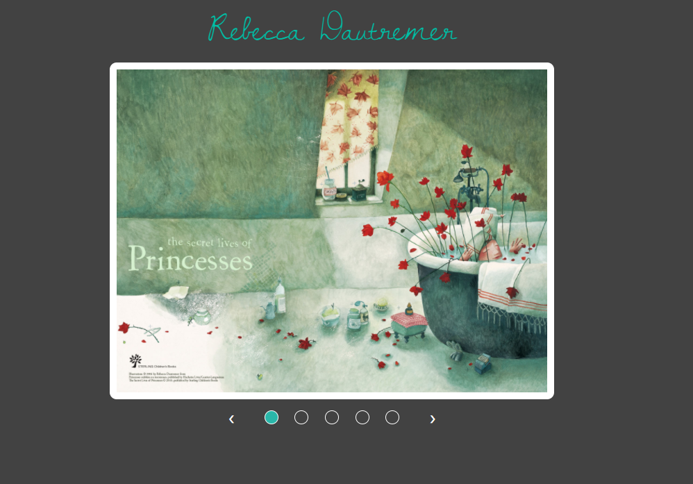
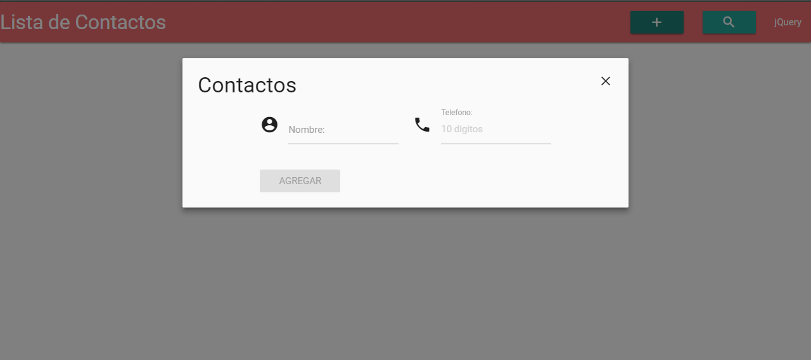
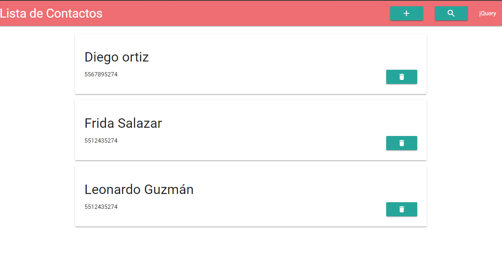

# Clase Práctica

- Tipo: `taller`
- Formato: `guiado`
- Duración: `2h`

***

## Objetivos

- Probar, intentar y practicar más.
- Practicar codeando y resolviendo ejercicios con jQuery
- Sacar y resolver todas las dudas que tengas

## Enunciados

A continuación tienes algunos ejercicios de práctica que serán resueltos, paso
a paso, por tu equipo de profes en una sesión presencial (`taller`). Te
sugerimos que intentes resolver los ejercicios por tu cuenta (o en equipo)
**antes** de la sesión presencial. Así, ya vienes con dudas específicas y
estarás familiarizada con los retos. Quizás, puedas tú presentar tu solución
ante la clase y así ayudar al resto de tus compañeras :)

Debes subir todos tus ejercicios a `GitHub` y publicarlos en `gh-pages`.

### 1. Carrusel

Vamos a crear un carrusel de imágenes!

El tema es totalmente libre, deben funcionar tanto las flechas de desplazamiento como sus botones indicadores y estos deben corresponder a cada imagen

### 2. Agenda de contactos

Crea una agenda de contactos donde puedas agregar, eliminar, filtrar y contabilizar a los contactos.

A través de un modal debes poder agregar:

  - Nombre de contacto
  - Número telefónico
  - Email (opcional)

  

El contacto creado debe agregarse en nuestro HTML con un botón/ícono que nos de la opción de eliminar el contacto.

