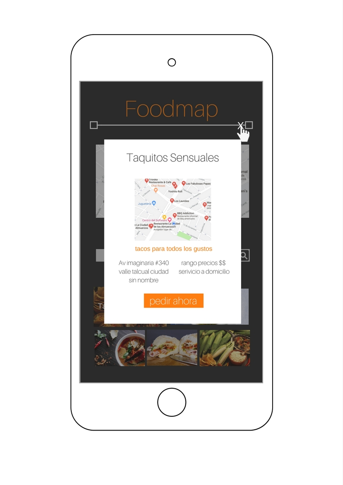

# Retos

- Tipo: `práctica`
- Formato: self-paced`
- Duración: `20h`

## Objetivos

- A continuación te presentamos el reto que debes completar para poner tus
  conocimientos a prueba.

***

### F O O D M A P

> Crea una web que a través de un input pueda filtrar los restaurantes 
que se encuentran cerca de ti.
El diseño es totalmente libre, con este ejercicio debes aplicar manejo del DOM con JQuery y eventos con Jquery. 
¡Mucha suerte!

#### Flujo de la aplicación.

