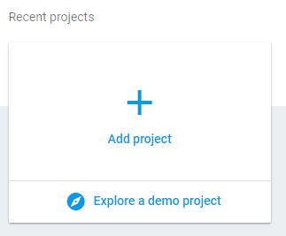
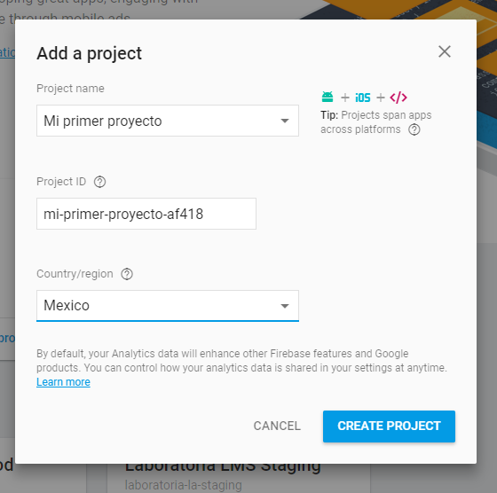
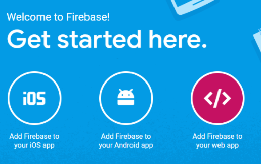
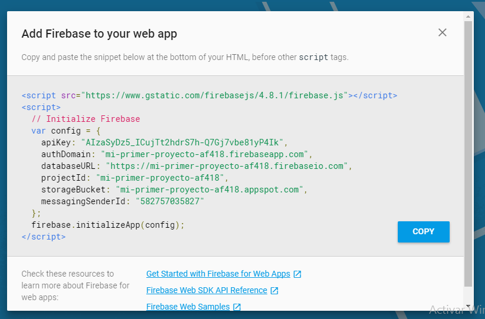
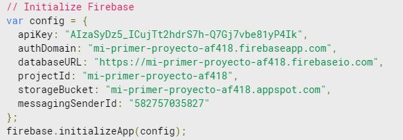
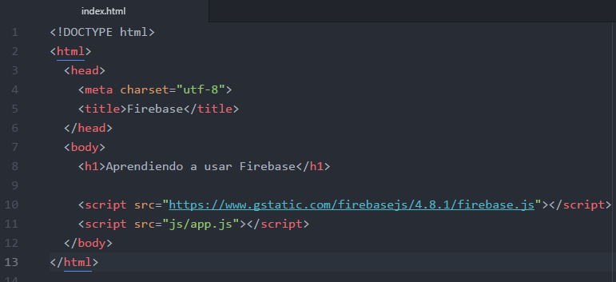
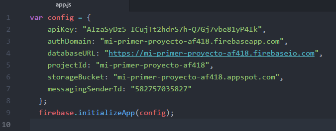

# Firebase: Creando mejores apps

- Tipo: `lectura`
- Formato: `self-paced`
- Duración: `60min`

***

## ¿Qué es Firebase?

Según su propia definición, Firebase es un conjunto de herramientas orientadas
a la creación de aplicaciones de alta calidad, al crecimiento de los usuarios
y a ganar más dinero.

O bien, podemos describir Firebase como una suite de diferentes aplicaciones
que nos harán más fácil el desarrollo de nuestra aplicación.
Está disponible tanto para Android, iOS o Web, contiene varias y diversas
funcionalidades que todo desarrollador puede combinar y adaptar a
sus propias necesidades.

### Iniciando proyecto con Firebase

1. Lo primero que vamos a hacer es ir a la pagina principal de
  [Firebase](https://firebase.google.com)

  

2. Nos dirigimos a nuestra consola

  

3. Creamos un nuevo proyecto

    

    

4. Hecho lo anterior seleccionamos la opción de `Add Firebase to your web app`

  

  y nos arrojará unas líneas de script que pegaremos en nuestro desarrollo.

  

5. El primer script lo pondremos en nuestro **HTML** por encima de cualquier
   otro script:

   

   y el siguiente en nuestro archivo js:

   

6. Y ya con esto tenemos Firebase en nuestro proyecto!!! Si revisamos nuestros
  archivos quedan de la siguiente manera:

  

  

>*Esto mismo es lo que viene en la documentación de firebase, compáralo e
  inténtalo.*
