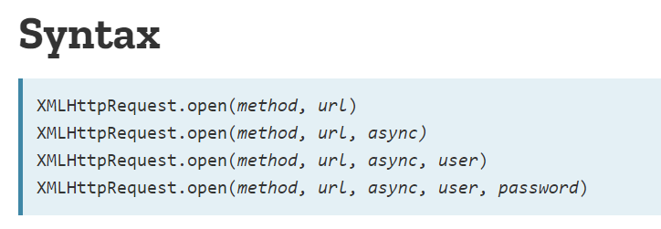

# XHR

- Tipo: `lectura`
- Formato: `self-paced`
<<<<<<< HEAD
- Duración: `30min`
=======
- Duración: `90min`
>>>>>>> ecbbb00edd44800c7b2f51c15dc469133655c4de

***

## Objetivos de Aprendizaje

- Entender qué es XHR

## Analogía

Una buena manera de entender XHR es usando la siguiente analogía:

> **Preparar un pastel!**
> Para prepararlo necesitamos, harina, huevo, leche, mantequilla y un horno.
> Encendemos el horno. Luego procedemos a mezclar los 4 ingredientes y ya
> lista la mezcla la metemos al horno, aquí va a tardar un poco en lo que se
> hornea pero mientras podemos ir preparando la cubierta del pastel.

Un objeto XHR es proporcionado por el entorno de JavaScript y se utiliza para hacer peticiones AJAX, es muy parecido a la parte de la preparación de la mezcla donde primero debemos "preparar" las configuraciones y luego mandar nuestra petición, pero una vez hecho esto nuestro código puede seguir adelante y hacer otras peticiones o tareas.

> Cuando el horno nos regresa el pastel horneado podemos continuar con
> decorarlo

Una vez que nuestra petición tiene respuesta puede seguir adelante con lo que hayamos dispuesto para esta "tarea".

## XMLHTTPRequest

El entorno de JavaScript nos proporciona una forma de realizar solicitudes
<<<<<<< HEAD
HTTP asíncronas. Hacemos eso con un objeto XMLHttpRequest. Podemos crear estos
objetos con la función de constructor XMLHttpRequest proporcionada.
=======
HTTP asíncronas. Esto lo hacemos con un objeto XMLHttpRequest, podemos usar
este objeto con la función de constructor XMLHttpRequest proporcionada.
>>>>>>> ecbbb00edd44800c7b2f51c15dc469133655c4de

XMLHttpRequests (comúnmente abreviado como XHR o xhr) se puede utilizar para
solicitar cualquier tipo de archivo (por ejemplo, archivos de texto plano,
HTML, JSON, de imagen, etc.) o datos de una API.

Ahora profundizaremos en el objeto XMLHttpRequest. Veremos cómo crearlo, qué
métodos y propiedades se deben usar y cómo enviar realmente solicitudes
asíncronas.

[XMLHttpRequests](https://www.youtube.com/watch?v=nz9S3uZE_dM)

### El objeto XHR y su método `.open()`

<<<<<<< HEAD
Ya que hemos construido un objeto XHR llamado _asyncRequestObject_. Podemos acceder a sus métodos, uno de los más importantes es el método `.open()`

asyncRequestObject.open();

.open() toma una serie de parámetros, pero los más importantes son sus dos primeros: el método HTTP y la URL para enviar la solicitud.



Si queremos solicitar de manera asíncrona la página de inicio del popular sitio de imágenes de alta resolución, Unsplash, usaremos una solicitud GET y proporcionaremos la URL:

asyncRequestObject.open('GET', 'https://unsplash.com');

A little rusty on your HTTP methods?
The main two that you'll be using are:

GET - to retrieve data
POST - to send data
For more info, check out our course on HTTP & Web Servers!

Warning: For security reasons, you can only make requests for assets and data on the same domain as the site that will end up loading the data. For example, to asynchronously request data from google.com your browser needs to be on google.com. This is known as the same-origin policy. This might seem extremely limiting, and it is!

The reason for this is because JavaScript has control over so much information on the page. It has access to all cookies and can determine passwords since it can track what keys are pressed. However, the web wouldn't be what it is today if all information was bordered off in its own silos. The way to circumvent the same-origin policy is with CORS (Cross-Origin Resource Sharing). CORS must a technology that is implemented on the server. Services that provide APIs use CORS to allow developers to circumvent the same-origin policy and access their information.

Así que hemos construido un objeto XHR llamado asyncRequestObject. Hay una cantidad de métodos que están disponibles para nosotros. Uno de los más importantes es el método abierto.

asyncRequestObject.open ();
.open () toma una serie de parámetros, pero los más importantes son sus dos primeros: el método HTTP URL para enviar la solicitud

Si queremos solicitar asincrónicamente la página de inicio del popular sitio de imágenes de alta resolución, Unsplash, usaremos una solicitud GET y proporcionaremos la URL:

asyncRequestObject.open ('GET', 'https://unsplash.com');
¿Un poco oxidado en tus métodos HTTP?
Los dos principales que usarás son:

GET - para recuperar datos
POST - para enviar datos
Para obtener más información, ¡consulta nuestro curso sobre HTTP y servidores web!

Advertencia: por motivos de seguridad, solo puede realizar solicitudes de activos y datos en el mismo dominio que el sitio que terminará cargando los datos. Por ejemplo, para solicitar datos de manera asincrónica desde google.com, su navegador debe estar en google.com. Esto se conoce como la misma política de origen. Esto puede parecer extremadamente limitante, ¡y lo es!

La razón de esto es porque JavaScript tiene control sobre tanta información en la página. Tiene acceso a todas las cookies y puede determinar las contraseñas, ya que puede rastrear qué teclas se presionan. Sin embargo, la web no sería lo que es hoy si toda la información estuviera delimitada en sus propios silos. La forma de eludir la política del mismo origen es con CORS (Intercambio de recursos de origen cruzado). CORS debe tener una tecnología implementada en el servidor. Los servicios que proporcionan API utilizan CORS para permitir a los desarrolladores eludir la política del mismo origen y acceder a su información.

## XHR's object `.send()` method

To actually send the request, we need to use the send method:
=======
Ya que hemos construido un objeto XHR llamado _asyncRequestObject_.

```javascript
const asyncRequestObject = new XMLHttpRequest ();
```

Podemos acceder a sus métodos, uno de los más importantes es el método `.open()`

asyncRequestObject.open();

`.open()` toma una serie de parámetros, pero los más importantes son sus dos primeros: el método HTTP y la URL para enviar la solicitud.


Si queremos solicitar de manera asíncrona la página de inicio del popular sitio de imágenes de alta resolución, Unsplash, usaremos una solicitud GET y proporcionaremos la URL:

```javascript
asyncRequestObject.open('GET', 'https://unsplash.com');
```

> Los métodos HTTP que por el momento más usaremos son:
> GET - para recuperar datos.
> POST - para enviar datos.

## El objeto XHR y su método `.send()`

Para enviar la solicitud, necesitamos usar el método de envío:
>>>>>>> ecbbb00edd44800c7b2f51c15dc469133655c4de

```javascript
asyncRequestObject.send();
```

<<<<<<< HEAD
Let's check out what happens:


[](https://youtu.be/m9C0LJoWhOE)

It's a little pointless to make a request for something but then do absolutely nothing with it! Why would you order some cake and then not go to pick it up or not eat it? The horror! We want to eat our cake, too!

## Handling Success

To handle the successful response of an XHR request, we set the onload property on the object to a function that will handle it:

```javascript
function handleSuccess () {
    // in the function, the `this` value is the XHR object
    // this.responseText holds the response from the server

    console.log( this.responseText ); // the HTML of https://unsplash.com/
=======
Ya sabemos que no hay mejor manera de aprender que irlo haciendo, para ver como
funciona, dirígete a [Unsplash](https://unsplash.com), abre tu developer tools
y agrega en consola el objeto y sus métodos open y send.


En el siguiente video podemos ver que es lo pasa, está en inglés pero si vas
haciendo el paso a paso como en el video, seguro que le entiendes.

[](https://youtu.be/m9C0LJoWhOE)

## Manejo de éxitos

Ya que la petición ha sido enviada debemos establecer la propiedad `onload` en
el objeto a una función que manejará la respuesta exitosa de nuestra solicitud
XHR:

```javascript
function handleSuccess () {
    // en la función, `this` es el valor del objeto XHR
    // this.responseText contiene la respuesta del servidor

    console.log( this.responseText ); // el HTML de https://unsplash.com/
>>>>>>> ecbbb00edd44800c7b2f51c15dc469133655c4de
}

asyncRequestObject.onload = handleSuccess;
```

<<<<<<< HEAD
As we just saw, if onload isn't set, then the request does return...but nothing happens with it.

## Handling Errors

You might've picked up that onload is called when the response is successful. If something happens with the request and it can't be fulfilled, then we need to use the onerror property:

```javascript
function handleError () {
    // in the function, the `this` value is the XHR object
=======
Con esto nos damos cuenta que si `onload` no está configurado, la solicitud vuelve pero no ocurre nada con eso.

## Manejo de errores

Ahora veamos que pasa si sucede algo con la solicitud y no se puede cumplir, entonces necesitamos usar la propiedad onerror:

```javascript
function handleError () {
>>>>>>> ecbbb00edd44800c7b2f51c15dc469133655c4de
    console.log( 'An error occurred 😞' );
}

asyncRequestObject.onerror = handleError;
```

<<<<<<< HEAD
As with onload, if onerror isn't set and an error occurs, that error will just fail silently and your code (and your user!) won't have any idea what's wrong or any way to recover.

## Putting it together

Here's the full code that we've built up that creates the XHR object, tells it what info to request, sets up handlers for a success or error, and then actually sends the request:
=======
Al igual que con `onload`, si `onerror` no está configurado y se produce un
error, ese error simplemente fallará en _silencio_ y tu código (¡y tu usuario!)
no sabrá qué es lo que está mal ni cómo recuperarlo.

## Juntando todo

Aquí está el código completo que hemos desarrollado.

Se crea el objeto XHR, se le dice qué información solicitar, configuramos los
manejadores para un éxito o error y luego finalmente se envía la solicitud:
>>>>>>> ecbbb00edd44800c7b2f51c15dc469133655c4de

```javascript
function handleSuccess () {
  console.log( this.responseText );
<<<<<<< HEAD
  // the HTML of https://unsplash.com/
}

function handleError () {
  console.log( 'An error occurred \uD83D\uDE1E' );
=======

}

function handleError () {
  console.log( 'An error occurred 😞' );
>>>>>>> ecbbb00edd44800c7b2f51c15dc469133655c4de
}

const asyncRequestObject = new XMLHttpRequest();
asyncRequestObject.open('GET', 'https://unsplash.com');
asyncRequestObject.onload = handleSuccess;
asyncRequestObject.onerror = handleError;
asyncRequestObject.send();
```

<<<<<<< HEAD
## APIs and JSON

Getting the HTML of a website is ok, but it's probably not very useful. The data it returns is in a format that is extremely difficult to parse and consume. It would be a lot easier if we could get just the data we want in an easily formatted data structure. If you're thinking that JSON would be a good idea, then you're right and I'll give you a piece of my cake!

Instead of requesting the base URL for Unsplash, let's create an app that pulls an image from Unsplash's API and relevant articles from the New York Times.

When making a request from an API that returns JSON, all we need to do is convert that JSON response into a JavaScript object. We can do that with JSON.parse();. Let's tweak the onload function to handle a JSON response:

```javascript
function handleSuccess () {
  const data = JSON.parse( this.responseText ); // convert data from JSON to a JavaScript object
=======
## APIs y JSON

Obtener el HTML de un sitio web está bien, pero probablemente no sea muy útil.
Los datos que devuelve están en un formato que es extremadamente difícil de
analizar y consumir.

Sería mucho más fácil (y útil) si pudiéramos obtener solo los datos que
queremos en una estructura de datos mejor ordenada, aquí entra **JSON**

Al realizar una solicitud desde una API que devuelve un JSON, todo lo que tenemos que hacer es convertir esa respuesta JSON en un objeto JavaScript.
Podemos hacer eso con `JSON.parse();`, modifiquemos la función de carga para manejar una respuesta JSON:

```javascript
function handleSuccess () {
  const data = JSON.parse( this.responseText );
>>>>>>> ecbbb00edd44800c7b2f51c15dc469133655c4de
  console.log( data );
}

asyncRequestObject.onload = handleSuccess;
```

<<<<<<< HEAD

<!-- Para obtener más información sobre el uso del objeto XHR para realizar
solicitudes asíncronas, consulte estos enlaces:

MDN's docs - https://developer.mozilla.org/en-US/docs/Web/API/XMLHttpRequest/open
WHATWG Spec - https://xhr.spec.whatwg.org/
W3C Spec - https://www.w3.org/TR/XMLHttpRequest/ -->

<!-- ¡Una de las mejores formas de aprender es ensuciarse las manos y probar cosas! Vaya a Unsplash, abra las herramientas de desarrollador y ejecute lo siguiente en la consola:

const asyncRequestObject = new XMLHttpRequest (); -->
=======
Para obtener más información sobre el uso del objeto XHR para realizar
solicitudes asíncronas, puedes consultar estos enlaces:

- [MDN's docs](https://developer.mozilla.org/en-US/docs/Web/API/XMLHttpRequest/open)

- [WHATWG Spec](https://xhr.spec.whatwg.org/)

- [W3C Spec](https://www.w3.org/TR/XMLHttpRequest/)
>>>>>>> ecbbb00edd44800c7b2f51c15dc469133655c4de
