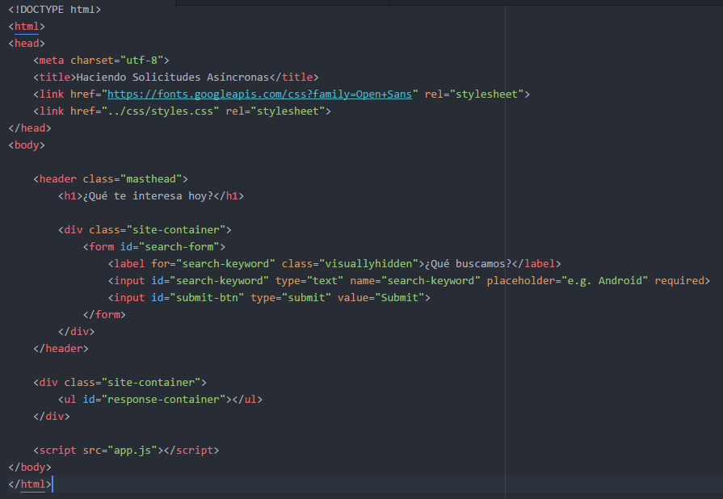
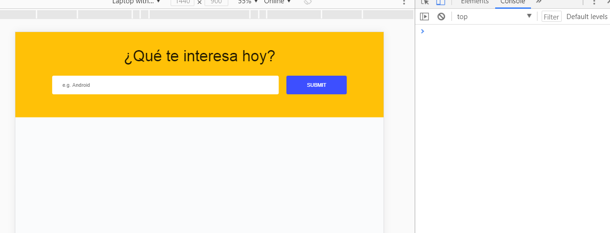
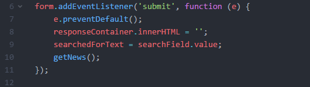
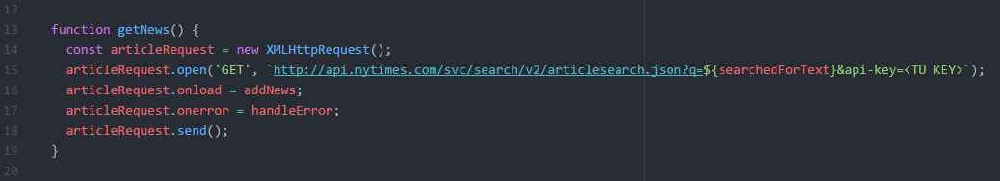
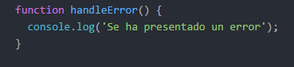
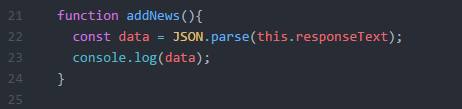
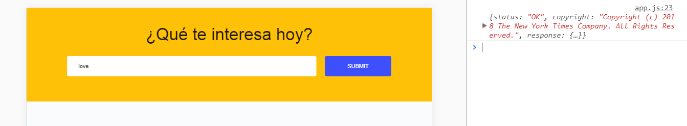
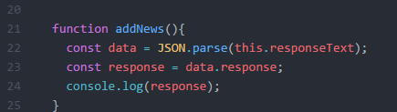
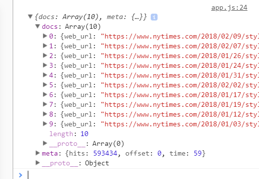

# XHR Project Demo

- Tipo: `lectura`
- Formato: `self-paced`
- Duración: `120min`

***

## Objetivos de Aprendizaje

- Usar XHR para construir una aplicación

## ¿Por dónde empezamos?

Lo primero y más importante es saber que queremos obtener.

Para este ejercicio guiado queremos hacer una petición a la página del NY Times
y que con la respuesta podamos ocupar sus noticias.

### Manos al teclado

1. Crea una cuenta de desarrollador aquí https://developer.nytimes.com/
  Nos enviarán una clave de acceso, con ella haremos las peticiones

2. Crea un proyecto con sus archivos HTML, CSS y JS
  (Nuestro HTML tiene una estructura sencilla pero tú puedes darle el estilo que prefieras)

    

  Así es como se ve en el navegador:

  

3. En nuestro archivo app.js nos traemos los elementos que usaremos y creamos un let sin asignarle valor por el momento

  

4. A nuestro formulario le agregamos el evento `submit` y las instrucciones a ejecutar

  

5. Como ya te diste cuenta, está invocando la función `getNews()` y es en esta función donde crearemos las peticiones

  

  - Creamos nuestro objeto _(línea 14)_

  - Hacemos uso del método `.open()` y es aquí donde debemos poner la clave que llegó a nuestro correo, **sustituyendo** < TU KEY > por tu clave _(linea 15)_

  - Las propiedades `.onload` y `.onerror` tienen asignadas sus funciones correspondientes

  - Envíamos la petición con el método `.send()`

6. La función `handleError()` quedará así

  

7. Vamos a empezar a trabajar con la función `addNews()`

  - Primero podemos hacer un console.log de `this.responseText` para saber que nos va a entregar esta respuesta (Un JSON)

  - Ya que vimos que tipo de información nos devolvió, podemos proceder con guardarlo en una const y hacer de nuevo un console.log para entender mejor la estructura de los datos

  
  

8. Observando detenidamente lo que nos regresa la consola vemos que este objeto tiene la propiedad `response`

  
  

9. A partir de este punto ya podemos jugar e investigar este JSON que tenemos en consola y por lo tanto ya podemos hacer uso de sus propiedades.

10. Creamos un `li`, le añadimos una clase para que tenga estilos, le agregamos texto que obtuvimos del JSON y lo anexamos al `ul`

  

11. Hecho todo esto, así debería verse en nuestro navegador

  

> Recuerda que en este ejemplo nuestro _html_ y el _li_ que creamos tienen estilos, asi que no te preocupes si se ve diferente. Lo importante es que te muestre en pantalla el elemento con los valores
