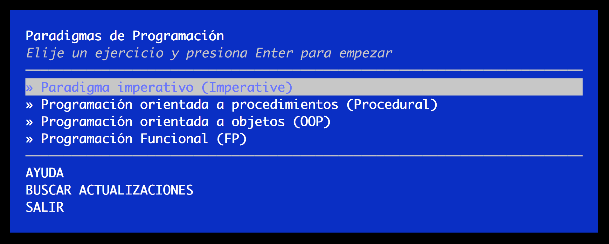

# Ejercicio imperativo

* Formato: `code`
* Duración: `5min`

***

## Requisitos

* Es fundamental tener instalado y configurado `git` y `npm`
* Cuenta en [GitHub](https://github.com/)
* Instalar `learnyouparadigms` con el siguiente comando:
  `npm install -g Laboratoria/learnyouparadigms`

Para empezar, una vez instalado el workshopper de `learnyouparadigms`, crea una
carpeta que se llame `paradigms` dentro de tu copia local del repo de tu cohort.

Crea también una rama con el nombre `paradigms`.

Cada ejercicio de `learnyouparadigms` creará un archivo en la carpeta
donde ejecutes el comando `learnyouparadigms`. Asegúrate de trabajar dentro de
la carpeta `paradigms` y la rama `paradigms`.

El ejercicio que tienes que hacer ahora es el primero: **Paradigma imperativo
(Imperative)**. Ejecuta el comando `learnyouparadigms` y selecciona el ejercicio
en el menu principal.

***

[Continuar](05-procedural.md)
