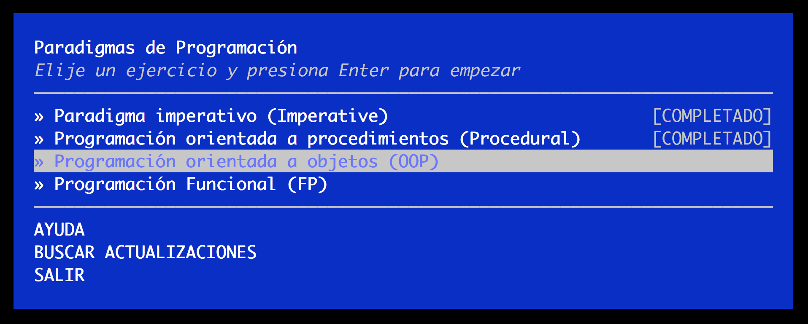

# Ejercicio OOP

* Formato: `code`
* Duración: `10min`

***

El ejercicio que tienes que hacer ahora es el tercero: **Programación orientada
a objetos (OOP)**. Ejecuta el comando `learnyouparadigms` y selecciona el
ejercicio en el menu principal.

[Continuar](10-fp.md)
