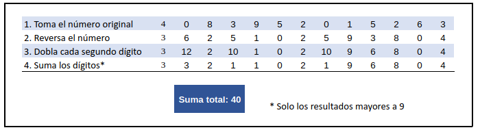

# Cartão de Crédito Válido

## Índice

* [1. Introdução](#1-Introdução)
* [2. Resumo do projeto](#2-resumo-do-projeto)
* [3. Considerações gerais](#3-considerações-gerais)
* [4. Marco: Critérios de Aceitação Mínimos do Projeto](#4-marco-critérios-de-aceitação-mínimos-do-projeto)
* [5. Marco Opcional: Mostrar a franquia do cartão](#5-marco-opcional-mostrar-a-franquia-do-cartão)
* [6. Considerações técnicas](#6-considerações-técnicas)
* [7. Objetivos de aprendizagem](#7-objetivos-de-aprendizagem)
* [8. Guias, dicas e leituras
  complementares](#8-guias-dicas-e-leituras-complementares)
* [9. Para considerar o feedback do projeto](#9-para-considerar-o-feedback-do-projeto)

***

## 1. Introdução

O [algoritmo de Luhn](https://en.wikipedia.org/wiki/Luhn_algorithm), também
chamado de módulo 10, é um método de soma de verificação, usado para validar
números de identificação, como o IMEI de telefones celulares, cartões de crédito
etc.

Esse algoritmo é simples. Obtemos o inverso do número a ser verificado (que
contém apenas dígitos [0-9]); todos os números que ocupam uma posição par devem
ser multiplicados por dois; se esse número for maior ou igual a 10, devemos
adicionar os dígitos do resultado; o número a verificar será válido se a soma de
seus dígitos finais for um múltiplo de 10.



## 2. Resumo do projeto

Neste projeto, você precisará criar um aplicativo da Web que permita ao usuário
validar o número de um cartão de crédito.  Além disso, você precisará
implementar a funcionalidade para ocultar todos os dígitos de um cartão, exceto
os quatro últimos.

O tema é livre. Você deve pensar em quais situações da vida real um cartão de
crédito precisaria ser validado e em como deveria ser a experiência do usuário
(telas, explicações, mensagens, cores, marca?) etc.

Como continuação do projeto de pré-admissão, você retrabalhará os fundamentos
do JavaScript, incluindo conceitos como variáveis, condicionais e funções,
bem como eventos e manipulação básica de DOM, fundamentos HTML e CSS.
Ao desenvolver este projeto, você também se familiarizará com novos conceitos.

### Os objetivos gerais deste projeto são os seguintes

* Trabalhar com base em um boilerplate, a estrutura básica de um projeto em diferentes
  pastas (através de módulos em JS).
* Conhecer as ferramentas de manutenção e melhoria do código (linters e testes
  unitários).
* Aprenda sobre objetos, estruturas, métodos e iteração (loops) em JavaScript
* Implementar controle de versão com git (e a plataforma github)

## 3. Considerações gerais

* Resolvemos este projeto **individualmente**. Recomendamos uma duração de 1-3 sprints.
* Concentre-se em aprender e não apenas "concluir" o projeto.
* Sugerimos que você não tente saber tudo antes de começar a codificar.
  Não se preocupe muito agora com o que você _ainda_ não entende.
  Você vai aprender.

## 4. Marco: Critérios de Aceitação Mínimos do Projeto

Esses são os requisitos que seu projeto deve atender para garantir que
seu trabalho atenda aos objetivos principais.

**1. Uma interface que deve permitir ao usuário:**  

* Inserir o número que desejamos validar. Use apenas caracteres
  numéricos (dígitos) no cartão para validar [0-9].
* Constatar se o resultado é válido ou não.
* Ocultar todos os dígitos do número do cartão, excetuando os últimos 4
  caracteres.
* Não deve poder inserir um campo vazio.

**2. Testes unitários dos métodos.**
Os métodos `validator` (`isValid` e `maskify`) devem ser cobertos por testes unitários.

**3. Código do seu projeto enviado para seu repositório e interface "implantada".**
O código final deve estar um repositório no GitHub. A interface, ou página da web,
deve ser "implantada" (acessível online publicamente) usando o GitHub Pages.

**4. Um README contendo uma definição de produto.**
No README, conte-nos como você pensou sobre os usuários e qual foi o seu
processo para definir o produto final em nível de experiência e interface.
Estas perguntas servem de guia:

* Quem são os principais usuários do produto
* Quais são os objetivos desses usuários em relação ao seu produto
* Como você acha que o produto que você está criando está resolvendo seus
  problemas

Com esses requisitos atendidos, você pode agendar um feedback do projeto com
um coach.

## 5. Marco Opcional: Mostrar a franquia do cartão

As partes opcionais permitem que você se aprofunde um pouco mais
nos objetivos de aprendizagem do projeto. Tudo na vida tem prós e contras, decida
sabiamente se você quiser gastar o tempo aprofundando/refinando ou aprendendo coisas
novas no próximo projeto.

No marco opcional você também pode validar se o número do
cartão é válido, mostre a [franquia](https://es.wikipedia.org/wiki/N%C3%BAmero_de_programa_bancaria)
do cartão (por exemplo, Visa, MasterCard, etc) usando estas [regras de validação](https://stevemorse.org/ssn/cc.html).
Se você escrever um novo método para isso, terá que fazer testes de unidade.

## 6. Considerações técnicas

A lógica do projeto deve estar implementada inteiramente em JavaScript. Nesse
projeto **NÃO** está permitido usar bibliotecas ou frameworks, só vanilla
JavaScript.

Para iniciar este projeto você terá que fazer um _fork_ e _clone_ desse
repositório, que contém um _boilerplate_ com testes. Um _boilerplate_ é a
estrutura básica de um projeto que serve como ponto de partida com arquivos
iniciais e configuração básica de dependências e testes.

Os testes unitários devem cobrir no mínimo de 70% dos _statements_, _functions_
e _lines_, e um mínimo de 50% de _branches_. O _boilerplate_ já contem o setup e
configurações necessárias para executar os testes assim como _code coverage_
para ver o nível de cobertura dos testes usando o comando `npm test`.

O _boilerplate_ que fornecemos contém esta estrutura:

```text
./
├── .babelrc
├── .editorconfig
├── .eslintrc
├── .gitignore
├── README.md
├── package.json
├── src
│   ├── validator.js
│   ├── index.html
│   ├── index.js
│   └── style.css
└── test
    ├── .eslintrc
    └── validator.spec.js
```

### Descrição de scripts/arquivos

* `README.md`: deve explicar como "deployar", instalar e executar a aplicação,
  assim como uma introdução a aplicação, suas funcionalidades e as decisões que
  foram tomadas.
* `src/index.html`: aqui será o ponto de entrada da sua aplicação. Este arquivo
  deve conter a marcação HTML e chamar o CSS e JavaScript necessários.
* `src/validator.js`: aqui você deve implementar o objeto `validator`, o qual
  já está _exportado_ no _boilerplate_. Este objeto (`validator`) deve conter
  dois métodos:
  - `validator.isValid(creditCardNumber)`: `creditCardNumber` é um `string`
    com o número do cartão a ser verificado. Esta função deve retornar um
    `boolean`, dependendo de sua validade, de acordo com o [algoritmo de
    Luhn](https://en.wikipedia.org/wiki/Luhn_algorithm).
  - `validator.maskify(creditCardNumber)`: `creditCardNumber` é um `string`
    com o número do cartão e esta função deve retornar um `string` onde todos,
    exceto os últimos quatro caracteres, são substituídos por um número (`#`) ou
    🐱. Essa função deve sempre manter os quatro últimos caracteres intactos,
    mesmo quando o `string` for mais curto.

    Exemplo de uso:

    ```js
    maskify('4556364607935616') === '############5616'
    maskify(     '64607935616') ===      '#######5616'
    maskify(               '1') ===                '1'
    maskify(               '')  ===                ''
    ```

* `src/index.js`: aqui você deve escutar os eventos de DOM, chamar
  `validator.isValid()` e `validator.maskify()`.
* `test/validator.spec.js`: este arquivo contem alguns testes de exemplo e aqui
  você deve implementar os testes para `validator.isValid()` e `validator.maskify()`.

O _boilerplate_ inclui tarefas que executam [eslint](https://eslint.org/) e
[htmlhint](https://github.com/yaniswang/HTMLHint) para verificar o `HTML` e
`JavaScript` com respeito a uma guia de estilos. Ambas tarefas são executadas
automaticamente antes de executar os testes quando usamos o comando `npm run
test`.
No caso do `JavaScript` estamos usando o `eslint` que está configurado no
arquivo `.eslintrc` que contem o mínimo de informação como versão do
JavaScript/ECMAScript, o ambiente (_browser_ nesse caso) e as [regras
recomendadas (`"eslint:recommended"`)](https://eslint.org/docs/rules/).
Nas regras/guias de estilo usaremos das recomendações padrão tanto para o
`eslint` quanto `htmlhint`.

#### Deploy

Disponibilizar os projetos e colocá-los "no ar" vai ser parte cotidiana do
ciclo de desenvolvimento em produtos de tecnologia.

Para este projeto, utilizaremos o Github Pages para essa finalidade.
O comando `npm run deploy` pode te auxiliar nessa tarefa e você pode também
consultar a [documentação oficial](https://docs.github.com/pt/pages).

## 7. Objetivos de aprendizagem

> ℹ️ Esta seção será automaticamente gerada no idioma pertinente, a partir dos
> objetivos de aprendizagem declarados em [`project.yml`](./project.yml), ao
> criar o repositório do projeto para uma coorte em particular usando
> [`./scripts/create-cohort-project.js`](../../scripts#create-cohort-project-coaches).
>
> Aqui você pode ver uma [lista de todos os objetivos de aprendizagem](../../learning-objectives/data.yml)
> cobertos em nosso currículo.

## 8. Guias, dicas e leituras complementares

### Primeiros passos

1. Se assegure de ter um bom :pencil: editor de texto, algo
   como [VS Code](https://code.visualstudio.com/).
2. Para executar os comandos você precisará de um :shell: UNIX Shell, que é um
   programa que interpreta linhas de comando (command-line interpreter) e também
   deve ter o git instalado. Se você usa um sistema operacional "UNIX-like",
   como GNU/Linux ou MacOS, você já tem um _shell_ (terminal) instalado (e
   provavelmente o `git` também). Se você usa Windows você pode usar o [Git
   bash](https://git-scm.com/download/win), embora seja recomendado que você
   teste :penguin: GNU/Linux.
3. Faça seu próprio :fork_and_knife:
   [fork](https://help.github.com/articles/fork-a-repo/) do repositório. Seus
   _mentores_ compartilharão com você um _link_ para um repositório privado e te
   darão acesso a este repositório.
4. :arrow_down: [Clone](https://help.github.com/articles/cloning-a-repository/)
   o _fork_ para seu computador (cópia local).
5. 📦 Instale as dependências do projeto rodando o comando `npm install`. Mas
   antes disso tenha certeza de ter instalado o [Node.js](https://nodejs.org/)
   (que inclui o [npm](https://docs.npmjs.com/)).
6. Se tudo foi bem, você deve conseguir executar os :traffic_light: testes
   unitários com o comando `npm test`.
7. Para ver a interface do seu programa no navegador, use o comando `npm start`
   para iniciar o servidor web e entre na url `http://localhost:5000` no seu
   navegador.
8. Let's Code! :rocket:

Este [video](https://drive.google.com/file/d/1CM6ZfpGfJMF6A8IcXoK5cFBBq-CY8oBR/view?usp=sharing)
da Paloma também pode te ajudar nos seus primeiros passos ;)

### Recursos e tópicos relacionados

Aqui está um vídeo de Michelle que mostra o algoritmo de Luhn (o vídeo está em
espanhol, mas pode ser útil) e mais algumas coisas que você deve saber para
realizar este projeto. Ouça com atenção e siga os conselhos dela! :)

[](https://www.youtube.com/watch?v=f0zL6Ot9y_w)

[Link](https://www.youtube.com/watch?v=f0zL6Ot9y_w)

Desenvolvimento de front-end:

* Saiba mais sobre [strings](https://javascript.info/string),
[arrays](https://javascript.info/array),
[iterate arrays](https://www.freecodecamp.org/news/how-to-loop-through-an-array-in-javascript-js-iterate-tutorial/),
[objetos](https://developer.mozilla.org/pt-BR/docs/Web/JavaScript/Guide/Working_with_Objects)
  e [como definir métodos](https://developer.mozilla.org/pt-BR/docs/Web/JavaScript/Guide/Working_with_Objects#definindo_m%C3%A9todos##)

## 9. Para considerar o feedback do projeto

Em resumo, os critérios mínimos de aceitação do projeto para considerar o
Project Feedback:

* [ ] Possui uma interface que permite ao usuário permita ao usuário
  validar o número de um cartão de crédito e ocultar todos os dígitos de um cartão
  e ocultar o número até os 4 últimos dígitos.
* [ ] O projeto será entregue incluindo testes unitários dos métodos
  `validator` (`isValid` e `maskify`).
* [ ] O projeto será entregue livre de _erros_ de `eslint` (_warnings_ são ok).
* [ ] O código do seu projeto será entregue no GitHub.
* [ ] A interface será "implantada" usando o GitHub Pages.
* [ ] O README contém uma definição de produto.
