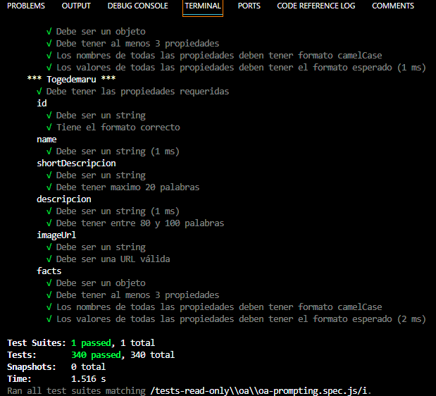

# **HITO 1:** SPA

Bienvenida al primer hito de tu aprendizaje en JavaScript mediante proyectos.
En esta fase, comenzarás construyendo una aplicación centrada en la
generación de datos mediante inteligencia artificial.

## Tareas de este hito

- [Prototipo](#prototipo)
- [Creación de set de datos](#creación-de-set-de-datos)
- [Test de prompting](#test-de-prompting)

### Prototipo

Elabora el diseño de la interfaz de la página principal,
donde se exhiben los elementos de tu conjunto de datos.

Es esencial que tu propuesta visual no solo represente la esencia
de tu solución ideal, sino que también se ajuste rigurosamente a
los principios fundamentales del
[diseño visual](https://coda.io/d/Bootcamp-UX-Contenido_dqkqk2rV9Z2/Diseno-de-interfaces_suOT7#_luWsQ).

### Creación de set de datos

El objetivo es crear un conjunto de datos que cumpla con las
[especificaciones proporcionadas](../README.md/#generar-los-datos).

1. **Definir temática**: En equipo seleccionen una temática para el conjunto de datos,
por ejemplo, personajes históricos, y tener en cuenta que la información sea variada
e interesante para la interacción futura.

2. **Estructurar datos**: En el archivo `src/data/dataset.js,` al generar tus datos,
reemplaza el contenido con la información generada. Asegúrate de que el archivo
exporte un arreglo con 24 objetos, cada uno siguiendo la estructura detallada
en el [prompt](https://espresso-matutino.notion.site/6-Pasos-Para-El-Prompt-Perfecto-280cac492ab54a258771ec56de27807d). Verifica que cada objeto contenga un **id** (identificador único),
**name** (nombre), **shortDescription** (descripción corta) y
**description** (descripción extendida), **imageUrl** (para la imagen),
**facts** (hechos), y,
opcionalmente, **extraInfo** (información adicional).

3. **Añadir imágenes**: Utilizar herramientas basadas en inteligencia artificial,
como el generador de imágenes de Bing, para crear imágenes correspondientes a cada
elemento del conjunto de datos o sencillamente googlearlas y obtener sus URLs.

4. **Datos de ejemplo**: En caso de no lograr generar los datos en un
periodo breve, como máximo tres días, puedes recurrir a los datos de
ejemplo disponibles en la ruta `./src/data/dataset.js`
**Es crucial no dedicar un sprint completo exclusivamente
a esta tarea**.

5. **Capturas de pantalla**: Incluir capturas de pantalla del prompt utilizado
para la generación de datos en el archivo readme, cumpliendo con el
requisito del proyecto.

### Test de prompting

Asegúrate de verificar con los tests ejecutando `npm run test:oas-prompting` para
garantizar que el archivo de datos generado cumple con los requisitos especificados.

## ¿Necesitas Ayuda?

En caso de que surjan dudas o preguntas durante la ejecución de este proyecto,
no dudes en buscar ayuda. Puedes encontrar apoyo a través de:

- **Documentación del Proyecto:** Asegúrate de revisar minuciosamente la
información proporcionada en el [README](../README.md), prestando especial
atención a las indicaciones, sugerencias y lecturas adicionales.

- **Coaches:** Los coaches están disponibles para brindarte ayuda.
Si encuentras desafíos que la documentación no aborda o si necesitas
una explicación más detallada, no dudes en solicitar una reunión de orientación
(OH) o comunicarte con nosotros a través de Slack.

- **Slack:** Siempre puedes escribir en el canal del proyecto
[#project-dataverse](https://claseslaboratoria.slack.com/archives/C05V648LL1G),
donde tus compañeras y coaches de Laboratoria pueden brindarte
apoyo de manera asincrónica.

[👈Todos los hitos](../README.md#6-hitos)
