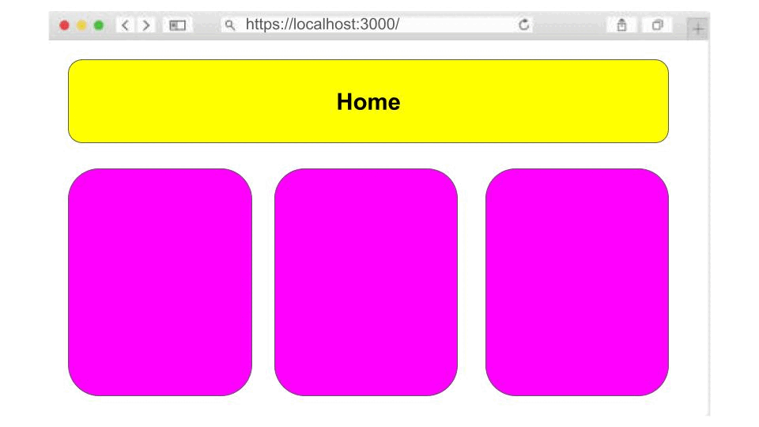

# **HITO 1:** SPA

Bienvenida al primer hito de tu aprendizaje en JavaScript a
través de proyectos. En este hito, comenzarás construyendo una
[SPA](https://es.wikipedia.org/wiki/Single-page_application)
(Single Page Application) .

## Tareas de este hito

* Prototipo de Dataverse:

  1. Utiliza el prototipo existente de Dataverse como punto de partida.
  2. Agrega la vista de chat al prototipo, permitiéndote la
  flexibilidad de utilizar el diseño actual o hacer modificaciones
  según sea necesario.

* Creación de Vistas de la SPA:

  1. Dirígete a la carpeta ```views```.
  2. Crea dos archivos: ```Home.js``` y ```About.js```,
  cada uno de estos archivos representará una vista.
  3. Dentro de cada archivo, agrega al menos un elemento o
  texto representativo de la vista correspondiente.
  4. Implementa el enrutador siguiendo las indicaciones
  detalladas en la
  [guía](https://github.com/Laboratoria/guide-router/tree/guide-v1).
  Asegúrate de seguir con precisión cada paso proporcionado
  en la guía para garantizar el correcto funcionamiento del
  enrutador.
  5. Implementa pruebas unitarias para los componentes
  con el objetivo de garantizar que respondan de
  manera adecuada a diversas rutas.



## 쯅ecesitas Ayuda?

Si en algún momento te encuentras con dudas o preguntas durante el desarrollo
de este proyecto, ¡no dudes en buscar ayuda! recuerda que puedes apoyarte con:

* **Documentación del Proyecto:** Asegúrate de revisar cuidadosamente la
documentación proporcionada en el [README](../README.md); especialmente las
pistas, tips y lecturas complementarias.

* **Coaches:** Los coaches están aquí para ayudarte.
Si enfrentas obstáculos que la documentación no resuelve o si necesitas
una explicación más detallada, no dudes en solicitar una OH o escribenos por Slack.

[👈Todos los hitos](../README.md#6-hitos)
