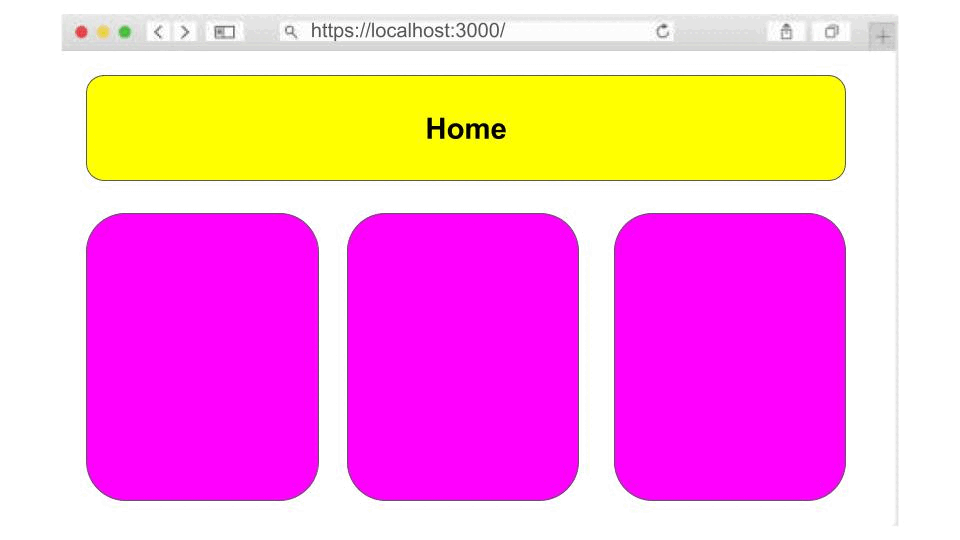

# **MARCO 1:** SPA

Bem-vinda ao primeiro marco do seu aprendizado em JavaScript
através de projetos. Neste marco, você começará construindo uma
[SPA](https://pt.wikipedia.org/wiki/Aplicativo_de_p%C3%A1gina_%C3%BAnica)
(Single Page Application).

## Tarefas deste marco

- [Protótipo de Dataverse](#prototipo-de-dataverse)
- [Criação de Visualizações da SPA](#criação-de-visualizações-da-spa)

### Protótipo de Dataverse

Projete as visualizações da página inicial, onde serão apresentados
os elementos do seu conjunto de dados, bem como as visualizações de
Chat Individual e Chat em Grupo. A premissa é otimizar e
reutilizar o design do protótipo do projeto anterior,
incorporando exclusivamente a visualização de chat individual e/ou
chat em grupo, evitando a necessidade de reinventá-lo.

É fundamental que a sua proposta visual não apenas reflita a
essência da sua solução ideal, mas também siga
estritamente os princípios fundamentais do
[design visual](https://coda.io/d/Bootcamp-UX-Contenido_dqkqk2rV9Z2/Diseno-de-interfaces_suOT7#_luWsQ).

> [!TIP]
> Use a identidade visual ou o protótipo do seu projeto anterior.

### Criação de Visualizações da SPA

  1. Seguindo este [guia](https://github.com/Laboratoria/curriculum/blob/main/guides/router-spa/README.pt.md),
  vá até a pasta `views`.
  2. Crie dois arquivos: `Home.js` e `About.js`,
  cada um desses arquivos representará uma visualização.
  3. Dentro de cada arquivo, adicione pelo menos um elemento ou
  texto representativo da visualização correspondente.

## Precisa de Ajuda?

Se em algum momento você tiver dúvidas ou perguntas durante o desenvolvimento
deste projeto, não hesite em procurar ajuda!
Lembre-se de que você pode contar com:

- **Documentação do Projeto:** Certifique-se de revisar cuidadosamente a
documentação fornecida no [README](../README.md); especialmente as
dicas, sugestões e leituras complementares.

- **Coaches:** Os coaches estão aqui para ajudar você.
Se você enfrentar obstáculos que a documentação não resolve ou se precisar
de uma explicação mais detalhada, não hesite em solicitar uma OH ou
nos enviar uma mensagem pelo Slack.

[👈Todos os marcos](../README.md#6-marcos)
