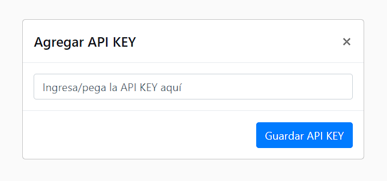

# **HITO 3:** Manejo de la API KEY

Almacenar de forma segura tu clave de API es el core de este hito.
<!-- Este es un tip de Github Pages, https://github.com/orgs/community/discussions/16925 -->
> [!IMPORTANT]
> Para ello, asegúrate de solicitar tu APIKEY a las coaches.

## Tareas de este hito

* Manejo de la API KEY en la Aplicación

El manejo de las API KEYs es crucial para mantener la seguridad.
Con el fin de no incluir la clave directamente en el código de la aplicación,
crea un input que permita ingresar o pegar la API KEY.
Este input puede estar ubicado en una vista,
dialog o modal.



* Almacenamiento Seguro de la API KEY con Local Storage

Para garantizar la seguridad y persistencia de la
API KEY, se sugiere utilizar [Local Storage](https://developer.mozilla.org/es/docs/Web/API/Window/localStorage).
Te recomendamos seguir estos pasos:

1. En la carpeta ```utils```, crea un nuevo archivo llamado ```apiKey.js```.

2. Dentro de ```apiKey.js```, implementa dos funciones esenciales:

```js
// src/utils/apiKey.js

export const getApiKey = () => {
   // Implementa el código para obtener la API KEY desde Local Storage
};

export const setApiKey = (key) => {
  // Implementa el código para guardar la API KEY en Local Storage
};
```

* Pruebas para funciones de API Key

Dentro de la carpeta ```test```, crea un archivo llamado ```apiKey.spec.js```. En este archivo, desarrolla los tests correspondientes. Puedes utilizar el siguiente esquema como punto de partida:

``` js
// test/apiKey.spec.js

import { getApiKey, setApiKey } from '../src/utils/apiKey.js';

describe('getApiKey', () => {

  it('debería devolver el valor de la API Key', () => {
    // Desarrolla el test correspondiente aquí
  });
});

describe('setApiKey', () => {

  it('debería establecer correctamente la API Key', () => {
   // Desarrolla el test correspondiente aquí
  });
});

```

[👈Todos los hitos](../README.md#6-hitos)
