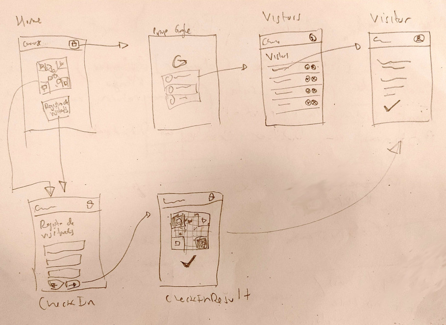

# Registro de Visitantes

## Índice

- [1. Preámbulo](#1-preambulo)
- [2. Resumen del proyecto](#2-resumen-del-proyecto)
- [3. Objetivos de aprendizaje](#3-objetivos-de-aprendizaje)
- [4. Consideraciones generales](#4-consideraciones-generales)
- [5. Requerimientos funcionales](#5-requerimientos-funcionales)
- [6. Consideraciones técnicas](#6-consideraciones-tecnicas)
- [7. Pistas, tips y lecturas complementarias](#7-pistas-tips-y-lecturas-complementarias)

## 1. Preámbulo

> El _cotrabajo​_, trabajo cooperativo, trabajo compartido, trabajo en
> cooperación o trabajo en oficina integrada (del inglés _coworking_) es una
> forma de trabajo que permite a profesionales independientes, emprendedores, y
> pymes de diferentes sectores, compartir un mismo espacio de trabajo, tanto
> físico como virtual, para desarrollar sus proyectos profesionales de manera
> independiente, a la vez que fomentan proyectos conjuntos. El neologismo
> "cotrabajo" es la traducción al español del término coworking.
>
> Fuente: [Wikipedia](https://es.wikipedia.org/wiki/Trabajo_cooperativo)

Dentro de las medidas de distanciamiento social 😷, el espacio de coworking más
famoso de tu ciudad se encuentra en el proceso de modernizar su
_registro de visitantes_. Como espacio de trabajo compartido, un coworking
recibe visitas constantemente que vienen a reunirse con lxs diferentes
inquilinxs.

Por ahora, como muchos otros espacios de oficinas, este coworking solo tiene un
registro físico, en papel, lo cual hace incómodo el proceso de llenar el
registro, autorizar acceso y auditar el historial de visitas. Además, este
proceso en papel implica contacto físico cercano, uso compartido de lapiceros,
etc.

Lxs administradorxs del coworking se dan cuenta de que necesitan una forma más
moderna de registrar a lxs visitantes donde no tengan que interactuar
físicamente con otra persona. Para esto contratan a tu equipo!

Crédito: [Pxfuel](https://pxfuel.com/)

## 2. Resumen del proyecto

En este proyecto construirás un prototipo para digitalizar el registro de
visitantes en un coworking.

Este prototipo debe ser una SPA (Single Page Application), lo que implica que
nuestra aplicación debe manejar la idea de _rutas_ y poder _renderizar_
diferentes _vistas_ dependiendo de la ruta (URL) actual así como reaccionar a
eventos de navegación.

Usaremos la plataforma de Firebase para autenticación y persistencia de datos
(Firestore). Además, la aplicación debe ser _responsive_ y poder usarse
fácilmente desde celulares y PCs.

Por un lado, la aplicación debe permitir que lxs visitantes se registren. Por
otro lado, lxs encargadxs del coworking deben poder acceder como _admin_ y
revisar, aceptar o rechazar las visitas.

## 3. Objetivos de aprendizaje

> ℹ️ Esta sección será auomáticamente generada en el idioma pertinente, a partir
> de los objetivos de aprendizaje declarados en [`project.yml`](./project.yml),
> al crear el repo del proyecto para un cohort en particular usando
> [`./scripts/create-cohort-project.js`](../../scripts#create-cohort-project-coaches).
>
> Acá puedes ver una [lista de todos los objetivos de aprendizaje](../../learning-objectives/data.yml)
> que contempla nuestra currícula.

## 4. Consideraciones generales

- Este proyecto se debe resolver en equipos de 2 o más personas.

<!--
- Intenta pensar en un alcance que, considerando su complejidad y la cantidad de
  personas en el equipo, te permita terminar el proyecto dentro del tiempo
  estimado.
-->

- La división y organización del trabajo debe permitir, sin excepciones, que
  **cada integrante** del equipo practique el aprendizaje de todo lo involucrado
  en **cada historia de usuarix**. No se dividan el trabajo como en una fábrica.
  * ¿Hasta acá has avanzado en tus proyectos con cierta fluidez y sin mayores
    problemas? Sé generosa con tus compañeras, permíteles aprender y practicar
    sin restricciones, aunque tome un poco más de tiempo. Aproveha de
    _coachearlas_, de hacer _pair programming_, una de las mejores maneras de
    aprender es explicando verbalmente.

  * ¿Se te está haciendo difícil y te cuesta un poco más avanzar? No te quedes
    con las partes "fáciles" del proyecto, conversa, negocia, exige tu oportunidad
    para practicar y aprender lo que se te hace más difícil.

- Solamente pueden trabajar en una única historia por vez, no pueden avanzar a
  la siguiente sin haber completado la anterior. La historia se completa cuando
  se cumplen **todos** sus Criterios de Aceptación + **toda** su Definición
  de Terminado.

## 5. Requerimientos funcionales

Al tratarse de un esfuerzo que busca reemplazar un proceso ya existente en el
mundo físico (el registro de visitantes), el coworking ya tiene una idea
bastante clara de la funcionalidad que quieren implementar. De hecho, ya han
tenido algunas reuniones y sesiones de _lluvia de ideas_ (_brain storming_) y
nos presentan el siguiente _storyboard_ con el flujo de navegación a grandes
rasgos.

El _storyboard_ contiene dos casos de uso distintos (el de visitante y el de
admin). En el dibujo podemos ver en la esquina superior izquierda la página de
inicio (`Home`), a partir de la cual podemos iniciar sesión (flecha que va hacia
la derecha) o acceder al formulario de registro (flecha que va hacia abajo).

A pesar de la baja fidelidad del storyboard, ya podemos ir viendo que están
pensando en una serie de _páginas_ o _vistas_ en particular (como `Home`,
`CheckIn`, `Visitors`, ...) y dos grandes casos de uso a grandes rasgos:

- Caso de uso de _visitante_:
  * Comienza en la _página_ `Home` y escanea QR o hace click en link.
  * Pasa a `CheckIn`, donde tenemos el formulario de registro.
  * Una vez enviado el formulario pasamos a `CheckInResult`, donde vemos otro
    QR (que apunta detalles de visita) y muestra el _estado_ (_status_) de la
    visita.
- Caso de uso de _admin_:
  * Comienza en `Home` y hace click en _iniciar sesión_.
  * Pasa a popup de inicio de sesión con Google.
  * Una vez autenticado accedemos a `Visitors`, la lista de visitantes, donde
    podemos aceptar o rechazar visitas así como acceder a más detalle en la
    _página_ `Visitor`.

### Historias de Usuaria

Basado en el _storyboard_, nos entregan también una serie de
_historias de usuaria_ que debemos usar como guía para el desarrollo de nuestra
aplicación.

- Como _visitante_, debo poder escanear un código QR para acceder al formulario de
  registro de visitantes.
- Como _visitante,_ debo poder llenar el formulario de registro de visitantes y
  enviarlo para solicitar acceso al coworking. En este formulario el visitante
  tendrá que incluir su nombre, email, persona a la que visita, empresa a la que
  representa (si aplica), fecha, hora y duración de la visita.
- Como _visitante_, después de enviar el formulario debo ver el estado de mi
  registro (pendiente, aceptado o rechazado) así como un código QR con el que
  identificarme en la puerta. El estado debe actualizarse sin tener que recargar
  la página.
- Como _admin_, debo poder iniciar sesión con google para acceder a
  funcionalidad restringida.
- Como _admin_, debo poder acceder a un listado de visitas para ver quienes
  están solicitando acceso.
- Como _admin_, debo poder filtrar el registro de visitas por fecha y status
  para poder encontrar fácilmente las visitas.
- Como _admin_, debo poder cambiar el estado (status) de las visitas
  (_pendiente_, _aceptada_, _rechazada_).
- Como _admin_, debo poder ver el detalle completo de cada visita por separado,
  con su propia URL, para que así pueda a través de un QR (que en este caso
  contiene una URL) ir directo al registro de esa visita.
- Como _visitante_, debo poder tomar una fotografía (selfie) para incluir en el
  formulario de registro (usando el [API web de la cámara](https://developer.mozilla.org/es/docs/Web/API/MediaDevices/getUserMedia)).

Te recomendamos crear _issues_ en GitHub o un Trello para cada una de las
historias de usuaria para así poder hacer seguimiento del avance.

También ten en cuenta que es probable que a la hora de comenzar con las
historias de usuario sientas la necesidad de crear _sub historias_ o romper
historias grandes en otras más chiquitas.

## 6. Consideraciones técnicas

- **Vanilla**: Este proyecto se debe desarrollar usando Vanilla JavaScript, HTML
  y CSS. Este proyecto invita a explorar soluciones a temas comunes de las SPA
  (vistas, componentes, renderizado, rutas, etc) sin _frameworks_, con la idea
  de familiarizarnos con APIs nativas del DOM y navegador.
- **Responsive**: Nuestra interfaz debe adaptarse con naturalidad a diferentes
  tamaños de pantalla, relación de aspecto, etc. En particular, este producto es
  esencial que funcione bien en celulares, tablets y PCs.
- **SPA (Single Page Application)**: La aplicación debe ser una SPA, lo cual
  implica que cuando la usuaria navega a _otra página_ de la aplicación, en vez
  de ir a otra URL y cargar un nuevo documento HTML, nuestra aplicación se hace
  cargo de hacer el ruteo y renderizar la _vista_ o _componente_ en cuestión.
- **Arquitectura basada en componentes**: Como parte de la necesidad de hacer
  una SPA, es de gran ayuda apoyarse en una arquitectura de componentes que nos
  permita pensar en _cajitas dentro de cajitas_ (siguiendo el modelo del DOM),
  reusarlas y componer poniendo unas dentro de otras. El boilerplate ?????
- **Despliegue de front-end en Firebase Hosting**: En este proyecto haremos uso
  del servicio de _hosting_ (_alojamiento web_) de Firebase para alojar nuestra
  web app y que quede desplegada en una URL pública.
- **Autenticación de Google con Firebase**: Para la autenticación de usuarios,
  usaremos el sistema de autenticación de Firebase con la opción de
  autenticación con Google. De esta forma las usuarias podrán iniciar sesión con
  su cuenta existente de Google.
- **Persistencia con Firestore**: Para almacenar el registro de visitas en sí
  (la información de cada visita), haremos uso de Firestore, que es una base de
  datos que nos ofrece Firebase. En principio solo deberíamos necesitar una
  _colección_ en nuestra base de datos, donde cada _documento_ representa los
  datos enviados por el formulario de registro de visitantes.
- **Reglas de firestore**: El proyecto debe incluir reglas de Firestore que
  garanticen que los documentos en la colección de visitas solo se pueden crear
  con el campo `status` con el valor `pending` y además solo los usuarios
  _admin_ deben poder _listar_ la colección. (Ver sección sobre el rol de
  _admin_ más abajo).
- **Real time**: Firestore nos ofrece un mecanismo que nos permite escuchar
  cambios en una colección o un documento. En esta aplicación haremos uso de
  estas características para actualizar el estado de las visitas (en el listado
  de visitas, la vista de resultado de registro y la vista de detalle de
  visita).
- **Linters**: El _boilerplate_ incluye una configuración de _eslint_ que
  debemos respetar dentro de lo posible/razonable.
- **Pruebas unitarias**: El desarrollo de cada _historia_ y/o _feature_ debe ir
  acompañado de pruebas unitarias como parte del _diseño_, _desarrollo_ y
  _criterios de aceptación_. Esto implica describir las pruebas, basadas en el
  _storyboard_ y las _historias de usuaria_, antes de la implementación, durante
  la misma (para ejercitar el código) y después para validar y garantizar. La
  arquitectura basada en componentes elegida en este proyecto facilita que nos
  enfoquemos en las pruebas de los componentes de interfaz como unidad
  principal.
- **Códigos QR**: El _boilerplate_ incluye una librería
  ([`QRCode`](https://davidshimjs.github.io/qrcodejs/)) para poder crear códigos
  QR dínamicamente desde la interfaz. Esta librería está siendo incluída en una
  etiqueta `<script>` en el archivo `index.html`. El constructor `QRCode` está
  disponible en el ámbito _global_.

Sobre el _rol_ de admin...

## 7. Pistas, tips y lecturas complementarias

Getting started

- Para comenzar, una integrante del equipo tendrá que hacer un _fork_  de este
  repositorio. Este _primer fork_ será usado para integrar los cambios de todo
  el equipo. Una vez creado el primer _fork_, el resto de integrantes del equipo
  crearán su propio _fork_ a partir del primero. De esta manera cada integrante
  del equipo tiene su propio fork. Cada una puede trabajar en ramas dentro de su
  fork y después integrar a través de _pull requests_ en la rama principal del
  _primer fork_.
- Arquitectura basada en componentes
- Hello world!
- Routing
- Hello routes!
- Hello auth
- Subsripciones a eventos de larga vida y fugas de memoria (_memory leaks_).
