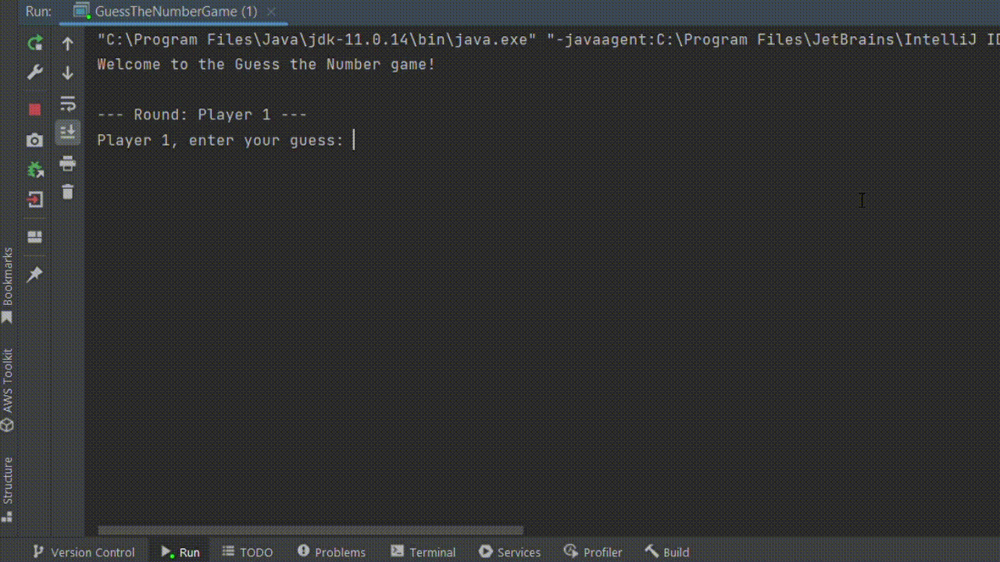
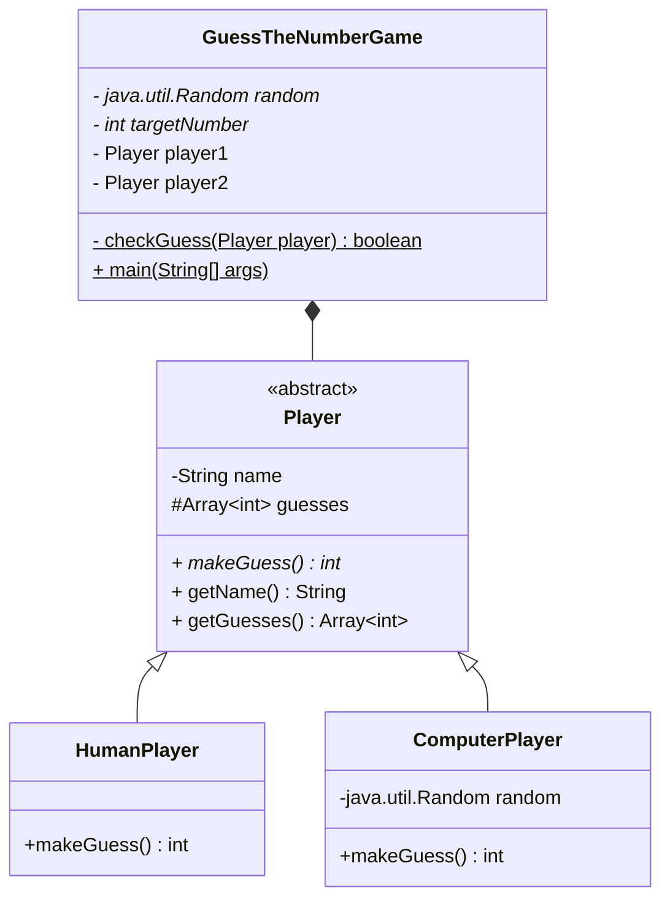

# Guess the Number - Adivina el número

## Índice

* [1. Consideraciones generales](#1-consideraciones-generales)
* [2. Preámbulo](#2-preámbulo)
* [3. Resumen del proyecto](#3-resumen-del-proyecto)
* [4. Objetivos de aprendizaje](#4-objetivos-de-aprendizaje)
* [5. Consideraciones generales](#5-consideraciones-generales)
* [6. Consideraciones técnicas](#6-consideraciones-técnicas)
* [7. Recomendaciones](#7-recomendaciones)

---

## 1. Consideraciones generales

* Este proyecto lo resolvemos de manera **individual**.
* El rango de tiempo estimado para completar el proyecto es de 1 a 2 Sprints.
* Concentra tu atención en adquirir conocimiento en lugar de
simplemente "terminar" el proyecto.
* ¡Paciencia! No te inquietes en exceso por lo que aún no comprendas completamente.
Tu aprendizaje se desarrollará a medida que avances.

## 2. Preámbulo

En la actualidad, Java es uno de los lenguajes de programación más utilizados
en el mundo. A pesar de la diversidad de plataformas y herramientas disponibles,
es esencial tener una base sólida en los conceptos fundamentales de Java y la
programación orientada a objetos (OOP). El objetivo de este proyecto es
introducirte en el mundo de Java mediante un juego sencillo y entretenido.

## 3. Resumen del proyecto

Es un juego interactivo que se lleva a cabo en la terminal, en el que la
jugadora y la computadora toman turnos para intentar adivinar un número
aleatorio entre 1 y 100. Se deberá tener en cuenta el intento anterior si fue
"muy alto" o "muy bajo".

## 4. Objetivos de aprendizaje

### Java & OOP

* [ ] **Tipos de datos primitivos**
* [ ] **Tipos de datos: primitivos vs no primitivos**
* [ ] **Strings (cadenas de caracteres)**
* [ ] **Arrays (arreglos)**
* [ ] **_Access Modifiers_: `private`**
* [ ] **_Access Modifiers_: `protected`**
* [ ] **_Access Modifiers_: `public`**

* #### Programación Orientada a Objectos (OOP)

  - [ ] **Clases**
  - [ ] **Objetos**
  - [ ] **Métodos**
  - [ ] **Atributos**
  - [ ] **Constructores**
  - [ ] **Encapsulamiento**
  - [ ] **Abstracción**
  - [ ] **Composición**
  - [ ] **Interfaces**
  - [ ] **Herencia: `super`**
  - [ ] **Herencia: `extends`**
  - [ ] **Herencia: `overrride`**
  - [ ] **Lenguaje Unificado de Modelado (UML): Diagramas de clases**

* [ ] **Variables**
* [ ] **Conditionales**
* [ ] **Uso de bucles/ciclos (loops)**

* #### Collecciones

  - [ ] **Listas: ArrayList**

* #### Testing

  - [ ] **JUnit**
  - [ ] **Mockito**

## 5. Consideraciones generales

* Duración del proyecto: Se estima que este proyecto tomará entre 1 y 2 sprints.
* Enfoque exclusivo en Java.
* El juego se desarrollará en la terminal.
* Se utilizará un número aleatorio entre 1 y 100 como número secreto.
* La jugadora y la computadora se turnarán para adivinar el número.
* Después de cada turno, se mostrará información sobre la suposición realizada.
* El juego terminará cuando se adivine el número. Se debe mostrar la lista de
todos los intentos de la jugadora ganadora.

### Diagrama de clases

#### `GuessTheNumberGame`

**Propósito:**
Maneja la lógica principal, decide qué jugador toma el siguiente turno.

**Atributos:**

* `random`: Generador de números aleatorios.
* `targetNumber`: Número aleatorio entre 1 y 100 a adivinar en la partida actual.

**Métodos:**

* `static main(String[] args)`: Inicia el juego y genera el número aleatorio.
* `checkGuess(Player player)`: Ejecuta un turno, obtiene la suposición y evalúa
  el nuevo estado de la partida.

#### `Player`

**Propósito:**
Representa a una jugadora genérica. Es una clase abstracta. Define los
atributos y métodos que todas las _clases_ de jugadoras deberían compartir:

**Atributos:**

* `name`: El nombre de la jugadora
**Métodos:**

* `makeGuess()`: Devuelve la suposición de la jugadora. Es un método abstracto.
* `getName()`: Devuelve el nombre de la jugadora.
* `getGuesses()`: Devuelve el historial de suposiciones de la jugadora.

#### `HumanPlayer` y `ComputerPlayer` (heredan de `Player`)

**Propósito:**
Representa a la jugadora _Humana_ y _Computadora_ respectivamente.

**Métodos:**

* `makeGuess()`: Método de que cada clase que herada de `Player` debe implementar.

**Relaciones:**

* La clase `GuessTheNumberGame` interactúa con las clases `HumanPlayer` y
  `ComputerPlayer` para gestionar el juego.
* Tanto la clase `HumanPlayer` como `Computer Player` son subclases de `Player`,
  lo que implica que hereda todas sus propiedades y métodos, pero también
  tiene algunas características adicionales propias.

Este diseño de clases permite separar las responsabilidades, facilitando
el mantenimiento y posibles extensiones del juego en el futuro.

Por ejemplo, podríamos añadir diferentes jugadoras "máquina" con diferentes
estrategias para la suposición automática, un nuevo tipo de jugador "remoto" o
incluso diferentes niveles de dificultad.

### **Criterios de aceptación mínimos del proyecto**

* La jugadora y la computadora se alternarán en turnos para
 intentar adivinar dicho número.
* Tras cada intento, se debe mostrar:
  - El nombre del jugador (persona o computadora).
  - La suposición que se hizo.
  - Un mensaje que indique si la suposición fue demasiado alta, demasiado baja
  o correcta.
* El juego finalizará en cuanto la jugadora o la computadora acierte el
número secreto. Se debe mostrar un mensaje de fin del juego, así como una lista
todos los intentos realizados por la jugadora ganadora.

## 6. Consideraciones técnicas

* El juego se llevará a cabo en la terminal haciendo uso de Java.
* La lógica del juego se basará en estructuras de control,
incluyendo ciclos, condicionales y colecciones.
* Debes depara para segmentar el código y mejorar
su legibilidad y mantenimiento.
* Debes usar una funcionalidad de la biblioteca de utils de java para
la generación de números aleatorios.
* Debes realizar **tests unitarios** para tus clases y sus métodos haciendo
uso de JUnit y mockeando la generación de números aleatorios con mockito.

## 7. Recomendaciones

**Documentación de Java**: La documentación oficial de Java es una excelente
fuente de información sobre las clases y métodos disponibles en Java
(recomendamos utilizar Java 20).

**Diseña la estructura del juego**: Antes de empezar a escribir código,
considera cómo deseas que funcione el juego. Piensa en cómo alternar
los turnos entre la jugadora  y la computadora, cómo generar y evaluar
las suposiciones, y cómo mostrar la información al jugador. Detente un momento
a analizar y diseñar tu solución antes de comenzar a implementarla.

**Separación de responsabilidades**: Te recomendamos seguir el diagrama de
clases provisto, para lograr una clara separación de la lógica del juego en
componentes o clases que permitan mantener el código organizado y legible.

**Necesitas bucles y condicionales**: Los bucles y las sentencias condicionales
serán tus aliadas en este proyecto para controlar los turnos, evaluar las
suposiciones y determinar el ganador.

**Manejo de números aleatorios**: Utiliza la clase `Random` de `java.util` para
generar el número secreto aleatorio. Puedes encontrar información sobre cómo
usarla en la documentación de Java.

**Pruebas unitarias**: A medida que desarrolles el juego, intenta escribir
pruebas unitarias para verificar que las diferentes partes del juego funcionen
como se espera. Puedes utilizar el framework JUnit para escribir tus pruebas.

Recuerda que este proyecto está diseñado para que puedas tomar tus
conocimientos previos en JavaScript, para que puedas "traducirlos" a Java,
aprendiendo en el proceso el paradigma de programanación orientado a objetos.

**_¡Diviértete mientras construyes tu juego de adivinar el número! 🎲🎮_**
