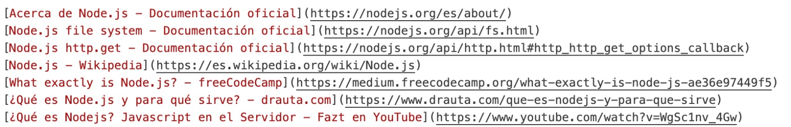
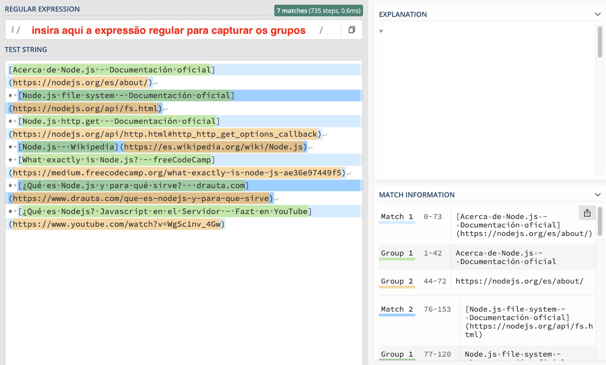

# Markdown Links

## Índice

* [1. Prefácio](#1-prefácio)
* [2. Objetivos de aprendizagem](#2-objetivos-de-aprendizagem)
* [3. Funcionalidades](#3-funcionalidades)
* [4. Etapas Iniciais](#4-etapas-iniciais)
* [5. Considerações gerais](#5-considerações-gerais)
* [6. Critérios de aceitação mínimos do projeto](#6-criterios-de-aceitação-mínimos-do-projeto)
* [7. Hacker edition](#7-hacker-edition)
* [8. Guias, dicas e leituras complementares](#8-guias-dicas-e-leituras-complementares)
* [9. Dividindo o problema - babies steps](#9-dividindo-o-problema)
* [10. Checklist](#10-checklist)

***

## 1. Prefácio

Nesse projeto será criado uma ferramenta de linha de comando (CLI) que permitirá que o usuário execute a biblioteca diretamente do terminal. Essa biblioteca, escrita em [Node.js](https://nodejs.org/), será responsável por analisar arquivos em formato Markdown.

Nesse projeto será criada uma biblioteca de código que servirá
como ferramenta para analisar links dentro de arquivos Markdown. Essa biblioteca será acessível por linha de comando (CLI) que permitirá que o usuário execute a biblioteca diretamente do terminal. Essa biblioteca, escrita em [Node.js](https://nodejs.org/), será responsável por analisar arquivos em formato Markdown. A biblioteca também será acessível por importação do 
módulo publicado

[Markdown](https://pt.wikipedia.org/wiki/Markdown) é uma linguagem de marcação
muito popular entre os programadores. É usada em muitas plataformas que
manipulam texto (GitHub, fórum, blogs e etc) e é muito comum encontrar arquivos
com este formato em qualquer repositório (começando pelo tradicional
`README.md`).

A CLI tem como objetivo principal encontrar e apresentar os links presentes nos arquivos Markdown. Esses links podem estar quebrados, ou não serem mais válidos, prejudicando o valor da informação que está ali. A CLI exibirá a rota do arquivo onde o link foi encontrado, a URL do link e o texto presente no link. Esses dados são exibidos ao usuário para facilitar a visualização e análise dos links encontrados nos arquivos.


## 2. Objetivos de aprendizagem

> ℹ️ Esta seção será automaticamente gerada no idioma pertinente, a partir dos
> objetivos de aprendizagem declarados em [`project.yml`](./project.yml), ao
> criar o repositório do projeto para uma coorte em particular usando
> [`./scripts/create-cohort-project.js`](../../scripts#create-cohort-project-coaches).
>
> Aqui você pode ver uma [lista de todos os objetivos de aprendizagem](../../learning-objectives/data.yml)
> cobertos em nosso currículo.

## 3. Funcionalidades

O objetivo é que através da CLI seja feita a exibição das informações necessárias e para que isso se cumpra, você desenvolverá as funções responsáveis por revelar rota do arquivo, URL e o texto âncora de arquivos em formato Markdown, bem como as funções para validar links e fornecer estatísticas.

A função principal, `MdLinks`, deverá ter os seguintes argumentos:

* `path`: Rota absoluta ou relativa ao arquivo ou diretório. Se a rota passada é relativa, deve resolver como sendo relativa ao diretório onde foi chamada - current working directory
* `options`: Um objeto com a seguinte propriedade:
- `validate`: Um booleano que determina se deseja validar os links encontrados.
- `stats`: Booleano que determina se deseja obter um output com informações estatísticas gerais.
      
A referida função deve ser executada ao inserir o comando (md-links) + o caminho do arquivo  `(md-links <path-to-file>)`, seu comportamento padrão não validará as URLS,  apenas irá identificá-las  em um arquivo Markdown (com base no caminho do arquivo passado como argumento).

No terminal, deverá estar presente as seguintes informações:
* `file`: caminho do arquivo onde o link foi encontrado; 
* `href` : url encontrada no link; 
* `text`: texto que aparece dentro do link 

A informação deverá retornar ao usuário da seguinte maneira:
 	
```sh
$ md-links ./some/example.md
./some/example.md http://algo.com/2/3/ Link de algo
./some/example.md https://outra-coisa-.net/algum-doc.html algum doc
./some/example.md http://google.com/ Google
```

### Options 

Ao utilizar a flag `--validate`, o módulo fará requisições HTTP para verificar se os links estão funcionando corretamente. No terminal, deverá estar presente as seguintes informações:

* `file`: caminho do arquivo onde o link foi encontrado; 
* `href`: url encontrada no link; 
* `ok/fail`: ok em caso de sucesso, e fail em caso de falha na validação. 
* `status`: código de resposta HTTP;
* `text`: texto que aparece dentro do link; 

	Por exemplo: 

```sh
$ md-links ./some/example.md --validate
./some/example.md http://algo.com/2/3/ ok 200 Link de algo
./some/example.md https://outra-coisa-.net/algum-doc.html fail 404 algum doc
./some/example.md http://google.com/ ok 301 Google
```

Utilizando a flag `–stats`, serão retornados as seguintes estatísticas: 
* Quantidade total de links encontrados. 
* Quantidade de links únicos encontrados. 
  
  Por exemplo: 
  
```sh
$ md-links ./some/example.md --stats
Total: 3
Unique: 3
```

Também podemos combinar as flags `–stats` e `–validate` para obter as estatísticas que dependem dos resultados da validação dos links, ou seja, trazendo a quantidade de links quebrados. 

  Por Exemplo:

```sh
$ md-links ./some/example.md --stats --validate
Total: 3
Unique: 3
Broken: 1
```

### Expressões Regulares
Nos arquivos formato `Markdown`, os `links` são assinalados com seus `titulos` entre `colchetes`, seguidos pela `URL` entre parênteses, veja:




Nesse projeto você criará uma função que precisa identificar no texto cada ocorrência desse padrão. Para que ocorra essa identificação, existe uma linguagem própria, conhecida como `expressão regular`. 

Esse tipo de expressão consiste em padrões que montamos para capturar combinações específicas de caracteres em textos. Acessando o [link](https://developer.mozilla.org/pt-BR/docs/Web/JavaScript/Guide/Regular_Expressions) podemos ver que as `expressões regulares` utilizam caracteres especiais (metacaracteres) para assinalar padrões. 

Você pode acessar o site [Regex 101](https://regex101.com) para escrever expressões regulares e testar se elas funcionam ou não. Para testar, insira sua `expressão regular` (metacaracteres), acompanhada de um texto formato Markdown, feito isso o site retornará todos os grupos que deram "match" com o padrão fornecido na expressão regular:



Em resumo, você precisará desenvolver uma função eficiente para capturar os links em arquivo com formato Markdown.


## 4. Etapas Iniciais

Uma das habilidades que esperamos que você possa desenvolver durante o bootcamp é o de definir "mini-projetos/babies steps" que a aproxime do "grande projeto". É o mesmo que começar fazendo as bordas de um quebra-cabeça sem necessariamente saber como se encaixará no final.

Para começar este projeto, algumas sugestões:

- **Comece com um fluxograma**: Este projeto é diferente dos que você tem trabalhado até agora. Como não há uma interface web, tudo será desenvolvido em seu editor e console/terminal. Por isso, para visualizar melhor o que você terá que fazer para planejar suas tarefas e objetivos, é aconselhável fazer um fluxograma. Se você nunca fez um fluxograma, confira este [recurso](https://www.youtube.com/watch?v=Lub5qOmY4JQ). Uma alternativa ao fluxograma pode ser o pseudocódigo.
- **Planejamento**: Neste projeto recomendamos o uso do Github Projects, ferramenta de planejamento e organização do GitHub. Por meio de issues e milestones pode-se organizar e planificar tarefas e objetivos concretos.
Levando em consideração os entregáveis do projeto, 9. Checklist e os passos que foram definidos em seu fluxograma, crie o seu planejamento em GitHub Projects;
- **Antes do código**: Desta vez você estará trabalhando em `NodeJS`, é importante que você conheça essa ferramenta e suas funcionalidades.
- **Fork** e **clone** deste repositório;
- **Criação** e **configuração** do arquivo `_package.json_`;
- Instalação de dependências principais: `Jest` e `Eslint`;
- Decidir antecipadamente se usará `ES Modules`, ou seja usar import/export, ou se utilizará `CommonJS Modules`, ou seja, require/module.exports Certifique-se de ter esta decisão clara desde o início para que você não encontre problemas mais tarde.
- Início do código: Nessa etapa você pode seguir as informações do [tópico 9](#9-dividindo-o-problema).


## 5. Considerações gerais

* Este projeto deve ser feito individualmente.

* O intervalo de tempo estimado para concluir o projeto é de 4 a 5 Sprints.

* É permitido usar bibliotecas externas.

* A biblioteca e script executável (ferramenta de linha de comando - CLI) devem ser implementados em JavaScript para serem executadas com NodeJS. 

* Para este projeto, sugerimos que você não use a versão síncrona da função de leitura de arquivo, _readFileSync_, e tente resolver esse desafio de forma assíncrona.

* Para este projeto é opcional o uso de ES module _(import/export)_. Caso você decida utilizá-lo deverá criar um script de build no _package.json_ para que seja transformado em requires e _module.exports_ com ajuda do Babel.
 
* Para diminuir a complexidade de seu algoritmo recursivo, recomendamos usar a versão síncrona da função de leitura dos diretórios, readdirSync.

## 6. Critérios de mínimos de aceitação

* Os testes unitários devem cobrir no mínimo 70% dos statements, functions, lines e branches. Recomendamos que explore o Jest para as suas provas unitárias.
* Neste projeto não é permitido utilizar async/await. Em vez disso, procure trabalhar com .then e .catch para manipular as Promessas de forma sequencial.

* Sua ferramenta deve ter sido publicada via [Npm](https://www.npmjs.com/), e seu módulo deve ser instalável via npm install <github-user>/md-links. 

* O módulo deve incluir um executável que pode ser chamado tanto por linha de comando quanto importado com require para ser usado em seu código. 

* Ao inserir _md-links caminho-do-arquivo_ a ferramenta deve retornar os links existentes no arquivo e o título de cada link.

* Ao inserir o comando anterior acrescido da flag _–validate_ no terminal, a ferramenta deve retornar os links existentes no arquivo, seu título, o código http e uma mensagem de **OK** ou **FAIL**.

* Ao inserir a flag _–stats_ ao invés do comando anterior, a ferramenta deve retornar o total de links e o total de links únicos.

* Ao inserir md-links caminho-do-arquivo acrescidos das flags _–validade_ e _–stats_ juntas, a ferramenta deve retornar o total de links, o total de links únicos e os links que estão quebrados.

## O projeto deve ser entregue com os seguintes arquivos:
* **README.md**:  deve conter a descrição do módulo, instruções de instalação e uso para o usuário, documentação da API e exemplos. Tudo que for relevante para qualquer desenvolvedora saber como utilizar a sua biblioteca sem inconvenientes.

* **index.js**: este arquivo deve exportar a função mdLinks.
package.json deve possuir o nome, versão, descrição, autor, licença, dependências e scripts (pretest, test e etc).
* **.editorconfig**: Este arquivo não deve ser alterado. Deve conter a configuração para o editor de texto.
* .eslintrc: Este arquivo deve conter a configuração para o linter. Contém uma configuração básica para ESLint, caso queira colocar regras adicionais como Airbnb, você deverá modificar este arquivo.

* **.gitignore:** Este arquivo pode ser configurado para ignorar o node_modules e outras pastas que não devem ser incluídas no controle de versão (git).

* **test/md-links.spec.js**: Deve conter os testes unitários para a função mdLinks(). A sua implementação deve rodar estes testes.

## 7. Hacker edition

As seções chamadas _Hacker Edition_ são **opcionais**. É para caso você tenha
**terminado** todos os requisitos anteriores e ainda tenha tempo disponível,
e pode assim aprofundar e/ou exercitar mais sobre os objetivos de
aprendizagem deste projeto.

* Poder adicionar uma propriedade `line` a cada objeto `link` indicando em que
  linha do arquivo está o link.
* Poder agregar mais estatísticas.
* Integração contínua com Travis ou Circle CI.

***

## 8. Guias, dicas e leituras complementares

Participe do canal do Slack
[#project-md-links](https://claseslaboratoria.slack.com/archives/C03T1E5TJCQ)
para conversar e pedir ajuda no projeto.

### FAQs

#### Como faço para que o meu módulo seja instalável pelo GitHub?

Para que o módulo seja instalável pelo GitHub você tem que:

* Deixar o seu repo público
* Ter um `package.json` válido

Com o comando `npm install <githubname>/<reponame>` podemos instalar diretamente
pelo GitHub. Ver [docs oficiais dp `npm install`
aqui](https://docs.npmjs.com/cli/install)

Por exemplo, o
[`course-parser`](https://github.com/Laboratoria/course-parser) que é
usado para o currículo não está publicado nos registros públicos do NPM, com
isso temos que instalar diretamente pelo GitHub com o commando `npm install Laboratoria/course-parser`.

### Sugestões de implementação

A implementação deste projeto tem várias partes: ler do sistema de arquivos,
receber argumentos através da linha de comando, analisar um teste, fazer
consultas HTTP, etc. Tudo isso pode ser feito de muitas formas, tanto com
bibliotecas quanto com JS puro.

Por exemplo, o _parse_ (análise) do Markdown para extrair os links poderia ser
criado das seguintes maneiras (todas são válidas):

* Usando um _módulo_ como
  [markdown-it](https://github.com/markdown-it/markdown-it), que nos devolve um
  array de _tokes_ que utilizamos para identificar os links.
* Seguindo outro caminho, poderíamos usar [expressões regulares
  (`RegExp`)](https://developer.mozilla.org/pt-BR/docs/Web/JavaScript/Guide/Regular_Expressions).
* Também poderíamos usar uma combinação de vários _módulos_ (poderia ser válido
  transformar o markdown em um HTML usando o
  [marked](https://github.com/markedjs/marked) e depois extrair os links com uma
  biblioteca de DOM como [JSDOM](https://github.com/jsdom/jsdom) o
  [Cheerio](https://github.com/cheeriojs/cheerio)).
* Usando um _custom renderer_ de [marked](https://github.com/markedjs/marked)
  (`new marked.Renderer()`).

Não hesite em consultar as suas companheiras e mentores
se tiver dúvidas a respeito
destas decisões. Não existe uma única maneira certa :wink:

### Tutoriais / NodeSchool workshoppers

* [learnyounode](https://github.com/workshopper/learnyounode)
* [how-to-npm](https://github.com/workshopper/how-to-npm)
* [promise-it-wont-hurt](https://github.com/stevekane/promise-it-wont-hurt)

### Outros recursos

* [Sobre Node.js - Documentação oficial](https://nodejs.org/pt-br/about/)
* [Node.js file system - Documentação oficial](https://nodejs.org/api/fs.html)
* [Node.js http.get - Documentação
  oficial](https://nodejs.org/api/http.html#http_http_get_options_callback)
* [Node.js - Wikipedia](https://pt.wikipedia.org/wiki/Node.js)
* [What exactly is Node.js? -
  freeCodeCamp](https://medium.freecodecamp.org/what-exactly-is-node-js-ae36e97449f5)
* [Node.js – O que é, como funciona e quais as
  vantagens](https://www.opus-software.com.br/node-js/)
* [O que é npm](https://www.hostinger.com.br/tutoriais/o-que-e-npm)
* [JavaScript assíncrono: callbacks, promises e async
  functions](https://medium.com/@alcidesqueiroz/javascript-ass%C3%ADncrono-callbacks-promises-e-async-functions-9191b8272298)
* [NPM](https://docs.npmjs.com/getting-started/what-is-npm)
* [Publicar
  package](https://docs.npmjs.com/getting-started/publishing-npm-packages)
* [Criando um módulo
  Node.js](https://docs.npmjs.com/getting-started/publishing-npm-packages)
* [Ler um
  arquivo](https://nodejs.org/api/fs.html#fs_fs_readfile_path_options_callback)
* [Ler um
  diretório](https://nodejs.org/api/fs.html#fs_fs_readdir_path_options_callback)
* [Path](https://nodejs.org/api/path.html)
* [Criando sua CLI com
  Node.js](https://medium.com/henriquekuwai/criando-sua-cli-com-node-js-d6dee7d03110)


## 9. Dividindo o problema

### Ler um arquivo

Como primeiro desafio, você pode tentar ler um único arquivo com
um caminho fixo e imprimir seu conteúdo no console com um `console.log`.

A biblioteca nativa `FS` (FileSystem) será útil para você.

**Lembrar**: Para este projeto, sugerimos que você **não use**
a versão síncrona da função de leitura de arquivo,
`readFileSync`, e tente resolver esse desafio de forma assíncrona.

### Descobrir a extensão de um arquivo

Já sabendo ler um arquivo, aventure-se em saber qual
é a sua extensão.

Lembre-se, as extensões são aquelas letras no final do
nome de um arquivo, por exemplo: .js, .txt, .doc etc.

A biblioteca `FS` também pode ser útil aqui.

### Obter o conteúdo de um diretório

Este projeto consiste em buscar arquivos, mas para isso,
você deve primeiro ser capaz de vê-los.

Tenta imprimir para console a lista de arquivos em uma pasta.

A biblioteca `FS` também será útil aqui.

**Lembrar**: Para diminuir a complexidade de seu algoritmo
recursivo, recomendamos usar a versão síncrona da função
de leitura do diretórios, `readdirSync`.

### Definir rotas

Para acessar pastas e arquivos, será necessário
indicar onde eles estão localizados em seu computador, sendo
chamadas de **rotas**.

Use a biblioteca nativa `path` para unir dois segmentos de caminho,
Por exemplo, se quisermos juntar:

1) /home/Laboratório/
2) ./teste

O resultado seria: /home/Lab/test

### Recursão

Este projeto pode ser resolvido com
**recursão**.

Por que?

Porque não sabemos quantas pastas e arquivos
teremos que passar antes de terminar.

Se você receber um caminho de pasta, não saberá com antecedência se
há mais pastas dentro ou mais arquivos.

Portanto, certifique-se de entender o que o
recursão e veja alguns exemplos.

### Crie uma promessa

O valor de retorno da nossa biblioteca é uma `Promise`,
não um `Array`.

Tente ler sobre promessas e criando uma por
conta própria usando **new Promise()**

É importante que você saiba o que é um **callback** porque serão usadas
nas promessas.

## 10. Checklist

### General

* [ ] Poder instalar via `npm install --global <github-user>/md-links`

### `README.md`

* [ ] Um board com o backlog das implementações da sua biblioteca
* [ ] Documentação técnica da sua biblioteca
* [ ] Guia de uso e instalação da biblioteca

### API `mdLinks(path, opts)`

* [ ] O módulo exporta uma função com a interface (API) esperada
* [ ] Implementa suporte para arquivo individual
* [ ] Implementa suporte para diretórios
* [ ] Implementa `options.validate`

### CLI

* [ ] Possuir o executável `md-links` no path (configurado no `package.json`)
* [ ] Executar sem erros e ter o resultado esperado
* [ ] Implementar `--validate`
* [ ] Implementar `--stats`

### Testes

* [ ] Os testes unitários devem cobrir no mínimo 70% dos statements, functions,
  lines e branches.
* [ ] Rodar os testes e linter (`npm test`).