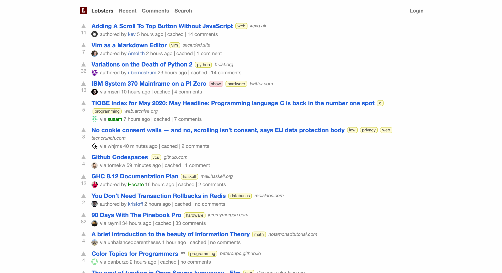

# Proyecto de extensión: News Alerts

## Índice

- [1. Preámbulo](#1-preambulo)
- [2. Resumen del proyecto](#2-resumen-del-proyecto)
- [3. Consideraciones generales](#3-consideraciones-generales)
- [4. Objetivos de aprendizaje](#4-objetivos-de-aprendizaje)
- [5. Criterios de aceptación mínimos del proyecto](#5-criterios-de-aceptacion-minimos-del-proyecto)
- [6. Consideraciones técnicas](#6-consideraciones-tecnicas)

***

## 1. Preámbulo

[Hacker News](http://hackerne.ws/) y [Lobsters](https://lobste.rs/) son "agregadores"
de noticias sobre tecnología. Son servicios que recopilan noticias de diversas
fuentes y las agregan en un único lugar. En cualquier momento puedes visitar
esos sitios _web_ y encontrar las últimas noticias respecto a temas de tecnología
y programación en general listadas en forma de _links_ que llevan directamente
a la fuente original.

Estos "agregadores" suelen tener un sistema de popularidad en el que la primera
noticia listada será la que tiene mayor cantidad de votos a favor (_upvotes_)
y que, además, es aún relativamente nueva. Así, las noticias van posicionadas
en un _ranking_ muy simple de entender. Cualquier persona registrada puede votar
por cada noticia para favorecer su posición en este _ranking_.

Uno de los problemas que presentan estas plataformas es que si bien puedes enterarte
de todas las noticias, no hay (que sepamos) una manera de enterarte sobre temas
más específicos o "subtemas". Por ejemplo, dentro del universo de noticias sobre
tecnología y programación, quiero enterarme solamente de aquellas relacionadas
a _React_ ¿No sería genial enterarme de ese tema mediante una alerta?

## 2. Resumen del proyecto

Una manera de enviar alertas a lxs usuarixs es mediante notificaciones así es que
en este proyecto crearás un sistema notificaciones para estos agregadores de noticias.

Crédito: [Pxfuel](https://pxfuel.com/)

Si bien para enviar notificaciones podemos usar el sistema "nativo" de notificaciones
de cada sistema operativo, también podemos enviarlas mediante un correo electrónico,
mensajes de texto, un mensaje en un canal de _Slack_, una mención en _Twitter_
o alguna otra red social, etc.

Nuestro sistema deberá poder registrar las "palabras clave" o _keywords_ específicos
que le interesen a nuestrxs usuarixs y enviar notificaciones sobre noticias nuevas
relacionadas a ese asunto en particular. Podríamos, por ejemplo, enfocarnos en la
"palabra clave" "React", entonces el sistema deberá preguntar cada cierto tiempo
a alguno de estos agregadores (de tu elección) si hay alguna noticia relacionada
a esta palabra y enviar una notificación (también de tu elección). Como nadie
querrá recibir notificaciones sobre noticias "repetidas" o ya conocidas, tendrás
que validar que no se haya enviado antes una notificación sobre la misma noticia.

Para simplificar y focalizar tu aprendizaje, te sugerimos no crear una interfaz
_web_ que registre las preferencias de lxs usuarixs y que lo hagas directamente
en tu código después de elegir los subtemas.

Ya te habrás hecho la idea de que este sistema deberá correr en el _back-end_,
si no es así te recomendamos que revises otros proyectos _back-end_ primero si
es que te parece necesario.

## 3. Consideraciones generales

- Este proyecto se debe resolver en equipos de 2 o más personas.
- Si bien se menciona "Hacker News" o "Lobsters" por ser los más populares, puedes
trabajar con cualquier otro agregador de noticias. Estos 2 son los que nos parecen
más fáciles de [_scrapear_](https://es.wikipedia.org/wiki/Web_scraping).
- Este proyecto es "agnóstico" a la tecnología que uses, es decir que puedes
desarrollarlo en Vanilla JavaScript o algún _framework_  o biblioteca (librería)
de tu elección.
- Intenta pensar en un alcance que, considerando su complejidad y la cantidad de
personas en el equipo, te permita terminar el proyecto en 3 semanas.

## 4. Objetivos de aprendizaje

- [Poner en práctica todo lo aprendido hasta ahora](https://github.com/Laboratoria/bootcamp/blob/master/projects/learning-objectives.md).
- Diseñar y _testear_ un producto antes de desarrollarlo.
- Obtener datos de una fuente viva como lo es un sitio web usando alguna técnica
de [_web scrapping_](https://es.wikipedia.org/wiki/Web_scraping).
- Aprender a enviar notificaciones mediante algún servicio de _mailing_,
_chat_ o redes sociales.
- Aprender a programar tareas repetitivas en el tiempo usando alguna API nativa
de Node.js o alguna _library_.

## 5. Criterios de aceptación mínimos del proyecto

- Obtener los datos que se deben procesar de algún agregador de noticias.
- Obtener estos datos de manera periódica y automática, mientras el programa
se esté ejecutando.
- Enviar notificaciones a lxs usuarixs mediante algún servicio de _mailing_, SMS,
_chat_ o red social.
- No enviar notificaciones sobre noticias repetidas.
- Seguir el siguiente flujo de trabajo general:
  * Hacer un prototipo funcional, esto te permitirá terminar de entender y definir
  los detalles de tu proyecto.
  * Iterar por lo menos 1 vez sobre tu prototipo para incluir todo lo aprendido
  en el paso previo.
  * Hacer una [refactorización](https://es.wikipedia.org/wiki/Refactorizaci%C3%B3n)
  de tu código.

## 6. Consideraciones técnicas

- Para poder obtener los datos de un sitio _web_ vas a necesitar conocer sobre
  [_web scrapping_](https://es.wikipedia.org/wiki/Web_scraping). En Node.js esto
  se puede lograr usando en conjunto la _librería_ llamada [axios](https://www.npmjs.com/package/axios)
  para hacer el _request_ del HTML y otra llamada [cheerio](https://cheerio.js.org/)
  que te permitirá obtener solo aquello en lo que estamos interesados de ese HTML.
- Para poder correr tareas periódicamente en el servidor tendrás que conocer de
  los procesos del tipo [_daemon_](https://es.wikipedia.org/wiki/Daemon_(inform%C3%A1tica))
  y los [cron jobs](https://es.wikipedia.org/wiki/Cron_(Unix)) que te permitirán
  ejecutar constantemente una acción. En Node.js esto se puede lograr con la
  _librería_ [node-cron](https://www.npmjs.com/package/node-cron).
- Para poder enviar notificaciones tendrás que usar un servicio de terceros. Te
  tocará usar otra _library_ que permita usar estos servicios, por ejemplo
  [Twitter tiene uno](https://www.npmjs.com/package/twitter) que permite enviar
  mensajes a esa red social. Existen otras para enviar [mensajes de texto](https://www.npmjs.com/package/twilio),
  [mensajes por chat](https://www.npmjs.com/package/slack) o
  [correo electrónico](https://www.npmjs.com/package/mailchimp-api-v3).
- Siéntete libre de usar cualquier otra alternativa para enviar las notificaciones.
