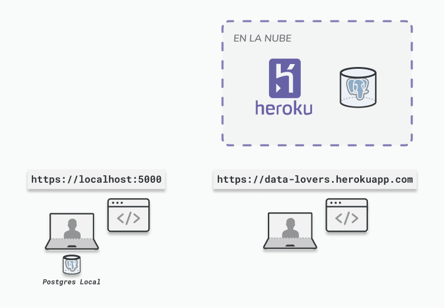

# Chat App

## Índice

- [1. Preámbulo](#1-preámbulo)
- [2. Resumen del proyecto](#2-resumen-del-proyecto)
- [3. Objetivos de aprendizaje](#3-objetivos-de-aprendizaje)
- [4. Consideraciones generales](#4-consideraciones-generales)
- [5. Criterios de aceptación mínimos del proyecto](#5-criterios-de-aceptación-mínimos-del-proyecto)
- [6. Pistas, tips y lecturas complementarias](#6-pistas-tips-y-lecturas-complementarias)

---

## 1. Preámbulo

La mensajería instantánea es uno de los usos más populares que tiene la Internet
desde que se popularizó su uso. Desde IRC, ICQ y MSN Messenger, a los chats en
redes sociales, Slack, Telegram y WhatsApp, poder comunicarnos en tiempo real
con otras personas es algo que ya damos por sentado en nuestra vida cotidiana.

Muchas herramientas tienen estas funcionalidades para facilitar las
interacciones diarias en nuestro trabajo, pero además existen chats para
entregar soporte directo a personas, por la fluidez que ofrecen, incluso
llegando al ejemplo de los _chatbots_.

Incluso siendo parte de una organización de tecnología, muchas veces los equipos
de desarrollo se enfrentan a problemas que otros equipos ya vivieron en el
pasado y no logran comunicarse por correo o videollamada para pasar sus
aprendizajes de forma oportuna, lo que termina frenando la capacidad de la
organización completa de responder a los desafíos propios de su negocio.

Has sido seleccionada para formar parte de la creación de una renovada área de
desarrollo de esta organización. Uno de los valores más importantes en esta
iniciativa es la comunicación abierta y fluida, y se ve que implementar esto
producirá un gran cambio cultural en la organización completa. Por esto ha
surgido la necesidad de tener un lugar donde las personas desarrolladoras puedan
comunicarse rápidamente entre sí.

Has sido invitada a participar de esta iniciativa y te han propuesto la creación
de una herramienta de chat propia (para evitar gastos a terceros) para que tus
compañeras y compañeros ocupen menos tiempo en resolver problemas, logren
masificar experiencias y aprendizaje locales a toda el área de desarrollo y
puedan así contribuir al crecimiento técnico de todas.

## 2. Resumen del proyecto

En este proyecto construirás una aplicación de mensajería instantánea. Esta
aplicación requerirá que las personas puedan registrarse e iniciar sesión para
poder enviar mensajes a un canal de chat general y a canales temáticos que cada
persona puede crear o unirse por su cuenta.

Para acercar este proyecto lo más posible a entornos profesionales le daremos
gran importancia al desarrollo a través de
[Historias de Usuaria](https://www.atlassian.com/es/agile/project-management/user-stories)
para definir alcance y prioridad de las funcionalidades que desarrollarás. Para
esto te ayudaremos como coaches jugando el rol de _Product Owner_. Te
entregaremos las primeras historias ya hechas, para que tengas una base inicial
, y durante el proceso tendrás que seguir escribiendo tus propias historias para
abarcar todas las funcionalidades.

Para implementar mensajes instantáneos en un chat ocuparás la librería
[Socket.io](https://socket.io), que te permitirá implementar _web sockets_ para
mantener conexiones abiertas entre las personas que estén conectadas dentro del
chat y el “servidor” que centralizará la comunicación, recibiendo los mensajes y
enviándolos de nuevo a los “clientes”.

Para construir la UI podrás ocupar uno de los siguientes _frameworks_: React,
Vue o Angular.

Alojarás esta aplicación en la plataforma [Heroku](https://www.heroku.com/) y
construirás con [GitHub Actions](https://github.com/features/actions) tu propio
_pipeline_ de Integración Continua/Entrega Continua (o CI/CD por Continuous
Integration/Continuous Delivery) para automatizar el despliegue que hará que tu
proyecto esté disponible a través de Internet para cualquier persona. Para
almacenar los datos ocuparás la base de datos PostgreSQL en la versión que
provee nativamente Heroku.

## 3. Objetivos de aprendizaje

> ℹ️ Esta sección será automáticamente generada en el idioma pertinente, a
> partir de los objetivos de aprendizaje declarados en
> [`project.yml`](./project.yml), al crear el repo del proyecto para un cohort
> en particular usando
> [`./scripts/create-cohort-project.js`](../../scripts#create-cohort-project-coaches).
>
> Acá puedes ver una
> [lista de todos los objetivos de aprendizaje](../../learning-objectives/data.yml)
> que contempla nuestra currícula.

## 4. Consideraciones generales

### 4.1 Historias de Usuaria

Las Historias de Usuaria actualmente son esenciales en el desarrollo de software
ágil. En pocas palabras, son descripciones en texto de una funcionalidad de la
aplicación en desarrollo, desde el punto de vista de quienes la ocuparán, las
usuarias. Las usaremos a lo largo de todo el proceso de desarrollo y crearás
nuevas historias a medida que vayamos aprendiendo sobre lo que es prioritario y
lo que reporte mayor valor para nuestras usuarias.

Ocuparemos la fórmula _Persona + Necesidad + Propósito_ expresada en el
siguiente ejemplo:

```text
Yo como fanática de la música funk (Persona)
Quiero encontrar listas de reproducción de ese género musical (Necesidad)
Para descubrir artistas y bandas nuevas (Propósito)
```

### 4.2 El rol de _Product Owner_

Este rol tiene la responsabilidad de maximizar el valor entregado por el equipo
en el desarrollo de un producto. En general, esto implica que la persona PO
tiene un mayor conocimiento del “negocio” (o _dominio_) y contribuye al equipo
definiendo la prioridad de las historias desarrolladas, con el objetivo de
entregar el mayor valor posible a usuarios.

En este proyecto te apoyarás en una coach que asumirá el rol de PO. Como
cualquier equipo de desarrollo, tú y tus compañeras tendrán que conversar con la
PO para priorizar las Historias de Usuarias y definir el alcance de las
funcionalidades. Durante estas conversaciones esperamos que puedan fortalecer
las habilidades de negociación y priorización, que cualquier desarrolladora debe
tener.

### 4.3 WebSockets

Los WebSockets son una avanzada tecnología que permiten abrir una comunicación
interactiva bidireccional entre el navegador de un “cliente” y un “servidor”.
Este tipo de conexiones permiten crear fácilmente, entre otras cosas, chats
entre personas a través de la web, que sería muy difícil con conexiones
tradicionales.

Imaginemos una aplicación que requiera recargar manualmente la página cada vez
que queramos ver los mensajes nuevos, no sería ni muy instantánea ni muy útil.
Con WebSockets, cargaremos la página una vez y la conexión quedará abierta para
que simplemente recibamos los mensajes de otras personas manejando _eventos_.

Con la librería [Socket.io](https://socket.io) podemos implementar conexiones de
este tipo sin tener que hacer muchas cosas manualmente. Así, familiarizándote
con ella podrás agregar la comunicación instantánea a tu aplicación sin muchas
demoras y así podrás enfocarte en las funcionalidad más complejas.


### 4.4 Heroku y Postgres

Heroku es una plataforma similar a Firebase. Ambas pertenecen a la categoría
llamada “Plataforma como Servicio”, en inglés _Platform-as-a-Service_ (PaaS).
Estas plataformas permiten alojar aplicaciones para que nuestro trabajo quede
disponible por Internet a cualquier persona.

Por otro lado, PostgreSQL, o simplemente Postgres, es un motor de _base de datos
relacional_. Estos tipos de bases de datos son ampliamente usados en la
industria y Postgres es una de las más conocidas.

Para el desarrollo de este proyecto trabajarás haciendo despliegues a Heroku y
ocupando su servicio nativo de Postgres para almacenar, o _persistir_, tus
datos.

### 4.5 El _pipeline_ de Integración Continua/Entrega Continua

Para que nuestro código esté disponible para usuarias es necesario desplegar
nuestra aplicación. Esto lo hiciste previamente con GitHub Pages y Firebase, en
este último caso ejecutando `firebase deploy`.

Una forma de aumentar la productividad en el desarrollo es automatizar el
despliegue para evitar posibles errores manuales o algún paso que se nos olvide,
como ejecutar las pruebas antes.

Para aprovechar esta mayor productividad usarás
[GitHub Actions](https://github.com/features/actions) para construir un
_pipeline_ de Integración Continua/Entrega Continua que ejecutará las pruebas
con cada _commit_ a `main` y, una vez que todas pasen con éxito, desplegará tu
aplicación automáticamente a Heroku.

### 4.6 Estructura de archivos

El _boilerplate_ contiene una estructura de archivos como punto de partida:

```text
.
├── .gitignore
├── docker-composer.yml
├── project.yml
└── README.md
```

## 5. Criterios de aceptación mínimos del proyecto

### 5.1 Comportamiento mínimo

Como mínimo tu proyecto debe permitir al usuario hacer lo siguiente:

1. Escribir mensajes en un canal de chat general
2. Ver mensajes enviados por otras personas en tiempo real
3. Guardar el historial de mensajes enviados
4. Registrarse en la aplicación
5. Iniciar sesión para ingresar al chat
6. Crear canales de chat al que puedan acceder otros usuarios

### 5.2 Desarrollo iterativo con Historia de Usuaria y _Product Owner_

Deberás realizar el desarrollo a partir de Historias de Usuaria, partiendo de la
base que te entregamos y luego escribiendo nuevas a medida que vayas
progresando.

Además deberás escoger a una de las coaches para que sea PO de tu equipo durante
todo el proyecto. Te apoyarás en tu PO para definir y negociar prioridades y el
alcance de cada historia. En esta persona también te apoyarás para escribir las
historias.

Como punto de partida, agenda una reunión de _kick-off_ con la coach que escojan
para definir las prioridades del primer sprint.

### 5.3 Comunicación en tiempo real con Socket.io

Deberás hacer una integración con la librería Socket.io para implementar
comunicación a través de WebSockets que permitan a usuarias chatear en tiempo
real.

### 5.4 Despliegue automatizado con un _pipeline_ de CI/CD

Deberás construir un _pipeline_ con GitHub Actions para desplegar tu aplicación
a Heroku de forma automática con cada _push_ a la rama `main`. El despliegue
debe realizarse solo después de que todas las pruebas se hayan ejecutado en el
_pipeline_ y pasado con éxito.

### 5.5 Persistencia de datos con una base de datos

Deberás ocupar el servicio nativo de Postgres en Heroku para persistir los datos
de tu aplicación.

### 5.6 Modularización del código

Como tendrás que ocupar una librería externa, Socket.io, será muy importante que
esa integración se haga de forma ordenada. Para esto tendrás que definir una
estructura de carpetas lógica y clara, y procurar _separar responsabilidades_.
Cada script debiera tener solo una responsabilidad y exportar funciones que sean
ocupadas por otros.

### 5.7 Pruebas unitarias

Deberás incluir pruebas unitarias para tu aplicación y testear aquellas partes
más críticas de tu propio código. No vamos a testear que Socket.io funciona como
debiera o que la base de datos efectivamente guarda los datos. Si necesitas
testear una función que se integra con código no hecho por ti, puedes ocupar
_test doubles_, a veces llamados simplemente _mocks_.

## 6. Pistas, tips y lecturas complementarias

### 6.1 ¿Qué “tamaño” debieran tener mis Historias?

Esta herramienta, aunque útil, no soluciona automáticamente todos los problemas.
Es muy fácil caer en la trampa de intentar poner absolutamente todos los
aspectos de una funcionalidad en una única historia y comprometernos con su
desarrollo en un sprint de 1 o 2 semanas, para luego darnos cuenta que el
trabajo requerido era mayor al esperado y terminar acarreando la misma historia
en progreso sprint tras sprint.

Para evitar historias muy grandes es importante aplicar un enfoque iterativo al
escribirlas. Si es necesario podemos “romper” una historia grande en historias
más pequeñas que comprendan incrementos de una misma funcionalidad.

A modo de ejemplo, podemos implementar el inicio de sesión asumiendo que los
datos ingresados por el usuario siempre están correctos, o si validamos algo,
validar lo más importante, y si queremos agregar la recuperación de contraseña,
podemos luego tener una historia aparte que contemple solo eso.

### 6.2 Comunicación en tiempo real con Socket.io

### 6.3 Despliegues a Heroku y persistencia con Postgres

Una de las ventajas de Heroku, es la rapidez del proceso, pues detecta
automáticamente algunas características de nuestro proyecto y nos evita tener
que hacer muchas configuraciones de forma manual. Es posible tener una
aplicación corriendo en Heroku ¡en menos de 5 minutos!

Este tipo de tecnologías es muy importante actualmente en el desarrollo de
aplicaciones, ya sea front-end, back-end o full-stack, puesto que automatizan
una de las tareas esenciales del desarrollo de software: el _despliegue_. Le
llamamos “desplegar” (hacer _deployment_) al acto de tomar el código de nuestra
aplicación y moverlo a uno de estos servicios para que nuestros cambios más
actuales queden disponibles para usuarios. Durante el bootcamp muchas veces
hiciste esto con `firebase deploy` para desplegar los cambios a Firebase o
quizás configurando tu repositorio para que el código se viera en
[GitHub Pages](https://pages.github.com/).

Así como Firebase permitía guardar datos en su base de datos Firestore, Heroku
permite conectar de forma nativa con Postgres. Usualmente configurar bases de
datos puede llegar a ser una tarea compleja, especialmente si queremos
configurarlas en los entornos de “producción”. Heroku simplifica todo este
proceso con Postgres entregándonos los beneficios y ahorrándonos hacer muchas
configuraciones.



### 6.4 El _pipeline_ de Integración Continua/Entrega Continua

Durante el desarrollo es frecuente que debamos realizar la tarea de desplegar
repetidamente, incluso varias veces al día. Esto transforma el despliegue en una
tarea recurrente propensa a errores: quizás nos equivocamos en el comando exacto
para desplegar; quizás nos olvidamos de correr antes las pruebas o de hacer una
verificación manual; incluso puede que necesitemos desplegar a una plataforma
que requiera varios pasos adicionales que debamos repetir manualmente una y otra
vez.

Como seres humanos, tenemos una gran habilidad para realizar tareas “difusas”,
que requieren pensamiento creativo, pero si la tarea es simplemente realizar y
marcar acciones de una lista, bueno, ahí no nos va tan bien. Afortunadamente ya
se ha vuelto un estándar de la industria (al menos las partes más avanzadas)
usar herramientas que permiten ejecutar todos estos pasos de forma automática a
través de un _pipeline_ de “Integración Continua”.

Un _pipeline_ es simplemente una “línea de producción”, un proceso que
automatizamos para desplegar nuestra aplicación, un canal por donde pasa nuestro
código cumpliendo distintas etapas, las que van acercando cada vez más nuestro
trabajo a “producción”. Por ejemplo, podríamos tomar nuestro código, correr las
pruebas y solo si todas pasaron con éxito entonces podríamos desplegar a alguna
plataforma (Firebase, Heroku, etc.).


### 6.5 Sobre la _Product Owner_

El rol de _Product Owner_ (PO) se puede encontrar en los equipos ágiles que
usualmente usan la metodología
[Scrum](https://www.scrum.org/resources/blog/que-es-scrum). Sin embargo, pasó a
formar parte del ecosistema ágil en general, independiente de la metodología,
recibe distintos nombres pero tiene básicamente la misma función.

Aunque este rol suele asumirlo de forma exclusiva una persona que no se
involucra en el desarrollo, en la práctica sus responsabilidades no son fijas ni
exclusivas del rol mismo, y dependerá de la organización en que se encuentre el
equipo.

### Otros recursos

- [¿Qué es el rol de Product Owner? | Agile Alliance (texto, inglés)](https://www.agilealliance.org/glossary/product-owner/)
- [Product Owner Ágil en resumen | Henrik Kniberg - YouTube (video, subtítulos autotraducidos en español)](https://www.youtube.com/watch?v=502ILHjX9EE)
