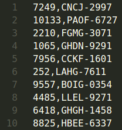
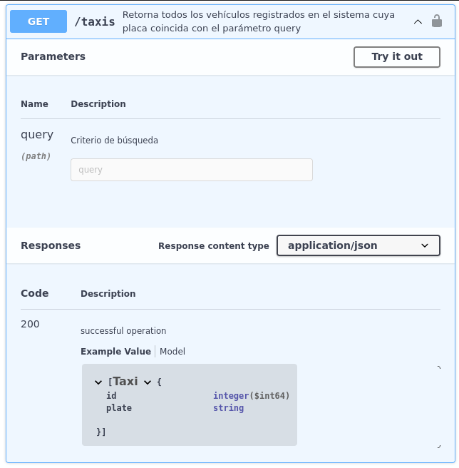

# Fleet Management Software API

## Índice

- [1. Preâmbulo](#1-preâmbulo)
- [2. Resumo do projeto](#2-resumo-do-projeto)
- [3. Objetivos de aprendizagem](#3-objetivos-de-aprendizagem)
- [4. Critérios de aceitação do projeto](#4-critérios-de-aceitação-do-projeto)
- [5. Stack de tecnologia](#5-stack-de-tecnologia)
- [6. Modelo Base](#6-modelo-base)
- [7. Dicas, guias e leituras complementares](#7-dicas-dicas-e-leituras-complementares)
- [8. Edição Hacker](#8-edição-hacker)

***

## 1. Preâmbulo

De acordo com [Wikipedia](https://pt.wikipedia.org/wiki/Internet_das_coisas),
a internet das coisas (IoT, em inglês) é um conceito que se refere à
interconexão digital de objetos cotidianos com a internet. Constitui uma mudança
radical na qualidade de vida das pessoas na sociedade, oferecendo muitas novas
oportunidades de acesso a dados, serviços específicos na educação, segurança,
assistência médica e transporte, entre outros campos.

Em logística e gestão de frotas de automóveis, por exemplo, é possível rastrear
a localização e as condições da carga e dos veículos o tempo todo, por meio de
sensores sem fio conectados à internet que enviam alertas em caso de
eventualidades (atrasos, danos, roubos, etc).


A IoT também apresenta desafios como o armazenamento, análise e visualização da
grande quantidade de informações que ela gera. Estima-se que até 2025, os
dispositivos IoT gerem
[79,4 zettabytes](https://www.statista.com/statistics/1017863/worldwide-iot-connected-devices-data-size/)
(1 zettabyte equivale a 1 trilhão
de gigabytes). Como desenvolvedoras, devemos estar cientes desses desafios e
contribuir para sua resolução com nossa experiência, conhecimento e vontade de
aprender.

## 2. Resumo do projeto

Neste projeto, você construirá a API REST de um
[Software de Gestão de Frotas](https://en.wikipedia.org/wiki/Fleet_management)
para consultar as localizações dos veículos de uma empresa de táxis em Pequim,
China.

Forneceremos milhões de localizações de milheres de táxis. Esperamos
que, como desenvolvedora, você explore novas alternativas e técnicas para
armazenar e consultar essa grande quantidade de informações e possa garantir
a melhor experiência do usuário em sua API REST.

## 3. Objetivos de aprendizagem

> ℹ️ Esta seção será gerada automaticamente no idioma apropriado, a partir dos
objetivos de aprendizagem declarados em [`project.yml`](./project.yml), ao criar
o repositório do projeto para uma turma específica, usando
[`./scripts/create-cohort-project.js`](../../scripts#create-cohort-project-coaches).
>
> Aqui está uma
[lista de todos os objetivos de aprendizado](../../learning-objectives/data.yml)
contemplados em nosso currículo.

## 4. Criterios de aceitação do projeto

 A empresa que nos contratou, instalou dispositivos GPS em seus taxis.
 Estes dispositivos utilizam sinais de satelitales para determinar
 com precisão as coordenadas geográficas do taxi.
 Até o momento a informação de localização estão armazenadas em arquivos
 de texto, no entando, não é o ideal consultar informações desta forma.

Nosso cliente precisa:

1. Carregar a informação dos arquivos de textp em uma
base de dados Postgresql.
2. Desenvolver uma API REST que permita consultar, mediante
requisições HTTP, a informação armazenada na base de dados.

### Definição do produto

O [_Product Owner_](https://www.youtube.com/watch?v=r2hU7MVIzxs&t=202s)
nos apresenta este _backlog_ que é o resultado do seu trabalho com
as pessoas que representam os nossos clientes.

***

#### [Historia de usuario 1] Carregar a informação na base de dados

Eu como _desenvolvedora_ quero carregar a informação, armazenada
até agora em arquivos de texto, em uma base de datos Postgresql,
para facilitar sua consulta e análise.

##### Critérios de aceitação

- Desenvolver um script SQL que
carregue as informações dos arquivos de texto na base
de dados.

##### Definição de pronto

- Os scripts SQL precisam criar as tabelas no banco de dados.
- Os scripts devem carregar os dados disponibilizados pela
empresa de taxis.

#### [Historia de usuario 2] Endpoint última localização

Eu como cliente da API REST preciso de um _endpoint_ para
consultar a última localização reportada por cada taxi.

##### Critérios de aceitação

- O _endpoint_ responde para cada taxi a siguiente informação:
ID, placa, latitude, longitude e data e hora.
- O _endpoint_ faz paginação dos resultados para garantir que as
respostas sejam mais fáceis de manejar.
- O _endpoint_ responde as solicitações em pouco tempo para
não afetar a experiência da usuária. _Nota: devido
à grande quantidade de informação, se espera com **segurança** tempos de
resposta mais lentos se uma estratégia de otimização de banco de dados
não for implementada._

##### Definição de pronto

- Deve existir uma documentação para o _endpoint_ desenvolvido
especificando
[método HTTP](https://developer.mozilla.org/en-US/docs/Web/HTTP/Methods),
url, parâmetros,
[Headers](https://developer.mozilla.org/en-US/docs/Web/HTTP/Headers),
[HTTP response code](https://shorturl.at/bdegB)
e
[corpo](https://developer.mozilla.org/en-US/docs/Web/HTTP/Messages).
- O código do _endpoint_ deve receber _code review_ de pelo
menos uma colega.
- O código _endpoint_ deve estar disponível em um repositorio do Github.
- O código _endpoint_ deve contar com testes unitarios e e2e.

***

#### [Historia de usuario 3] Endpoint histórico de localizações

Eu como cliente da API REST preciso de um _endpoint_ para
consultar todas as localizações de un taxi dado um ID de um taxi e uma data.

##### Critérios de aceitação

- O _endpoint_ responde para o ID do taxi consultado a seguinte
informação: latitude, longitude e data e hora.
- O _endpoint_ faz paginação dos resultados para garantir que as
respostas sejam mais fáceis de manejar.
- O _endpoint_ responde as solicitações em pouco tempo para
não afetar a experiência da usuária. _Nota: devido
à grande quantidade de informação, se espera com **segurança** tempos de
resposta mais lentos se uma estratégia de otimização de banco de dados
não for implementada._

##### Definição de pronto

- Deve existir uma documentação para o _endpoint_ desenvolvido
especificando
[método HTTP](https://developer.mozilla.org/en-US/docs/Web/HTTP/Methods),
url, parâmetros,
[Headers](https://developer.mozilla.org/en-US/docs/Web/HTTP/Headers),
[HTTP response code](https://shorturl.at/bdegB) e
[corpo](https://developer.mozilla.org/en-US/docs/Web/HTTP/Messages).
- O código do _endpoint_ deve receber _code review_ de pelo
menos uma colega.
- O código _endpoint_ deve estar disponível em um repositorio do Github.
- O código _endpoint_ deve contar com testes unitarios e e2e.

***

#### [Historia de usuario 4] Endpoint lista de taxis

Eu como cliente da API REST preciso de um _endpoint_ para
listar todos os taxis.

##### Critérios de aceitação

- O _endpoint_ responde para cada taxi: ID e placa.
- O _endpoint_ faz paginação dos resultados para garantir que as
respostas sejam mais fáceis de manejar.
- O _endpoint_ responde as solicitações em pouco tempo para
não afetar a experiência da usuária. _Nota: devido
à grande quantidade de informação, se espera com **segurança** tempos de
resposta mais lentos se uma estratégia de otimização de banco de dados
não for implementada._

##### Definição de pronto

- Deve existir uma documentação para o _endpoint_ desenvolvido
especificando
[método HTTP](https://developer.mozilla.org/en-US/docs/Web/HTTP/Methods),
url, parâmetros,
[Headers](https://developer.mozilla.org/en-US/docs/Web/HTTP/Headers),
[HTTP response code](https://shorturl.at/bdegB)
e
[corpo](https://developer.mozilla.org/en-US/docs/Web/HTTP/Messages).
- O código do _endpoint_ deve receber _code review_ de pelo
menos uma colega.
- O código _endpoint_ deve estar disponível em um repositorio do Github.
- O código _endpoint_ deve contar com testes unitarios e e2e.

#### [Historia de usuario 5] Carregar a informação na base de dados usando uma CLI

Eu como _desenvolvedora_ quero carregar a informação, armazenada
até agora em arquivos de texto, em uma base de datos Postgresql, usando uma CLI,
para facilitar sua consulta e análise.

##### Critérios de aceitação

- Desenvolver uma interface de Linha de Comando (CLI) que
carregue a informação dos arquivos de texto na base
de dados:

    No caso de Java

    ```bash
    java UploadGPSData.java <path-to-files>
    --type=taxis|trajectories
    --dbname=<dbname>
    --host=<hostname>
    --port=<port>
    --username=<username>
    ```

    Onde os parâmetros esperados são:

    `<path-to-files>`: especifica o diretorio dos arquivos a carregar.

    `--type=taxis|trajectories`: indica o [tipo de arquivo](#data)
    a carregar taxis ou trajetorias.

    `--dbname=dbname`: especifica o nome da base de dados para se conectar.

    `--host=hostname`: especifica o nome do host da máquina
    em que se está executando a base de dados.

    `--port=port`: especifica a porta TCP onde a base de
    dados está escutando conexões.

    `--username=username`: especifica o usuario para se conectar na
    base de dados.

    _Nota: a CLI deve solicitar a
    senha de conexão com a base de dados.
    Por segurança, esta não pode ser um parâmetro._

##### Definição de pronto

- O código da Interface de Linha de Comando (CLI) deve
receber _code review_ de pelo menos uma colega.
- O código da Interface de Linha de Comando (CLI) deve
estar disponível em um repositorio de Github.
- O código da Interface de Linha de Comando (CLI) deve
contar com testes unitários.

***

## 5. Stack de tecnologías

- [Spring Boot](https://spring.io/projects/spring-boot/): para
criar aplicações Java
- [Spring Boot Test](https://docs.spring.io/spring-boot/docs/current/reference/html/features.html#features.testing.spring-boot-applications):
para testes de integração.
- [JUnit](https://junit.org/junit5/): para testes unitários.
- [Hibernate](https://docs.spring.io/spring-framework/reference/data-access/orm/hibernate.html):
como [ORM](https://en.wikipedia.org/wiki/Object%E2%80%93relational_mapping)
para facilitar consultas ao banco de dados.
- [Postgresql](https://www.postgresql.org/): como base de dados.

## 6. Boilerplate

O _boilerplate_ contém uma estrutura de arquivos como ponto de partida:

```text
.
├── .gitignore
├── README.md
└── data
└── docs
└── server
```

### `data`

Nesta pasta você deve armazenar tanto os dados crus como os scripts que
foram criados para carregar a informação de taxis e localizações para a base de dados
da sua aplicação.

Aqui pode baixar os arquivos com os dados _crus_:

- [fleet-management-software-data-part-1.zip](https://storage.googleapis.com/bootcamp-assets/projects/05-fleet-management/fleet-management-software-data-part-1.zip)
- [fleet-management-software-data-part-2.zip](https://storage.googleapis.com/bootcamp-assets/projects/05-fleet-management/fleet-management-software-data-part-2.zip)

Os arquivos `fleet-management-software-data-part-1.zip`
e `fleet-management-software-data-part-2.zip`
contém a informação de taxis e localizações.
Ao descompactar serão criadas duas pastas: `taxis` e `trajectories`.

Em `taxis` você encontrará o arquivo `taxis.txt`. En cada linha
do arquivo, encontrará o identificador (ID) e a placa de um taxi. As
informações estão separada entre sí por vírgulas.



Na pasta `trajectories` encontrará 10.357 arquivos com extensão
txt. Cada archivo contém as localizações de um taxi. O nome do arquivo
corresponde ao identificador do taxi. Por exemplo, o arquivo `9557.txt`
contém as localizações do taxi com identificador 9557. En cada linha destes
arquivos, encontrará o identificador do taxi (ID), a data e hora,
latitude e longitude de uma localicação. Em cada linha, as informações estão
separada entre sí por virgulas.


A informação de taxis e localizações foi extraída do projeto
[T-Drive: Driving Directions based on Taxi Traces](https://shorturl.at/enBJW)
de Microsoft.

### `server`

Nesta pasta você deve armazenar todos os arquivos correspondentes a
API REST.

## 7. Guias, dicas e leituras complementares

### Modelagem de dados

A base de dados recomendada para sua aplicação é o PostgreSQL. Te
recomendamos usar [vercel Postgresql](https://vercel.com/docs/storage/vercel-postgres)
para que não tenha que instalar PostgreSQL em seu computador.

Uma vez que tenha acceso a uma instancia de PostgreSQL, deverá criar tabelas em
sua base de dados para almazenar a informação entregue. Recomendamos
então criar as tabelas, uma para armazenar a informação de taxis e outra
para armazenar a informação de localizações. Deverá definir as colunas
de cada tabela de acordo com a informação entregue.

Pode criar uma tabela no PostgreSQL usando
[SQL](https://www.postgresqltutorial.com/postgresql-create-table/)
ou
[Prisma Client](https:/shorturl.at/stxIL)
se estiver usando Prisma.

### Persistencia de dados

Depois de criar as tabelas em seu banco de dados, você deve armazenar nelas,
todas as informações que foram entregues em arquivos TXT. Para isso recomendamos
escrever uma CLI em Java.
Porém, lembre-se que neste projeto você processará mais de 10 mil
arquivos e você terá um banco de dados com conexões limitadas. Discutir com
um coach quais estratégias você pode implementar para que nem o computador nem o
banco de dados morra tentando carregar as informações.

### Definir endpoints de API

Deverá definir e documentar os endpoints de sua API.
Deves usar [Swagger](https://swagger.io/) para isto.

Para uma API REST deve definir para cada endpoint entre outras coisas, qual o
[método HTTP](https://developer.mozilla.org/en-US/docs/Web/HTTP/Methods),
url, parámetros,
[headers](https://developer.mozilla.org/en-US/docs/Web/HTTP/Headers),
[HTTP Status Code](https://shorturl.at/bdegB)
y
[body](https://developer.mozilla.org/en-US/docs/Web/HTTP/Messages).

Por exemplo, na imagem a seguir se define um endpoint para consultar a
informação dos taxis na aplicação. O método do endpoint é o _GET_,
a url é _/taxis_. Recebe um parâmetro _query_, retorna a informação com
_código HTTP_ 200 em formato json graças ao _header_
`Content-type` com valor `application/json`.



### Melhorar tempos de resposta e experiencia de usuaria

Consultar as 780 localicações do taxi com placa
`ABGB-4538` para o dia `2008-02-02` Pode demorar cerca de 10
segundos. Para uma usuária da sua API REST, isso é uma
eternidade. Que estratégias você pode implementar para reduzir os tempos de
resposta e melhorar a experiência do usuário?

Algunas estrategias que poderia tentar são:

- Criar [índices](https://shorturl.at/owR09) sobre a tabela de localizações.
- Implementar um esquema de
[particionamiento](https://www.postgresql.org/docs/9.1/ddl-partitioning.html)
sobre a tabela de localizações.
- [Consultar y visualizar progresivamente](https://shorturl.at/ivyBS)
a informação em lotes.

Discuta com uma coach cada uma destas estrategias e encontre outras que
pode usar para melhorar a _performance_ de sua aplicação.

## 8. Hacker edition

Para a hacker edition deste projecto te convidamos a adicionar
a funcionalidade da seguinte historia de usuaria:

***

### [Historia de usuario 4] Endpoint exportação Excel

Eu como cliente da API REST preciso de um _endpoint_ para
exportar em formato Excel todas as localizações de un veículo
em uma dara específica.

#### Critérios de aceitação

- O _endpoint_ proporciona um arquivo em formato excel com
a seguinte informação: ID, placa, latitude, longitude e
data e hora.
- O _endpoint_ resolve a solicitação em tempos de resposta
ótimos que não afetam a experiencia da usuaria. _Nota: devido
a grande quantidade de informação, se espera con **segurança** tempos
de resposta lentos
se não se implementar uma estrategia de otimização da base de dados._

#### Definição de pronto

- Deve existir uma documentação para o _endpoint_ desenvolvido
especificando
[método HTTP](https://developer.mozilla.org/en-US/docs/Web/HTTP/Methods),
url, parâmetros,
[Headers](https://developer.mozilla.org/en-US/docs/Web/HTTP/Headers),
[HTTP response code](https://shorturl.at/bdegB)
e
[corpo](https://developer.mozilla.org/en-US/docs/Web/HTTP/Messages).
- O código do _endpoint_ deve receber _code review_ de pelo
menos uma colega.
- O código _endpoint_ deve estar disponível em um repositorio do Github.
- O código _endpoint_ deve contar com testes unitarios e e2e.

***

Talvez a primeira alternativa que te ocorra seja adicionar um endpoint em sua
API que recebe como parâmetro o veículo e a data e retorne un arquivo de
Excel para baixá-lo do seu navegador web. No entanto, esta opção é geralmente
ser muito lento. Por exemplo a geração e download do arquivo Excel com
as 33 mil localizações do veículo `DHOA-9863` para o dia `2008-02-27`
pode levar vários segundos, afetando a experiência dos usuários que
Eles geralmente são impacientes.

Os tempos de resposta desta funcionalidade podem ser melhorados se o arquivo
Excel não for baixado _online_, mas enviado para um e-mail.
Discuta com uma coach como você poderia implementar esta alternativa e quais outras
estratégias existem.
