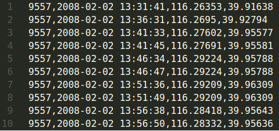

# Fleet Management Software API

## Índice

* [1. Preámbulo](#1-preámbulo)
* [2. Resumen del proyecto](#2-resumen-del-proyecto)
* [3. Objetivos de aprendizaje](#3-objetivos-de-aprendizaje)
* [4. Criterios de aceptación del proyecto](#4-criterios-de-aceptación-del-proyecto)
* [5. Stack de tecnologías](#5-stack-de-tecnologías)
* [6. Boilerplate](#6-Boilerplate)
* [7. Pistas, tips y lecturas complementarias](#7-pistas-tips-y-lecturas-complementarias)
* [8. Hacker edition](#8-hacker-edition)

***

## 1. Preámbulo

De acuerdo con
[Wikipedia](https://es.wikipedia.org/wiki/Internet_de_las_cosas),
la internet de las cosas (IoT, por sus siglas en inglés)​ es un concepto que
se refiere a una interconexión digital de objetos cotidianos con internet.
Constituye un cambio radical en la calidad de vida de las personas en la
sociedad, ofrece una gran cantidad de nuevas oportunidades de acceso a
datos, servicios específicos en la educación, seguridad, asistencia
sanitaria y en el transporte, entre otros campos.

En logística y manejo de flota, por ejemplo, se puede hacer seguimiento en
todo momento de la ubicación y las condiciones de la carga y los activos
mediante sensores inalámbricos conectados a internet que envían alertas en
caso de eventualidades (demoras, daños, robos, etc).


La IoT también plantea retos como el almacenamiento, análisis y
visualización de la gran cantidad de información que genera.
Se calcula que para el 2025 los dispositivos IoT generen
[79.4 zettabytes](https://www.statista.com/statistics/1017863/worldwide-iot-connected-devices-data-size/)
(1 zettabyte equivale a 1 trillón de gigabytes).
Como desarrolladoras debemos estar al tanto de estos retos y contribuir para
su solución desde nuestra experiencia, conocimiento y ganas de aprender.

## 2. Resumen del proyecto

En este proyecto construirás la API REST de un
[Fleet Management Software](https://en.wikipedia.org/wiki/Fleet_management)
para consultar las ubicaciones de los vehículos de una empresa
de taxis en Beijing, China.

Te entregaremos un poco más de 17 millones de ubicaciones de casi 10 mil
taxis. Esperamos que como desarrolladora explores nuevas alternativas y
técnicas para almacenar y consultar esta gran cantidad de
información y puedas garantizar la mejor experiencia de usuaria en tu
API REST.

## 3. Objetivos de aprendizaje

> ℹ️ Esta sección será automáticamente generada en el idioma pertinente, a partir
> de los objetivos de aprendizaje declarados en [`project.yml`](./project.yml),
> al crear el repo del proyecto para un cohort en particular usando
> [`./scripts/create-cohort-project.js`](../../scripts#create-cohort-project-coaches).
>
> Acá puedes ver una [lista de todos los objetivos de aprendizaje](../../learning-objectives/data.yml)
> que contempla nuestra currícula.

## 4. Criterios de aceptación del proyecto

 La empresa que nos ha contratado ha instalado dispositivos GPS en sus taxis.
 Estos dispositivos utilizan señales satelitales para determinar
 con precisión las coordenadas geográficas del taxi.
 Hasta el momento la información de ubicación se ha almacenado en archivos
 de texto, sin embargo, no es óptimo consultar la información con esta opción.

Nuestra clienta requiere:

1. Cargar la información de los archivos de texto a una
base de datos Postgresql.
2. Desarrollar una API REST que permita consultar, mediante
peticiones HTTP, la información almancenada en la base de datos.

### Definición del producto

El [_Product Owner_](https://www.youtube.com/watch?v=r2hU7MVIzxs&t=202s)
nos presenta este _backlog_ que es el resultado de su trabajo con el clientx
hasta hoy.

***

#### [Historia de usuario 1] Cargar información a base de datos

Yo como _desarrolladora_ requiero cargar la información, almacenada
hasta ahora en archivos de texto, en una base de datos Postgresql
para facilitar su consulta y análisis.

##### Criterios de aceptación

* Desarrollar una Interfaz de Línea de Comando (CLI) que
cargue la información de los archivos de texto a la base
de datos:

    En el caso de Java

    ```bash
    java UploadGPSData.java <path-to-files> 
    --type=taxis|trajectories
    --dbname=<dbname>
    --host=<hostname>
    --port=<port>
    --username=<username>
    ````

    En el caso de NodeJs

    ```bash
    node upload-gps-data.js <path-to-files> 
    --type=taxis|trajectories
    --dbname=<dbname>
    --host=<hostname>
    --port=<port>
    --username=<username>
    ````

    Donde los parámetros requeridos son:

    `<path-to-files>`: especifica el directorio de los archivos a cargar.

    `--type=taxis|trajectories`: indica el [tipo de archivos](#data)
    a cargarse taxis o trajectories.

    `--dbname=dbname`: especifica el nombre de la base de datos
    a la que conectarse.

    `--host=hostname`: especifica el nombre del host de la máquina
    en la que se está ejecutando la base de datos.

    `--port=port`: especifica el puerto TCP en el que  la base de
    datos está escuchando conexiones.

    `--username=username`: especifica el usuario para conectarse a
    la base de datos.

    _Nota: el CLI debe solicitar la
    contraseña de conexión a la base de datos.
    Por segurisdad esta no puede ser un parámetro._

##### Definición de terminado

* El código de la Interfaz de Línea de Comando (CLI) debe
recibir _code review_ de al menos una compañera.
* El código de la Interfaz de Línea de Comando (CLI) debe
estar cargado en un repositorio de Github.
* El código de la Interfaz de Línea de Comando (CLI) debe
contar con test unitarios.

***

#### [Historia de usuario 2] Endpoint última ubicación

Yo como clienta de la API REST requiero un _endpoint_ para
consultar la última ubicación reportada por cada taxi.

##### Criterios de aceptación

* El _endpoint_ responde para cada taxi la siguiente información:
ID, placa, latitud, longitud y fecha y hora.
* El _endpoint_ paginamos los resultados para asegurar que las
respuestas sean más fáciles de manejar.
* El _endpoint_ resuelve la solicitud en tiempos de respuesta
óptimos que no afectan la experiencia de la usuaria. _Nota: debido
a la gran cantidad de información, se espera con **seguridad** tiempos
de respuesta lentos
si no se plantea una estrategia de optimización la base de datos._

##### Definición de terminado

* Se cuenta con una documentación para el _endpoint_ desarrollado
especificando
[método HTTP](https://developer.mozilla.org/en-US/docs/Web/HTTP/Methods),
url, parámetros,
[encabezados](https://developer.mozilla.org/en-US/docs/Web/HTTP/Headers),
[códigos HTTP de respuesta](https://shorturl.at/bdegB)
y
[cuerpo](https://developer.mozilla.org/en-US/docs/Web/HTTP/Messages).
* El código del _endpoint_ debe recibir _code review_ de al
menos una compañera.
* El código _endpoint_ debe estar cargado en un repositorio de Github.
* El código _endpoint_ debe contar con test unitarios y e2e.

***

#### [Historia de usuario 3] Endpoint historial de ubicaciones

Yo como clienta de la API REST requiero un _endpoint_ para
consultar todas las ubicaciones de un taxi dado el ID del taxi y una fecha.

##### Criterios de aceptación

* El _endpoint_ responde para el ID del taxi consultado la siguiente
información: latitud, longitud y fecha y hora.
* El _endpoint_ paginamos los resultados para asegurar que las
respuestas sean más fáciles de manejar.
* El _endpoint_ resuelve la solicitud en tiempos de respuesta
óptimos que no afectan la experiencia de la usuaria. _Nota: debido
a la gran cantidad de información, se espera con **seguridad** tiempos
de respuesta lentos
si no se plantea una estrategia de optimización la base de datos._

##### Definición de terminado

* Se cuenta con una documentación para el _endpoint_ desarrollado
especificando
[método HTTP](https://developer.mozilla.org/en-US/docs/Web/HTTP/Methods),
url, parámetros,
[encabezados](https://developer.mozilla.org/en-US/docs/Web/HTTP/Headers),
[códigos HTTP de respuesta](https://shorturl.at/bdegB)
y
[cuerpo](https://developer.mozilla.org/en-US/docs/Web/HTTP/Messages).
* El código del _endpoint_ debe recibir _code review_ de al
menos una compañera.
* El código _endpoint_ debe estar cargado en un repositorio de Github.
* El código _endpoint_ debe contar con test unitarios y e2e.

***

#### [Historia de usuario 4] Endpoint listado de taxis

Yo como clienta de la API REST requiero un _endpoint_ para
listar todos los taxis.

##### Criterios de aceptación

* El _endpoint_ responde para cada taxi: ID y placa.
* El _endpoint_ paginamos los resultados para asegurar que las
respuestas sean más fáciles de manejar.
* El _endpoint_ resuelve la solicitud en tiempos de respuesta
óptimos que no afectan la experiencia de la usuaria. _Nota: debido
a la gran cantidad de información, se espera con **seguridad** tiempos
de respuesta lentos
si no se plantea una estrategia de optimización la base de datos._

##### Definición de terminado

* Se cuenta con una documentación para el _endpoint_ desarrollado
especificando
[método HTTP](https://developer.mozilla.org/en-US/docs/Web/HTTP/Methods),
url, parámetros,
[encabezados](https://developer.mozilla.org/en-US/docs/Web/HTTP/Headers),
[códigos HTTP de respuesta](https://shorturl.at/bdegB)
y
[cuerpo](https://developer.mozilla.org/en-US/docs/Web/HTTP/Messages).
* El código del _endpoint_ debe recibir _code review_ de al
menos una compañera.
* El código _endpoint_ debe estar cargado en un repositorio de Github.
* El código _endpoint_ debe contar con test unitarios y e2e.

## 5. Stack de tecnologías

Puedes implementar este proyecto en JavaScript o Java.

Si eliges JavaScript, el siguiente es el stack de tecnologías recomendado:

* [Express](https://expressjs.com/en/starter/hello-world.html):
como librería para implementar un servidor HTTP.
* [Prisma](https://www.prisma.io/): cómo
[ORM](https://en.wikipedia.org/wiki/Object%E2%80%93relational_mapping)
para facilitar consultas a la base de datos.
* [Jest](jestjs.io/): como framework de pruebas unitarias.
* [Superagent](https://www.npmjs.com/package/superagent): como
framework de pruebas e2e.
* [Postgresql](https://www.postgresql.org/): como base de datos.

Si eliges Java, el siguiente es el stack de tecnologías recomendado:

* [Spring Boot](https://spring.io/projects/spring-boot/): para
crear aplicaciones Java
* [Spring Boot Test](https://docs.spring.io/spring-boot/docs/current/reference/html/features.html#features.testing.spring-boot-applications):
para pruebas de integración.
* [JUnit](https://junit.org/junit5/): para pruebas unitarias.
* [Hibernate](https://docs.spring.io/spring-framework/reference/data-access/orm/hibernate.html):
cómo [ORM](https://en.wikipedia.org/wiki/Object%E2%80%93relational_mapping)
para facilitar consultas a la base de datos.
* [Postgresql](https://www.postgresql.org/): como base de datos.

## 6. Boilerplate

El _boilerplate_ contiene una estructura de archivos como punto de partida:

```text
.
├── .gitignore
├── README.md
└── data
└── docs
└── server
```

### `data`

En esta carpeta debes almacenar tanto la data cruda como los scripts que
desarrolles para cargar la información de taxis y ubicaciones a la base de datos
de tu aplicación.

Acá puedes descargar los archivos con la data _cruda_:

* [fleet-management-software-data-part-1.zip](https://storage.googleapis.com/bootcamp-assets/projects/05-fleet-management/fleet-management-software-data-part-1.zip)
* [fleet-management-software-data-part-2.zip](https://storage.googleapis.com/bootcamp-assets/projects/05-fleet-management/fleet-management-software-data-part-2.zip)

Los archivos `fleet-management-software-data-part-1.zip`
y `fleet-management-software-data-part-2.zip`
contienen la información de taxis y ubicaciones.
Al descomprimirlos se crearán dos carpetas: `taxis` y `trajectories`.

En la carpeta `taxis` encontrarás el archivo `taxis.txt`. En cada línea
del archivo, encontrarás el identificador (ID) y placa de un taxi. La
información esta separada entre sí por comas.


En la carpeta `trajectories` encontrarás 10.357 archivos con extensión
txt. Cada archivo contiene las ubicaciones de un taxi. El nombre del archivo
corresponde al identificador del taxi. Por ejemplo, el archivo `9557.txt`
contiene las ubicaciones del taxi con identificador 9557. En cada línea de
estos archivos, encontrarás el identificador del taxi (ID), la fecha y hora,
latitud y longitud de la ubicación. En una línea, la información está
separada entre sí por comas.



La información de taxis y ubicaciones ha sido extraída del proyecto
[T-Drive: Driving Directions based on Taxi Traces](https://shorturl.at/enBJW)
de Microsoft.

### `server`

En esta carpeta debes almacenar todos los archivos correspondientes al
API REST.

## 7. Pistas, tips y lecturas complementarias

### Modelamiento de datos

La base de datos recomendada para tu aplicación es PostgreSQL. Te
recomendamos usar [vercel Postgresql](https://vercel.com/docs/storage/vercel-postgres)
para que no tengas que instalar PostgreSQL en tu computadora.

Una vez tengas acceso a una instancia de PostgreSQL, deberás crear tablas en
tu base de datos para almacenar la información entregada. Te recomendamos
entonces crear dos tablas, una para almacenar la información de taxis y otra
para almacenar la información de ubicaciones. Deberás definir las columnas
de cada tabla de acuerdo a la información entregada.

Puedes crear una tabla en PostgreSQL usando
[SQL](https://www.postgresqltutorial.com/postgresql-create-table/)
o
[Prisma Client](https:/shorturl.at/stxIL)
si estás usando Prisma.

### Persistencia de datos

Una vez hayas creado las tablas en tu base de datos, deberás almacenar en
ellas toda la información entregada en archivos TXT. Para ello te
recomendamos escribir un CLI en JavaScript o Java.
Sin embargo, ten en cuenta que en este proyecto procesarás más de 10 mil
archivos y tendras una base de datos con conexiones limitadas. Discute con
una coach que estrategias puedes implementar para que ni computadora ni la
base de datos mueran en el intento de cargar la información.

### Definir endpoints de API

Deberás definir y documentar los endpoints de tu API.
Debes usar [Swagger](https://swagger.io/) para esto.

Para una API REST debes definir para cada endpoint entre otras cosas el
[método HTTP](https://developer.mozilla.org/en-US/docs/Web/HTTP/Methods),
url, parámetros,
[encabezados](https://developer.mozilla.org/en-US/docs/Web/HTTP/Headers),
[códigos HTTP de respuesta](https://shorturl.at/bdegB)
y
[cuerpo](https://developer.mozilla.org/en-US/docs/Web/HTTP/Messages).

Por ejemplo, en la siguiente figura se define un endpoint para consultar la
información de los taxis en la aplicación. El método del endpoint es _GET_,
la url es _/taxis_. Recibe un parámetro _query_, retorna la información con
_código HTTP_ 200 en formato json gracias al _header_
`Content-type` con valor `application/json`.


### Mejorar tiempos de respuesta y experiencia de usuaria

Consultar las 780 ubicaciones del taxi con placa
`ABGB-4538` para el día `2008-02-02` puede tardar alrededor de 10
segundos. Para una usuaria de tu API REST este tiempo es toda una
eternidad. ¿Qué estrategias puedes implementar para reducir los tiempos de
respuesta y mejorar la experiencia de usuaria?

Algunas estrategias que podrías intentar son:

* Crear
[índices](https://shorturl.at/owR09)
sobre la tabla de ubicaciones.
* Implementar un esquema de
[particionamiento](https://www.postgresql.org/docs/9.1/ddl-partitioning.html)
sobre la tabla de ubicaciones.
* [Consultar y visualizar progresivamente](https://shorturl.at/ivyBS)
la información en lotes.

Discute con una coach cada una de estas estrategias y encuentra otras que
puedas usar para mejorar el _performance_ de tu aplicación.

## 8. Hacker edition

Para la hacker edition de este proyecto te invitamos a agregar
la funcionalidad la siguiente historia de usuaria:

***

### [Historia de usuario 4] Endpoint exportación a Excel

Yo como clienta de la API REST requiero un _endpoint_ para
exportar en formato Excel todas las ubicaciones de un vehículo
en una fecha específica.

#### Criterios de aceptación

* El _endpoint_ proporcia un archivo en formato excel con
la siguiente información: ID, placa, latitud, longitud y
fecha y hora.
* El _endpoint_ resuelve la solicitud en tiempos de respuesta
óptimos que no afectan la experiencia de la usuaria. _Nota: debido
a la gran cantidad de información, se espera con **seguridad** tiempos
de respuesta lentos
si no se plantea una estrategia de optimización la base de datos._

#### Definición de terminado

* Se cuenta con una documentación para el _endpoint_ desarrollado
especificando
[método HTTP](https://developer.mozilla.org/en-US/docs/Web/HTTP/Methods),
url, parámetros,
[encabezados](https://developer.mozilla.org/en-US/docs/Web/HTTP/Headers),
[códigos HTTP de respuesta](https://shorturl.at/bdegB)
y
[cuerpo](https://developer.mozilla.org/en-US/docs/Web/HTTP/Messages).
* El código del _endpoint_ debe recibir _code review_ de al
menos una compañera.
* El código _endpoint_ debe estar cargado en un repositorio de Github.
* El código _endpoint_ debe contar con test unitarios y e2e.

***

Tal vez la primera alternativa que se te ocurra sea agregar un endpoint a tu
API que reciba como parámetro el vehículo y la fecha y retorne un archivo de
Excel para descargarlo desde el navegador web. Sin embargo, esta opción suele
ser muy lenta. Por ejemplo la generación y descarga del archivo de Excel con
las 33 mil ubicaciones del vehiculo `DHOA-9863` para el día `2008-02-27`
puede tardar varios segundos, afectando la experiencia de las usuarias que
usualmente son impacientes.

Los tiempos de respueta de esta funcionalidad puede mejorarse si el archivo de
Excel no se descarga _en línea_ sino que se envía a un correo electrónico.
Discute con una coach como podrías implementar esta alternativa y que otras
estrategias existen.
