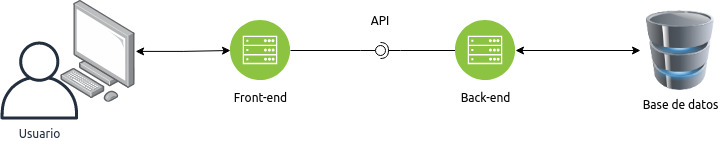
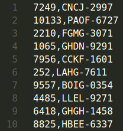
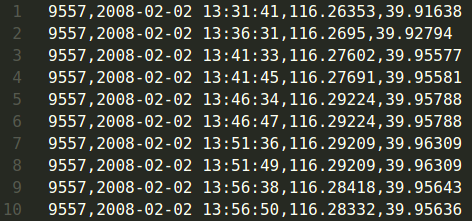
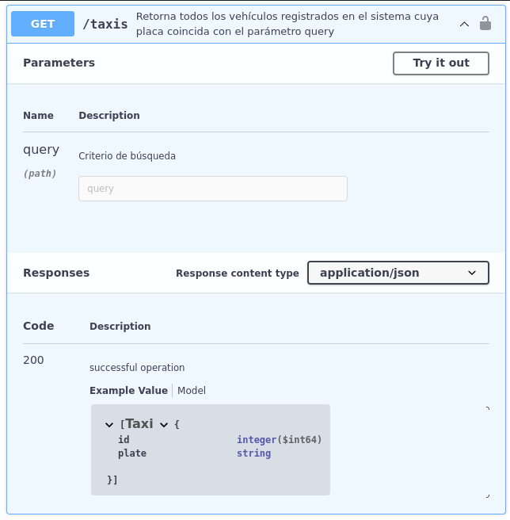
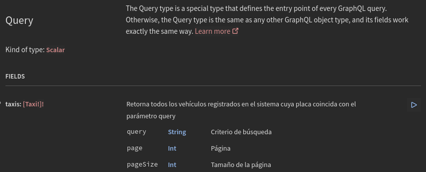

# Fleet Management Software

## Índice

* [1. Preámbulo](#1-preámbulo)
* [2. Resumen del proyecto](#2-resumen-del-proyecto)
* [3. Objetivos de aprendizaje](#3-objetivos-de-aprendizaje)
* [4. Criterios de aceptación mínimos del proyecto](#4-criterios-de-aceptación-mínimos-del-proyecto)
* [5. Stack de tecnologías](#5-stack-de-tecnologías)
* [6. Boilerplate](#6-Boilerplate)
* [7. Pistas, tips y lecturas complementarias](#7-pistas-tips-y-lecturas-complementarias)
* [8. Hacker edition](#8-hacker-edition)

***

## 1. Preámbulo

De acuerdo con
[Wikipedia](https://es.wikipedia.org/wiki/Internet_de_las_cosas),
la internet de las cosas (IoT, por sus siglas en inglés)​ es un concepto que
se refiere a una interconexión digital de objetos cotidianos con internet.
Constituye un cambio radical en la calidad de vida de las personas en la
sociedad, ofrece una gran cantidad de nuevas oportunidades de acceso a
datos, servicios específicos en la educación, seguridad, asistencia
sanitaria y en el transporte, entre otros campos.

En logística y manejo de flota, por ejemplo, se puede hacer seguimiento en
todo momento de la ubicación y las condiciones de la carga y los activos
mediante sensores inalámbricos conectados a internet que envían alertas en
caso de eventualidades (demoras, daños, robos, etc).

La IoT también plantea retos como el almacenamiento, análisis y
visualización de la gran cantidad de información que genera.
Se calcula que para el 2025 los dispositivos IoT generen
[79.4 zettabytes](https://www.statista.com/statistics/1017863/worldwide-iot-connected-devices-data-size/)
(1 zettabyte equivale a 1 trillón de gigabytes).
Como desarrolladoras debemos estar al tanto de estos retos y contribuir para
su solución desde nuestra experiencia, conocimiento y ganas de aprender.

## 2. Resumen del proyecto

En este proyecto construirás el frontend y backend de un
[Fleet Management Software](https://en.wikipedia.org/wiki/Fleet_management)
para visualizar en un mapa las ubicaciones de los vehículos de una empresa
de taxis en Beijing, China.

Te entregaremos un poco más de 17 millones de ubicaciones de casi 10 mil
taxis. Esperamos que como desarrolladora explores nuevas alternativas y
técnicas para almacenar, consultar y visualizar esta gran cantidad de
información y puedas garantizar la mejor experiencia de usuaria en tu
aplicación.

## 3. Objetivos de aprendizaje

> ℹ️ Esta sección será automáticamente generada en el idioma pertinente, a partir
> de los objetivos de aprendizaje declarados en [`project.yml`](./project.yml),
> al crear el repo del proyecto para un cohort en particular usando
> [`./scripts/create-cohort-project.js`](../../scripts#create-cohort-project-coaches).
>
> Acá puedes ver una [lista de todos los objetivos de aprendizaje](../../learning-objectives/data.yml)
> que contempla nuestra currícula.

## 4. Criterios de aceptación mínimos del proyecto

### Funcionalidades mínimas

Tu aplicación como mínimo deberá tener un Front-end y Back-end que permita:

* Visualizar en un mapa la ubicación más reciente de todos los vehículos
* Visualizar en un mapa todas las ubicaciones de un vehículo en una fecha
específica
* Almacenar y consultar los 17 millones de ubicaciones de los 10 mil taxis
que te entregaremos.
* **Garantizar tiempos de respuesta mínimos para una adecuada experiencia de
usuaria**.

Recuerda escribir Historias de Usuario, crear un prototipo de baja y alta
fidelidad, así como tests de usabilidad.

### Modularización del código

Deberás definir la estructura de carpetas y archivos que consideres
necesaria, tanto para el Front-end como para el Back-end. Puedes guiarte de
las convenciones del framework elegido. Por ende, los tests y el setup
necesario para ejecutarlos, serán hechos por ti.

### Pruebas unitarias

Deberás incluir pruebas unitarias para el Front-end y el Back-end de la
aplicación que desarrolles.
Te invitamos a escribir casos de prueba para las principales funcionalidades.

## 5. Stack de tecnologías

### Arquitectura de la aplicación

La arquitectura que te recomendamos para tu aplicación es la siguiente:



La usuaria final, a través de un navegador web, se conectará al Front-end de
tu aplicación. Este interactuará con el Back-end mediante un API, quién
consultará la base de datos.

Tendrás que usar toda tu experiencia, conocimiento y criterio técnico como
desarrolladora, para escoger los frameworks, librerías y tecnologías para
implementar la arquitectura propuesta. A continuación te presentamos
diferentes alternativas para implementar cada componente de la arquitectura.

### Front-end

Para el Front-end de tu aplicación podrás escoger entre Plain JavaScript o
React o Angular.

Dependiendo del tipo de API que decidas implementar, podrás usar
[fetch](https://developer.mozilla.org/en-US/docs/Web/API/Fetch_API/Using_Fetch)
o [axios](https://axios-http.com/docs/example)
o [Apollo Client](https://www.apollographql.com/docs/react/get-started/)
o cualquier otra librería para consumir el API de tu Back-end.

Existen múltiples librerías para desplegar un mapa en tu aplicación. La
alternativa que escojas dependerá si usas Plain JavaScript o un framework en
tu Front-end:

* Para Plain JavaScript recomendamos las librerías
[Leaflet](https://leafletjs.com/)
o [MapBox](https://www.mapbox.com/).

* Para Angular puedes usar
[Here](https://developer.here.com/blog/display-here-maps-angular-web-application)
o [MapBox](https://www.mapbox.com/)
o [ArcGis](https://www.youtube.com/watch?v=ea4D-qGU0_0).

* Para React puedes usar
[Here](https://developer.here.com/tutorials/react/)
o [MapBox](https://docs.mapbox.com/help/tutorials/use-mapbox-gl-js-with-react/)
o [ArcGIS](https://www.youtube.com/watch?v=0fJmKSWURyU).

* Google Maps es otra alternativa tanto para
[Plain JavaScript](https://shorturl.at/tvKLX) o
[Angular](https://shorturl.at/uADLS)
pero requiere crear una cuenta en
[Google Cloud](https://shorturl.at/dwAXZ)
y registrar una tarjeta de crédito.

Finalmente, deberás decidir el
[servicio de mapas](https://en.wikipedia.org/wiki/List_of_online_map_services)
que usará tu aplicación. La opción que te recomendamos es
[OpenStreetMap](https://www.openstreetmap.org/).

### Back-end

El Back-end de tu aplicación deberá ser implementado en JavasScript usando
el entorno de ejecución Node.js.

Deberás escoger implementar un API REST o un API GraphQL.

Si te decides por API REST, recuerda que puedes implementar un servidor HTTP
usando, por ejemplo,
[Node.js](https://shorturl.at/xyFIP) o
[Express](https://expressjs.com/en/starter/hello-world.html) o
[Fastify](https://www.fastify.io/docs/latest/Getting-Started/).

Si te decides por API GraphQL te recomendamos usar la librería
[Apollo Server](https://shorturl.at/puU46)
para implementar el servidor HTTP.

Para consultar la base de datos desde el Back-end puedes escoger usar un
[ORM](https://en.wikipedia.org/wiki/Object%E2%80%93relational_mapping)
como
[Prisma](https://www.prisma.io/)
o escribir directamente las consultas SQL usando un cliente JavaScript como
[node-postgres](https://node-postgres.com/).

### Base de datos

Como base de datos de tu aplicación te recomendamos que uses PostgreSQL.

## 6. Boilerplate

El _boilerplate_ contiene una estructura de archivos como punto de partida:

```text
.
├── .gitignore
├── README.md
└── client
└── data
└── docs
└── server
```

### `client`

En esta carpeta debes almacenar todos los archivos correspondientes al
Front-end de tu aplicación.

### `data`

En esta carpeta debes almacenar tanto la data cruda como los scripts que
desarrolles para cargar la información de taxis y ubicaciones a la base de datos
de tu aplicación.

Acá puedes descargar los archivos con la data _cruda_:

* [fleet-management-software-data-part-1.zip](https://storage.googleapis.com/bootcamp-assets/projects/05-fleet-management/fleet-management-software-data-part-1.zip)
* [fleet-management-software-data-part-2.zip](https://storage.googleapis.com/bootcamp-assets/projects/05-fleet-management/fleet-management-software-data-part-2.zip)

Los archivos `fleet-management-software-data-part-1.zip`
y `fleet-management-software-data-part-2.zip`
contienen la información de taxis y ubicaciones.
Al descomprimirlos se crearán dos carpetas: `taxis` y `trajectories`.

En la carpeta `taxis` encontrarás el archivo `taxis.txt`. En cada línea
del archivo, encontrarás el identificador (ID) y placa de un taxi. La
información esta separada entre sí por comas.



En la carpeta `trajectories` encontrarás 10.357 archivos con extensión
txt. Cada archivo contiene las ubicaciones de un taxi. El nombre del archivo
corresponde al identificador del taxi. Por ejemplo, el archivo `9557.txt`
contiene las ubicaciones del taxi con identificador 9557. En cada línea de
estos archivos, encontrarás el identificador del taxi (ID), la fecha y hora,
latitud y longitud de la ubicación. En una línea, la información está
separada entre sí por comas.



La información de taxis y ubicaciones ha sido extraída del proyecto
[T-Drive: Driving Directions based on Taxi Traces](https://shorturl.at/enBJW)
de Microsoft.

### `server`

En esta carpeta debes almacenar todos los archivos correspondientes al
Back-end de tu aplicación.

## 7. Pistas, tips y lecturas complementarias

### Definir stack tecnológico

Después de haber escrito las Historias de Usuario y tener un prototipo de
baja y alta fidelidad lo siguiente que deberías hacer es escoger una coach,
que actuará como
[arquitecta de software](https://en.wikipedia.org/wiki/Software_architect)
y reunirte con ella para que juntas decidan el stack tecnológico que usarás
en tu aplicación. En la sección
[5. Stack de tecnologías](#5-stack-de-tecnologías)
hemos descrito varias alternativas para el stack. Con ayuda de tu coach,
decide cuál alternativa es la mejor y documenta cada decisión.

### Modelamiento de datos

La base de datos recomendada para tu aplicación es PostgreSQL. Te
recomendamos [docker](https://hub.docker.com/_/postgres) para instalar
PostgreSQL en tu computadora.

Una vez tengas acceso a una instancia de PostgreSQL, deberás crear tablas en
tu base de datos para almacenar la información entregada. Te recomendamos
entonces crear dos tablas, una para almacenar la información de taxis y otra
para almacenar la información de ubicaciones. Deberás definir las columnas
de cada tabla de acuerdo a la información entregada.

Puedes crear una tabla en PostgreSQL usando
[SQL](https://www.postgresqltutorial.com/postgresql-create-table/)
o
[Prisma Client](https:/shorturl.at/stxIL)
si estás usando Prisma.

### Persistencia de datos

Una vez hayas creado las tablas en tu base de datos, deberás almacenar en
ellas toda la información entregada en archivos TXT. Para ello te
recomendamos escribir un script en JavaScript y ejecutarlo con Node.js.
Puedes basarte en el script que desarrollaste para
[MarkDown Links](https://shorturl.at/iqA56).
Sin embargo, ten en cuenta que en este proyecto procesarás más de 10 mil
archivos y tendras una base de datos con conexiones limitadas. Discute con
una coach que estrategias puedes implementar para que ni computadora ni tu
base de datos mueran en el intento de cargar la información.

### Definir endpoints de API

Deberás definir y documentar los endpoints de tu API.

Si escogiste un API REST debes definir para cada endpoint entre otras cosas el
[método HTTP](https://developer.mozilla.org/en-US/docs/Web/HTTP/Methods),
url, parámetros,
[encabezados](https://developer.mozilla.org/en-US/docs/Web/HTTP/Headers),
[códigos HTTP de respuesta](https://shorturl.at/bdegB)
y
[cuerpo](https://developer.mozilla.org/en-US/docs/Web/HTTP/Messages).

Por ejemplo, en la siguiente figura se define un endpoint para consultar la
información de los taxis en la aplicación. El método del endpoint es _GET_,
la url es _/taxis_. Recibe un parámetro _query_, retorna la información con
_código HTTP_ 200 en formato json gracias al _header_
`Content-type` con valor `application/json`.



Si escogiste un API GraphQL puedes documentar entre otras cosas la
[operación](https://graphql.org/learn/queries/),
los [campos](https://graphql.org/learn/queries/)
y los [argumentos](https://graphql.org/learn/queries/#arguments).

Por ejemplo, en la siguiente figura se define un endpoint para consultar la
información de los taxis en la aplicación. La operación es _taxis_. Recibe
parámetros _query_, _page_ y _pageSize_. También se indica que la respuesta
es un arreglo de objetos _Taxi_.



### Mejorar tiempos de respuesta y experiencia de usuaria

Consultar y visualizar en el mapa las 780 ubicaciones del vehículo con placa
`ABGB-4538` para el día `2008-02-02` puede tardar alrededor de 10
segundos. Para una usuaria de tu aplicación este tiempo es toda una
eternidad. ¿Qué estrategias puedes implementar para reducir los tiempos de
respuesta y mejorar la experiencia de usuaria?

Algunas estrategias que podrías intentar son:

* Crear
[índices](https://shorturl.at/owR09)
sobre la tabla de ubicaciones.
* Implementar un esquema de
[particionamiento](https://www.postgresql.org/docs/9.1/ddl-partitioning.html)
sobre la tabla de ubicaciones.
* [Consultar y visualizar progresivamente](https://shorturl.at/ivyBS)
la información en lotes.

Discute con una coach cada una de estas estrategias y encuentra otras que
puedas usar para mejorar el _performance_ de tu aplicación.

## 8. Hacker edition

Para la hacker edition de este proyecto te invitamos a agregar la funcionalidad de
exportar en formato Excel todas las ubicaciones de un vehículo en una fecha específica.

Tal vez la primera alternativa que se te ocurra sea agregar un endpoint a tu
API que reciba como parámetro el vehículo y la fecha y retorne un archivo de
Excel para descargarlo desde el navegador web. Sin embargo, esta opción suele
ser muy lenta. Por ejemplo la generación y descarga del archivo de Excel con
las 33 mil ubicaciones del vehiculo `DHOA-9863` para el día `2008-02-27`
puede tardar varios segundos, afectando la experiencia de las usuarias que
usualmente son impacientes.

Los tiempos de respueta de esta funcionalidad puede mejorarse si el archivo de
Excel no se descarga _en línea_ sino que se envía a un correo electrónico.
Discute con una coach como podrías implementar esta alternativa y que otras
estrategias existen.
