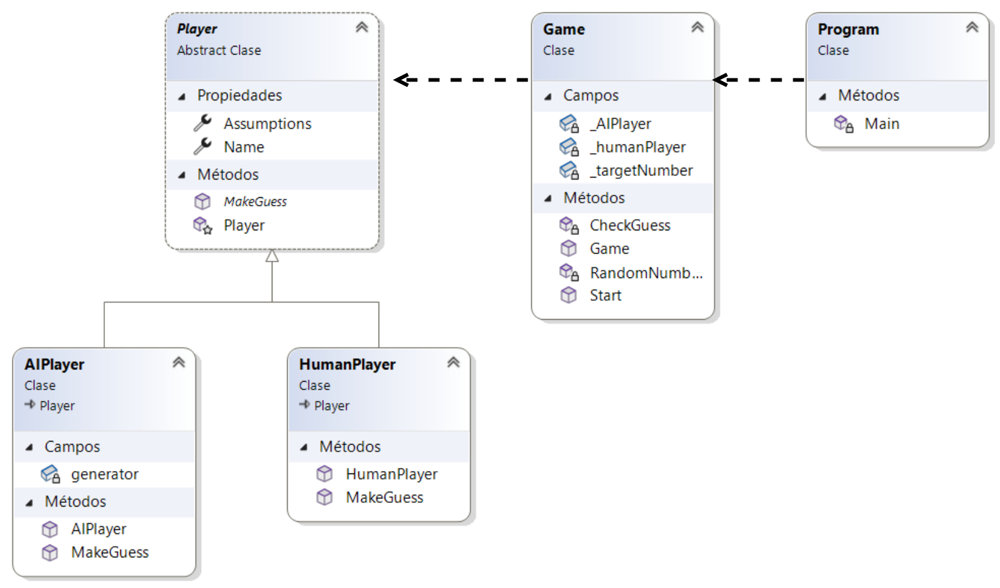

# C# 💻

## 1. Preámbulo

En el corazón de la programación moderna, C# se erige como un pilar fundamental,
combinando potencia, elegancia y versatilidad. Diseñado por Microsoft como parte de su
plataforma .NET, C# ha evolucionado para ser mucho más que el lenguaje de elección
para aplicaciones de Windows; se ha convertido en una herramienta indispensable para
desarrollar aplicaciones web, móviles y de escritorio en un espectro amplio de dominios.
En este proyecto, "Guess the Number", no solo te introduce al universo de C# a través de
un juego interactivo y divertido, si no que también te guía por los principios esenciales
de la programación orientada a objetos y el manejo de los principios básicos de C#.
Prepárate para embarcarte en una aventura que te llevará desde los fundamentos
hasta los aspectos más interesantes de la programación en C#, todo ello mientras
construyes un juego que desafiará tu ingenio.

---

## 2. Consideraciones Generales

Antes de sumergirnos en el código y la lógica detrás de "Guess the Number",
es crucial establecer algunas consideraciones generales
para garantizar una experiencia de aprendizaje fluida y efectiva:

- **Conocimientos Previos**: Aunque este proyecto está dirigido a principiantes en C#, se recomienda tener una comprensión básica de conceptos de programación como variables, bucles y condiciones. Esto facilitará el seguimiento de las explicaciones y la implementación del juego.

- **Experimentación Activa**: Te animamos a experimentar con el código más allá de las instrucciones y ejemplos proporcionados. Modificar y jugar con el código es una de las mejores maneras de aprender y consolidar tus habilidades de programación.

- **Paciencia y Persistencia**: ***El tiempo estimado para desarrollar este proyecto es de 2 sprints***.
Es normal enfrentarse a errores y desafíos. Tómate tu tiempo, practica y no dudes en buscar ayuda cuando la necesites.

### Comenzando

### Pre-requisitos

Para comenzar este proyecto necesitas:

- .NET SDK (Versión 5.0 o superior)
- Un IDE compatible con C# (Visual Studio, Visual Studio Code, Rider, etc.)

## Consideraciones Generales

Se sugiere utilizar [VS Code](https://code.visualstudio.com/download) para realizar este proyecto. Puedes agregar las siguientes extenciones para un desarrollo más agil:

- [Extensión para C# de microsoft](https://marketplace.visualstudio.com/items?itemName=ms-dotnettools.csdevkit).

Extensiones  de estilo recomendadas:

- Andromeda
- vscodeicons
- firacode

### Recursos recomendados

- Tutorial: [inicializar proyecto de consola](https://learn.microsoft.com/en-us/dotnet/core/tutorials/with-visual-studio-code?pivots=dotnet-8-0)

- Tutorial: [¡Hola, mundo!](https://dotnet.microsoft.com/es-es/learn/dotnet/hello-world-tutorial/intro)

- Video: [inicializar proyecto de consola](https://www.youtube.com/watch?v=axHut2e84fc&t=225s&ab_channel=ProgramadorX)

## 3. Consideraciones Técnicas

Para garantizar el éxito de este proyecto, es importante prestar atención a las siguientes consideraciones técnicas:

- **Versión de .NET**: Este proyecto se basa en .NET 5.0 o superior. Asegúrate de tener instalada la versión correcta del SDK de .NET para poder compilar y ejecutar el juego sin problemas.

- **Estructura del Proyecto**: El proyecto "Adivina el Número" se organiza en una estructura de proyecto simple, con una clase principal que contiene el flujo lógico del juego. Familiarizarte con la estructura del proyecto te ayudará a entender mejor cómo funciona el código y cómo puedes expandirlo o modificarlo.

- **Documentación y Comentarios**: Mantén tu código bien documentado y comenta las secciones complejas o importantes. Esto no solo te ayudará a ti y a otros a entender el código, sino que también es una práctica recomendada en el desarrollo de software.

- **Otros aspectos importantes**:

- - *Ambiente*: Tu proyecto se debe poder ejecutar desde la terminal (*inicia por crear un proyecto de consola*).
- - *Organización*: tu código debe estár dividido para facilidad de mantenimiento.
- - *Aleatoriedad*: Debes utilizar `new Random()` para generar números aleatorios.
- - *Pruebas Unitarias*: Debes realizar pruebas unitarias para validar tus funciones.
---

## 4. Hitos del Proyecto

Para hacer este proceso de aprendizaje más manejable y gratificante,
hemos dividido el proyecto en hitos claramente definidos.
Cada hito representa un paso crucial en la construcción del juego,
permitiéndote enfocarte en tareas específicas,
comprender mejor cada componente del proyecto y, lo más importante,
celebrar tus logros a medida que avanzas.

Estos hitos están diseñados no solo para guiarte a través del desarrollo del juego,
sino también para proporcionarte oportunidades de experimentación y personalización.
A continuación, presentaremos cada hito, explicando su objetivo,
los conceptos clave que cubrirá y sugerencias para explorar más allá
de los requisitos básicos.

Te animamos a abordar estos hitos con curiosidad y creatividad,
adaptando el proyecto a tus intereses y desafiándote a ti misma para aprender más
en cada paso.

### Hito 1: Configuración del Entorno de Desarrollo

#### Objetivos:

- Instalar el .NET SDK y un IDE (Visual Studio Code o Visual Studio).
- Familiarizarse con el entorno de desarrollo y las herramientas básicas.
- Crear un proyecto de consola en C# y ejecutar un programa simple ("Hola Mundo").

#### Recursos
- Guías para iniciar:
  - [Tutorial: Creación de una aplicación de consola de .NET con Visual Studio Code](https://learn.microsoft.com/es-es/dotnet/core/tutorials/with-visual-studio-code?pivots=dotnet-8-0)
  - [Tutorial de .NET: Hola mundo en 5 minutos](https://dotnet.microsoft.com/es-es/learn/dotnet/hello-world-tutorial/intro)
  - [Aprende C#](https://youtu.be/axHut2e84fc?si=AJcTUEMfxKnPSTC3)
  - [C# Desde Cero: Primeros Pasos](https://youtu.be/L-f8u0hwi4Y?si=q0UD721sVsvuF-xs)

### Hito 2: Estructuras de Control y Entrada/Salida

#### Objetivos

- Familiarizarse con las estructuras de control básicas en C# (`if`, `else`, `while`, `for`).
- Aprender a leer la entrada del usuario y mostrar mensajes en la consola.

### Desafío

Desarrollar un programa que solicite al usuario adivinar un número fijo, indicando después si su elección es correcta, demasiado alta o demasiado baja.

### Recursos

- Documentación sobre estructuras de control en C#:
  - [Selection Statements](https://learn.microsoft.com/es-es/dotnet/csharp/language-reference/statements/selection-statements)
  - [Tutorial: Estructuras de control en C#](https://www.youtube.com/watch?v=VBf3nEinpfA&list=PLU8oAlHdN5BmpIQGDSHo5e1r4ZYWQ8m4B&index=14&ab_channel=pildorasinformaticas)

- Tutoriales sobre cómo usar `Console.ReadLine()` y `Console.WriteLine()` para la entrada/salida de datos:
  - [Console.ReadLine Method](https://learn.microsoft.com/es-es/dotnet/api/system.console.readline?view=net-8.0)
  - [Console.WriteLine Method](https://learn.microsoft.com/en-us/dotnet/api/system.console.writeline?view=net-8.0)

### Para profundizar

- Generación de números aleatorios: [Generar números aleatorios con C#](https://www.discoduroderoer.es/generar-numeros-aleatorios-con-c-sharp/)
- Operadores de comparación: [Comparison Operators](https://learn.microsoft.com/es-es/dotnet/csharp/language-reference/operators/comparison-operators)

### Hito 3: Clases y Objetos

#### Objetivos

- Comprender y aplicar el uso de clases y objetos en C#.
- Introducir el concepto de campos (atributos) y métodos en una clase.

### Desafío

Implementar una clase `Juego` que encapsule toda la lógica del juego, e instanciar y utilizar un objeto de esta clase en el método `Main` para ejecutar el juego.

### Recursos

- Documentación sobre clases y objetos en C#:
  - [Classes and Objects in C#](https://learn.microsoft.com/es-es/dotnet/csharp/fundamentals/tutorials/classes)

### Para profundizar

- Modificadores de acceso: [Access Modifiers](https://learn.microsoft.com/es-es/dotnet/csharp/language-reference/keywords/access-modifiers)
- Interpolación de cadenas: [String interpolation](https://learn.microsoft.com/en-us/dotnet/csharp/language-reference/tokens/interpolated)

### Hito 4: Encapsulamiento y Métodos de Clase

#### Objetivos

- Aplicar el principio de encapsulamiento para proteger el estado interno de la clase `Juego`.
- Crear métodos específicos para manejar las funcionalidades del juego.

### Desafío

Refactorizar el código del juego para que la lógica interna del juego esté oculta y accesible solo a través de métodos públicos de la clase `Juego`.

### Recursos

- Guías sobre encapsulamiento y acceso a los miembros de una clase en C#.
  - [Curso de programación orientada a objetos en C# .Net #5 | Encapsulamiento](https://www.youtube.com/watch?v=IObsX4M6Ekg&ab_channel=hdeleon.net)

### Para profundizar

- Uso de `readonly`: [Diferencias entre const y readonly en C#](https://es.stackoverflow.com/questions/505650/diferencias-entre-const-y-readonly-en-c)

## Hito 5: Herencia y Polimorfismo

### Objetivos

- Explorar la herencia como medio para extender o modificar la funcionalidad de las clases existentes.
- Comprender el polimorfismo y cómo se puede implementar en C#.

### Desafío

Crear las clases `Jugador` (base) y `JugadorHumano`, `JugadorComputadora` (derivadas) para representar diferentes tipos de jugadores, implementando la lógica de adivinación específica para cada tipo mediante herencia y polimorfismo.

### Recursos

- Herencia en C#: [Inheritance in C#](https://learn.microsoft.com/es-es/dotnet/csharp/fundamentals/object-oriented/inheritance)
- Polimorfismo en C#: [Polymorphism in C#](https://learn.microsoft.com/es-es/dotnet/csharp/fundamentals/object-oriented/polymorphism)

### Para profundizar

- Listas y arreglos en C#: [Working with lists and arrays in C#](https://learn.microsoft.com/es-es/dotnet/csharp/tour-of-csharp/tutorials/arrays-and-collections)

### Diagrama de Clases del Proyecto "Adivina el Número"

El proyecto se estructura alrededor de las siguientes clases principales, con las siguientes responsabilidades y relaciones:

### Clases

#### Juego
- **Responsabilidades**:
  - Iniciar el juego.
  - Generar y mantener el número secreto a adivinar.
  - Controlar el flujo del juego, alternando turnos entre los jugadores.
- **Relaciones**:
  - Asociación con `Jugador` (incluyendo `JugadorHumano` y `JugadorIA`).

#### Jugador (abstracta)
- **Responsabilidades**:
  - Definir una interfaz común para todos los jugadores.
  - Mantener el nombre y el historial de suposiciones del jugador.
- **Relaciones**:
  - Superclase de `JugadorHumano` y `JugadorIA`.

#### JugadorHumano
- **Responsabilidades**:
  - Permitir al usuario hacer suposiciones ingresando números.
- **Relaciones**:
  - Hereda de `Jugador`.

#### JugadorIA
- **Responsabilidades**:
  - Generar suposiciones automáticamente (simulando una IA básica).
- **Relaciones**:
  - Hereda de `Jugador`.

#### Relaciones

- `Juego` tiene dos instancias de `Jugador`: una para el jugador humano y otra para la IA, demostrando una relación de asociación/composición.
- `Jugador` es una clase abstracta que define la estructura y comportamiento comunes para todos los jugadores, con `JugadorHumano` y `JugadorIA` especializando esta definición mediante herencia.

Este diseño nos una clara separación de responsabilidades entre la gestión del juego y la lógica específica del jugador, facilitando la extensión y mantenimiento del código.

### Recursos

- ¿Cómo hacer un diagrama de clase? - [Diagrama de clases UML](https://miro.com/es/diagrama/que-es-diagrama-clases-uml/)
- Video: [Cómo hacer un DIAGRAMA de CLASES UML ✅ [ fácil y profesional ]](https://www.youtube.com/watch?v=zMpr6RIePf8&ab_channel=SaberProgramas)

### Hito 6: Implementación de Pruebas Unitarias

#### Objetivos

- Implementar pruebas unitarias con MSTest para validar la lógica y funcionamiento del juego.
- Asegurar la calidad del software mediante la detección temprana de errores y comportamientos inesperados.

#### Desafío

Crear una suite de pruebas unitarias que cubra los distintos componentes y funcionalidades del juego, incluyendo la generación del número secreto, la validación de entradas del usuario, y la lógica de juego para determinar victorias y derrotas.

#### Recursos

- Introducción a MSTest y pruebas unitarias en .NET:
  - [Unit testing C# with MSTest and .NET Core](https://learn.microsoft.com/en-us/dotnet/core/testing/unit-testing-with-mstest)
  - [MSTest - Microsoft Test Framework](https://learn.microsoft.com/en-us/dotnet/api/microsoft.visualstudio.testtools.unittesting?view=mstest-net-1.2.0)

- Tutoriales y guías sobre cómo escribir pruebas unitarias efectivas:
  - [Unit Testing Best Practices](https://learn.microsoft.com/en-us/dotnet/core/testing/unit-testing-best-practices)
  - [Getting started with MSTest](https://www.youtube.com/watch?v=6v9CvmNQyNw)

### Para profundizar

- Principios de pruebas de software y desarrollo dirigido por pruebas (TDD):
  - [Test Driven Development (TDD)](https://learn.microsoft.com/en-us/dotnet/core/testing/test-driven-development)
- Estrategias para mockear y testear interacciones con el usuario:
  - [Mocking in .NET Core Unit Tests](https://learn.microsoft.com/en-us/dotnet/core/testing/mocking)
