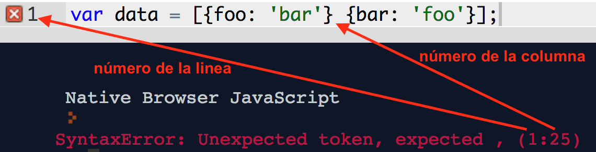

# Mensajes de error

## Objetivos de Aprendizaje

- Conocer los tipos diferentes de mensajes de error y el vocabulario en esos
  mensajes para resolver problemas en el código.

***

Todos comenten errores, incluso programadores con mucha experiencia.
Afortunadamente, la consola del Dev Tools te dirá cuando tienes un error.
Por otro lado, estos mensajes pueden ser difícil de comprender, y a veces
no es tan obvio que significan. El propósito de este lectura es explorar algunos
errores comunes y sus significados, y así resuelvas problemas en el código.

## Errores Comunes

Hay muchos tipos de errores, pero hay algunos que son muy comunes. Lee estas
referencias para comprender los errores más comunes.

### ReferenceError: "x" is not defined

[ReferenceError: "x" is not defined - MDN](https://developer.mozilla.org/es/docs/Web/JavaScript/Reference/Errors/Not_defined)

### SyntaxError: Unexpected token

Un "token" es una pieza pequeña del código. Por ejemplo, variables, funciones,
operadores, y palabras claves (como `if` o `while`), todos son tokens.

La palabra "unexpected" significa "inesperado", entonces si tienes un token
inesperado, significa que el navegador estaba leyendo el código hasta que llegó
a algo que no debe estar ahí. Usualmente, esto significa que algo hace falta
(como una coma o un `+`) justo antes del token inesperado.

[SyntaxError: Unexpected token - MDN](https://developer.mozilla.org/es/docs/Web/JavaScript/Reference/Errors/Unexpected_token)

Ejemplos:

```javascript
const foo = 'Nicole's code';
// SyntaxError: unexpected token: identifier
```

```javascript
const list = [1, 2,

const instruments = [
  'Ukulele',
  'Guitar',
  'Piano'
};
// SyntaxError: expected expression, got keyword 'const'
```

```javascript
const data = [{foo: 'bar'} {bar: 'foo'}];
// SyntaxError: missing ] after element list
```

A veces, en lugar de "Unexpected Token", verás algo como "Unexpected Identifier"
o "Unexpected Number". Estos son errores similares, y también casi siempre
significa que olvidaste agregar algo justo antes del
token inesperado. Afortunadamente, Chrome DevTools te dirá el número de la linea
donde tengas el error, y repl.it no solo te dirá el número de la linea, sino
también te dirá el número de la columna.



### TypeError: "x" is not a function

[TypeError: "x" is not a function - MDN](https://developer.mozilla.org/es/docs/Web/JavaScript/Reference/Errors/Not_a_function)

### SyntaxError: missing ) after argument list

[SyntaxError: missing ) after argument list - MDN](https://developer.mozilla.org/es/docs/Web/JavaScript/Reference/Errors/Missing_parenthesis_after_argument_list)

### Assignment in Conditional Expression

"Assignment in Conditional Expression" no es un mensaje de error, es un mensaje
de advertencia en repl.it.

Significa que hay un operador de asignación (`=`) en una condicional, pero debe
ser un operador de comparación (`===`).

Por ejemplo,

```javascript
if (x = 5) {
  console.log('x es 5.');
}
```

### Otras notas

Es importante tener en cuenta que los mensajes de error pueden variar entre
navegadores. La guía de referencia MDN describe mensajes de Firefox - los
mensajes de error en otros navegadores son similares, pero no exactamente el
mismo. En este lectura, nos enfocamos en los mensajes de Chrome y repl.it.

[Referencia MDN de Errores](https://developer.mozilla.org/es/docs/Web/JavaScript/Reference/Errors)
